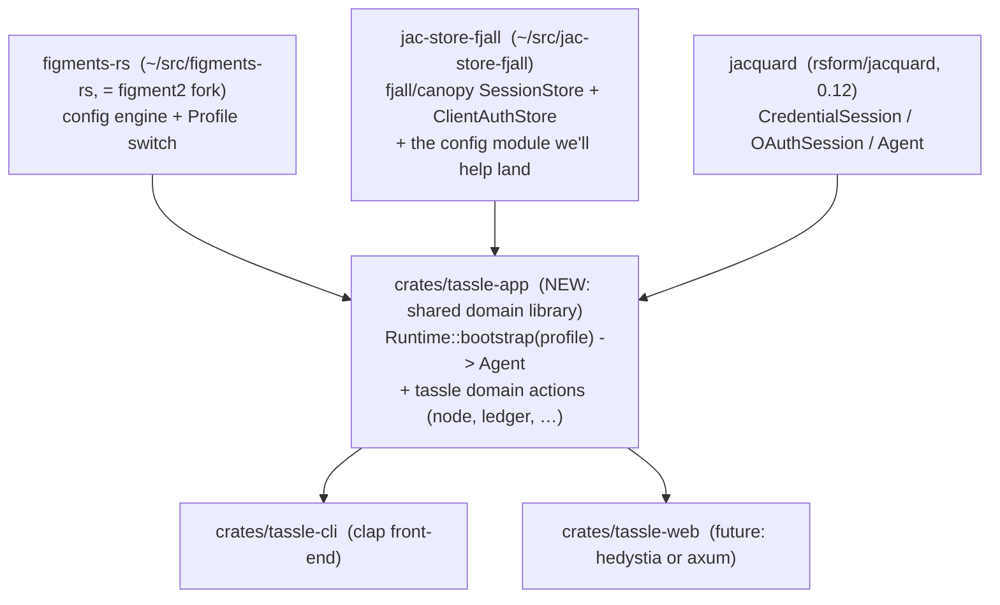

# Tassle Auth Design — App-Password MVP

> Distillation of [`discovery/cli-surface.md`](discovery/cli-surface.md) +
> [`discovery/cli-surface-findings.md`](discovery/cli-surface-findings.md),
> re-scoped to **app-password first, OAuth later**, and built on three existing
> libraries rather than a new tassle auth crate.
>
> **Amends** [`adr/0001-profile-config-before-auth.md`](adr/0001-profile-config-before-auth.md)
> follow-up ("Implement real OAuth under the same `auth login`"): real auth lands
> as **app-password**, not OAuth. OAuth remains the future path.

## 1. Status & scope

- **Status:** Draft for the design conversation. Decisions requested in §10.
- **In scope:** figment-profile-driven login switching; `jac-store-fjall` as the
  session store; app-password login/refresh/logout; multi-login-per-account;
  per-profile storage; the `config`↔`auth` CLI split; a shared domain layer for
  CLI + future web.
- **Deferred:** OAuth/DPoP/PAR/loopback, the `include:` permission-set lexicon,
  cross-process locking, CBOR output, Turso⇄hedystia interop proof.

App-password MVP drops most OAuth complexity: no DPoP key, no nonces, no PAR
state, no scopes. The persisted secret is **two JWTs** (`access_jwt`,
`refresh_jwt`) per session.

## 2. Architecture — compose three libraries, no tassle-auth crate

Rektide's constraint: **don't** wrap jacquard + jac-store-fjall in a confusing
layer, **and don't** leave all auth in the CLI crate. Resolution: auth is
*startup wiring* that lives in a **shared application crate** (`tassle-app`),
not a wrapper. `tassle-app` is the composition root + the domain actions; both
`tassle-cli` and a future `tassle-web` are thin front-ends on it.



- **`figments-rs`** = the `figment2` fork. Provides `Profile` (§3) — the switch.
- **`jac-store-fjall`** = storage backends + Jacquard trait impls (§4, §5). We
  use it **directly** (fjall backend, CBOR codec), and contribute the `config`
  module upstream (§6 asks a/b/e).
- **`jacquard`** = the auth logic (`CredentialSession`, `Agent`). We do **not**
  re-wrap its APIs.
- **`crates/tassle-app`** = bootstrap + domain. `Runtime::from_profile(figment,
  profile)` does: extract profile → boot that profile's store → construct the
  matching jacquard session → `Agent`. Domain methods take the `Agent` and do
  tassle things. **This is where the ~30 lines of auth wiring live** — shared by
  CLI and web, not a wrapper around jacquard's primitives, not stranded in CLI.
- tassle CLI commands and the future web service both call `tassle-app`.

> Why not a `tassle-auth` crate (the earlier proposal)? It would be a thin
> wrapper over jacquard + jac-store-fjall that re-exposes their APIs — exactly
> the "confusing layer" to avoid. The bootstrap wiring is small and belongs with
> the domain it boots. If the wiring ever grows a personality (CEL selectors,
> scope negotiation), it can split out then.

### 2.1 Source/version alignment (integration task)

`tassle` currently pulls `jacquard` from **git** (`Cargo.toml:19-20` +
`crates/tassle-cli/Cargo.toml:17-19`). `jac-store-fjall` pulls `jacquard = "0.12"`
from **crates.io** (`Cargo.toml:23-27`). These must resolve to the same version
or Cargo will compile jacquard twice and the trait impls won't type-check across
the boundary. **Decide: pin tassle to `jacquard = "0.12"` (crates.io) to match
jac-store-fjall**, or fork jac-store-fjall onto the same git rev. Flagged in §9.

## 3. figment profiles = login switcher (the core idea)

figment2 has a built-in `Profile` type (`src/profile.rs`) and extraction model
(`src/lib.rs:195-284`): a `Figment` holds `Map<Profile, Dict>`; `Toml::file(..).nested()`
treats top-level `[sections]` as profiles; `figment.select("X").extract::<T>()`
returns the merged view of `default` + `global` + `X`. Profile names are
arbitrary case-insensitive strings; `Profile::from_env("TASSLE_PROFILE")` and
`Figment::profiles()` (the iterator of known profiles, `src/figment.rs:832`) both
exist.

We repurpose this as the **login switcher**: one figment profile per login.

```toml
# ${XDG_CONFIG_HOME:-~/.config}/tassle/config.toml  (nested profiles)
[default]                       # applies to every profile unless overridden
auth_mode = "app_password"      # default auth mode
store_path = "${XDG_CONFIG_HOME}/tassle/default.fjall"   # default store location

[global]                        # overrides everything (rare; e.g. user_agent)

[player]                        # a login: app-password, default storage
did = "did:plc:player..."
handle = "player.bsky.social"
session_id = "primary"

[player-oauth]                  # same account, OAuth instead, own storage
did = "did:plc:player..."       #   -> "multiple logins to one account"
auth_mode = "oauth"
session_id = "oauth-test"
store_path = "${XDG_CONFIG_HOME}/tassle/profiles/player-oauth.fjall"

[storyteller]                   # a second account
did = "did:plc:st..."
auth_mode = "app_password"
```

Switching the active login = selecting a figment profile, via any of:
- `--profile <name>` global flag
- `TASSLE_PROFILE=<name>` env var (`Profile::from_env`)
- an `active_profile` key in a non-nested `tassle` section (the persisted default)

`tassle auth list` = `figment.profiles()`. `tassle auth switch <name>` = write
`active_profile`. **No new switching mechanism is invented** — it's figment all
the way down.

### 3.1 Multiple logins to one account

Two profiles with the same `did`, different `auth_mode` and/or `session_id`
(e.g. `player` app-password + `player-oauth` OAuth). `jac-store-fjall` already
supports this: OAuth and app-password live in **disjoint keyspaces**
(`TreeName::OauthSessions` vs `TreeName::AtpSessions`), and sessions key by
`did || SEP || session_id` so multiple `session_id`s per DID coexist
(`src/repo/kv.rs:84-87, 106-108`). A profile just picks the `SessionKey{did,
session_id}` to activate. No store change required to *store* the mix; ask (c)
covers *enumerating* it.

## 4. jac-store-fjall — current state (ground truth)

`~/src/jac-store-fjall/`. As of the recent cleanup the **engine-v2 refactor has
landed and the crate compiles**; a `bon` builder was re-added on the engine-v2
`OAuthStore`/`AppPasswordStore`/`FjallEngine` types for construction ergonomics.

### 4.1 engine-v2 (the landed shape)

The domain boundary moved up to `AuthRepository` = `RepoCore` + `OAuthRepo` +
`AppPasswordRepo` (`src/repo/mod.rs:67-153`); the byte `Engine` retired to a
private `RawKv`. The old `store/` layer + its `AuthStore<E,C>` are gone, and bon
builders now live on the new repo types. (Earlier "broken build / bon deleted"
notes are stale.) Remaining engine-v2 loose ends: `RepoCore::read_lock`, lazy
paged streams, `RepoCapabilities` — none block the MVP.

### 4.2 The API we'll use (confirmed by the tass-auth-spike)

`FjallAuth<C: Codec>` is the high-level handle over one fjall DB; `.oauth()` /
`.app_password()` hand back the two Jacquard-conforming stores sharing it:

```rust
// fjall backend, CBOR codec (default); backend/codec fixed at build time (§4.3).
let auth  = FjallAuth::open(path)?;                     // FjallAuth<Cbor>
//   …or the bon builder for full control:
//   FjallAuth::builder().path(p).codec(c).retry(r).harden(h).lock(l).build()?
let apppw = Arc::new(auth.app_password());  // SessionStore<SessionKey,AtpSession> + SessionSelector<CredentialSessionMatch>
let oauth = auth.oauth();                   // ClientAuthStore + SessionSelector<OAuthSessionMatch>

let resolver = Arc::new(JacquardResolver::default());
let session  = CredentialSession::new(apppw, resolver);
match session.resume(&SessionHint::any()).await? {
    CredentialResumeResult::LoginRequired(_) => { /* empty store → prompt */ }
    CredentialResumeResult::Resumed(_)       => { /* have a session */ }
}
```
Refs: `FjallAuth::open`/`builder` `src/engine/fjall.rs:235-293`; `.app_password()`
/`.oauth()` `src/engine/fjall.rs:295-304`; `CredentialSession::new`
`jacquard…/client/credential_session.rs:242`; `resume` returns `LoginRequired` as
a value, not an error (`:44-48`, `:528-530`). Verified by
`crates/tassle-cli/examples/auth_spike.rs`.

Reassuring built-ins for our design:
- `RepoCore` **already tracks active account**: `active_account()`,
  `set_active_account(did)`, `clear_active_account()` (`src/repo/mod.rs:67-95`).
  Per-store-instance; pairs naturally with per-profile stores.
- Permission hardening on by default (dir `0700`, files `0600`):
  `src/engine/fjall.rs:58-68,75-77`.
- `FjallEngine::from_db(db, lock)` (`src/engine/fjall.rs:95-102`) cohabits a fjall
  DB another consumer (e.g. hydrant) owns, on **disjoint keyspace names** — the
  "storage domains" escape hatch (§7).

### 4.3 Backend + codec are static (a real constraint)

`KvRepository<K: RawKv, C: Codec>` — both traits are **non-object-safe**
(`RawKv` has `type Db` + a generic closure method, `src/repo/kv.rs:52-70`;
`Codec` has generic methods, `src/codec/mod.rs:65-75`). So there is no
`Arc<dyn ClientAuthStore>` across mixed backends/codecs.

**Decision for MVP: fix backend=fjall, codec=Cbor at build time** via cargo
features. A profile selects the *path* and the *login*, not the backend type.
This keeps `Runtime::bootstrap` returning a concrete
`Agent<CredentialSession<AppPasswordStore<KvRepository<FjallEngine, Cbor>>>>` —
no boxing, no facade trait. If the web service later needs Turso (multi-process),
that's a separate build of `tassle-app` or an enum-of-impls facade (ask e) — not
day-one.

## 5. The present configuration interface (what rektide asked for)

Today the config interface is **effectively absent**:

- **`src/config.rs` is a 4-line stub** (`src/config.rs:1-4`): module doc only,
  points at `jacfj-figment-spike`. Intrdoc link doesn't resolve.
- **The `config` feature** (`Cargo.toml:85`: `config = ["dep:figment2"]`) gates
  the `figment2` dep and the empty `pub mod config` (`src/lib.rs:44-45`). It
  compiles; it does nothing functional. **No `Config` struct, no `Profile`
  selection, no extraction, no profiles anywhere in `src/`.**
- **`jacfj-figment-spike`** is an open **P3, unstarted** beads ticket. Its stated
  CORE QUESTION — *"do the builder path and the config-deserialization path
  converge?"* — is **live again** now that bon builders were re-added on the
  engine-v2 types. The clean answer: figment2 deserializes a `Config{path,
  backend, codec, lock, …}` struct, then feeds `FjallStore::builder()` (bon) from
  it (ask β).

What you configure a store with today, manually:
- **path** — caller-supplied `impl Into<PathBuf>`, no default, **no XDG**
  anywhere (`src/engine/fjall.rs:60-66`).
- **backend** — compile-time feature (`backend-fjall` default) + runtime
  constructor (`FjallEngine::open` vs `CanopyEngine::open`).
- **codec** — compile-time feature + type param; `Cbor` always available.
- **lock** — runtime `LockKind` enum (`src/lock.rs:77-90`), `preferred()` =
  parking_lot; **all variants `cross_process: false`**.
- **retry** — `RetryPolicy` (`src/retry.rs`).

There is **no notion of multiple named stores, no profile→store map, no storage
domains**. Multiple stores per process work fine (different paths) but you hold
them yourself.

## 6. Improvement asks for jac-store-fjall

Each: **what / why / size / touches**. "Status" = today, as-written.

| # | Ask | Why (use case) | Size · Status · Touches |
|---|---|---|---|
| **α** | **engine-v2 landing + bon builders.** Domain `AuthRepository` boundary, deletion of the old `store/` layer, bon builders re-added on the new repo types. | Prerequisite for *any* use. | ~~Medium~~ **DONE** (recent cleanup) · `src/engine/{fjall,canopy}.rs`, `src/repo/`, `README.md`. Was `jacfj-engine-v2`. |
| **β** | **Re-scope `jacfj-figment-spike`** (premise restored). figment2 → `Config{path, backend, codec, lock, …}` → `FjallStore::builder()` (bon). Decide runtime codec/backend selection given both are non-object-safe (likely: fix at build time, §4.3). | The config keystone for profile-switching. | Design · **open ticket** · beads `jacfj-figment-spike`. |
| **a** | **Build the `config` module.** A `Config` struct (figment-deserialized) + a constructor that, given a `figment2::Profile` (or resolved layered config), returns a booted store. The spike (β) made concrete. | Selecting a figment profile = selecting the active login + its storage. Central to the whole design. | Medium (after β decided) · **MISSING** · replace `src/config.rs:1-4`; reuses `FjallEngine::open`, `KvRepository::new`, `OAuthStore::new`/`AppPasswordStore::new`. |
| **b** | **Per-profile path convention + XDG helper.** A documented `StorePaths::for_profile(name) -> PathBuf` computing e.g. `${XDG_CONFIG_HOME}/tassle/profiles/<name>.fjall`, behind the `config` feature (add `xdg-basedir`). | Per-profile storage so each login's creds + active pointer + sweep ledger are isolated. CLI + web both need it. | **Small, additive** · **PARTIALLY SOLVED** (primitive exists, convention/helper doesn't) · new helper in `src/config.rs` or `src/path.rs`; flows into `FjallEngine::open`. |
| **e** | **Shared boot helper.** `fn stores_for_profile(cfg, profile) -> (OAuthStore<…>, AppPasswordStore<…>)` so neither tassle-cli nor tassle-web writes the wiring. | "Must work for CLI *and* web; no wrapper crate." Keeps wiring in one place. | Constrained by §4.3: with backend/codec fixed at build time, returns **concrete** types — **small**. Runtime selection would need a new object-safe facade — **design change**, defer. · **MISSING** · new in `src/config.rs`. |
| **c** | **Per-DID session enumeration.** Add `AppPasswordRepo::all_by_did(did)` / `OAuthRepo::all_sessions_by_did(did)` (mirror `first_by_did` but don't `Scan::Stop`). | `tassle auth status` listing all logins for one account; selecting a specific `session_id`. (Specific-session select already works via `SessionHint::Key`, `src/repo/mod.rs:178,249`.) | **Small, additive** (prefix-scan machinery exists at `src/repo/kv.rs:89-91,109-111`) · **MISSING** (only `first_by_did`) · `src/repo/mod.rs:100-115,122-153` + impls `src/repo/kv.rs:320-328,499-507`. |
| **g** | **Status discoverability.** Expose resolved path/codec/backend/lock so `auth status` can print "player → fjall@…/player.fjall (cbor)". | Dev/cred-flow UX. | **Small** · **PARTIAL** (lock inspectable via `RmwLock::kind()`; path not retained on `FjallEngine` `src/engine/fjall.rs:48-52`; codec/backend only knowable from the config that built the store). Cleanest: status comes from the figment `Config`, not the live store. |
| **d** | **Storage-domain partitioning** (a `Domain` param on `TreeName`). | "Profile may declare its own other-domain storage." | **Recommend REJECT.** `TreeName` is a closed 8-variant enum (`src/engine/mod.rs:26-43`); adding `Domain` reshapes key encoding + bootstrap — over-engineering. Per-domain = per-profile **path** (b) or `FjallEngine::from_db` cohabitation on disjoint keyspace names (`src/engine/fjall.rs:95-102`). See §7. |
| **f** | **Cross-process locking** (CLI + web sharing one store). | "Eventually a web service doing the same actions." | **Recommend DON'T ASK here.** All `LockKind`s are `cross_process: false`; fjall takes an exclusive file lock at open (single-owner DB). Out of scope per `README.md:824-826` (punted to a future `fseqlock`) and `doc/async.md:230-232`. Route around: per-profile single-writer (b), or `jac-store-turso` for the web tier. |

**Net:** ask α + β are the gates. a/b/e are the config module (one cohesive
contribution we'd upstream). c is a small additive win for multi-login UX. g is
polish. Defer/reject d and f.

## 7. Per-profile storage & "storage domains"

- **Per-profile storage** = each profile optionally declares its own store path
  (and, if we ever support it, backend/codec). Implemented by the `config` module
  (asks a/b/e): a profile with no `store_path` falls back to
  `StorePaths::for_profile(<profile-name>)`. Isolation is just separate fjall DBs
  at different paths.
- **Storage domains** — rektide: *"atproto is the database, so I don't foresee
  what local caches we'll really need."* Agree. Don't build domain partitioning
  into the store (reject ask d). The two escape hatches if a domain ever appears:
  1. a separate store instance at a separate path (just another profile-scoped
     fjall DB);
  2. `FjallEngine::from_db` cohabitation — share one physical DB with another
     consumer (e.g. hydrant) on **disjoint keyspace names** (`src/engine/fjall.rs:86-94`,
     `README.md:336-375`).
  The mechanism exists; we just don't name it "domains" inside the store.

## 8. Secrets handling

- Tokens live **only** in the fjall store (permission-hardened 0700/0600), never
  in figment profile fragments (per ADR 0001 §Consequences). figment profiles
  carry identity + `session_id` + `auth_mode` + optional `store_path` — **no
  secrets**.
- The app password itself: **not stored for MVP**. On `RefreshFailed`, re-prompt.
  (atpxrpc stores it plaintext for silent re-auth; we defer that until a keyring
  backend exists, where the app password properly belongs.)
- Encryption-at-rest: not in MVP (JWTs expire; app passwords revocable; store is
  0700). File a ticket before any shared/multi-user deploy.

## 9. CLI surface (profile-aware)

Resolves beads `tass-config-command-shape`. `★` MVP, `☆` nice-to-have.

```
# config (generic) — backed by figments-rs
tassle config get|set|unset <key>            ★
tassle config files                          ★  (loaded fragments + precedence)

# auth (login + session) — backed by tassle-app + jac-store-fjall
tassle auth login [<did-or-handle>]          ★  prompts app-password; createSession;
   [--password <p>] [--pds <url>]               writes profile + persists session
   [--profile <name>] [--auth-mode app_password|oauth]
tassle auth status                           ★  figment.profiles() x store: each login,
                                                 active marked, JWT exp, storage path
tassle auth logout [<profile|did>]           ★  deleteSession + drop session; --all
tassle auth switch <profile>                 ★  set active_profile (no token work)
tassle auth list                             ☆  profiles, machine-friendly
tassle auth token [<profile>]                ☆  print (refreshed) access_jwt for piping

# global flags
--profile <name>        (selects figment profile for this invocation)
--format json|table     (global; not per-command --json)
--account <did|handle>  (overrides the profile's DID for one call)
env: TASSLE_PROFILE, TASSLE_IDENTIFIER, TASSLE_PASSWORD, TASSLE_PDS

# hidden top-level aliases (#[command(hide = true)])
tassle login / logout / whoami / switch / token
```

`auth refresh` (OAuth scope expansion) is dropped — app-password has no scopes.

## 10. Implementation sequencing

Mapped to beads across two repos (tassle + jac-store-fjall). Each step unblocks
the next.

1. **(jac-store-fjall)** ~~finish `jacfj-engine-v2`~~ done; re-scope + land
   `jacfj-figment-spike`: `Config` struct + `stores_for_profile` + XDG
   `StorePaths::for_profile` (asks β/a/b/e), backend=fjall/codec=Cbor fixed at
   build time.
2. **(tassle ↔ jac-store-fjall)** reconcile jacquard source/version (§2.1) —
   pin tassle to `jacquard = "0.12"` crates.io to match.
3. **(jac-store-fjall)** re-scope `jacfj-figment-spike` (β) and land the `config`
   module: `Config` struct + `stores_for_profile` + XDG `StorePaths::for_profile`
   (asks a/b/e), with backend=fjall/codec=Cbor fixed at build time.
4. **(tassle)** extract `crates/tassle-app`: `Runtime::from_profile` bootstrap +
   move domain actions out of `tassle-cli/src/commands/`.
5. **(tassle)** `tassle config …` on figments-rs; deprecate `auth set` as alias.
   (Closes `tass-figments-config`, `tass-config-command-shape`.)
6. **(tassle)** `tassle auth login/status/logout/switch` + `--profile`/`--format`
   global flags; hidden aliases. `auth login` gains real createSession (replacing
   the ADR-0001 profile stub).
7. **(jac-store-fjall)** ask (c) per-DID enumeration lands whenever multi-login
   `status` needs it.
8. **(later)** OAuth loopback as a `tassle-app` mode gated on jacquard's
   `loopback` feature; `player-oauth`-style profiles light up. Web service
   (`tassle-web`/hedystia) reuses `tassle-app`; multi-process → `jac-store-turso`.

## 11. Open decisions for rektide

1. **No `tassle-auth` crate; bootstrap lives in `crates/tassle-app`?** (Recommended.
   This is the resolution to "no wrapper, not all in CLI".)
2. **Fix backend=fjall / codec=Cbor at build time for MVP?** (Recommended; §4.3.
   Runtime selection deferred.)
3. **jacquard source alignment**: pin tassle to `jacquard = "0.12"` crates.io?
   (Recommended; §2.1.)
4. **figment profile schema**: nested `[profile]` sections in one `config.toml`
   (as in §3), vs the current ADR-0001 `config.toml.d/<did>.toml` fragment-per-DID
   layout? These are different models — **needs a call.** (figment `nested` is the
   more idiomatic fit; the `.d` layout can survive as figment providers merging
   multiple files.)
5. **`active_profile` persistence**: a key in a non-nested `[tassle]` section, or
   `TASSLE_PROFILE` only?
6. **`--format` global vs `--json` per-command**: recommended global.
7. **Store the app password** for silent re-auth? Recommended **no** for MVP (§8).

## 12. Out of scope / deferred

- OAuth, DPoP, PAR, loopback, the `include:` permission-set lexicon.
- Cross-process locking / fseqlock — use per-profile single-writer or turso.
- Turso⇄hedystia (Bun/libsql) interop proof.
- CBOR output (free once `--format` is global).
- A `tassle-auth` crate (explicitly rejected; see §2).
- Reconciling with legacy TS `src/auth/*` (reference only).
