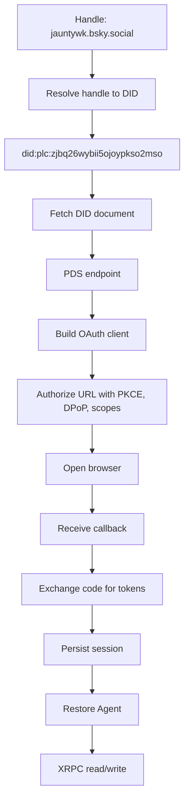

# Tassle Design Draft

## Status

Draft proposal for a CLI-first AT Protocol application that reads and updates a Mage: The Ascension character sheet stored by rpg.actor, then records Tassle-specific energy events as separate AT Protocol collections.

## Goals

- Build a TypeScript CLI that runs directly with Node type stripping.
- Use `gunshi` for command routing.
- Authenticate to AT Protocol with OAuth loopback login in the CLI.
- Read the current user's rpg.actor Mage sheet from their PDS.
- Write Tassle action records to the user's PDS.
- Keep auth and PDS/XRPC code reusable by a later Hedystia web server.
- Support localhost development and later real-domain hosting.

## Non-Goals For The First Pass

- No full web application yet.
- No hosted appview or firehose ingestion yet.
- No custom storage backend beyond local CLI config files.
- No attempt to replace rpg.actor's `actor.rpg.stats` character sheet model.

## Discovered References

- rpg.actor publishes lexicons at `https://rpg.actor/lexicons/<nsid>.json`.
- The relevant rpg.actor collection is `actor.rpg.stats`, not `rpg.actor.*`.
- `actor.rpg.stats/self` can contain a `mage` block with Mage: The Ascension stats.
- The example user `jauntywk.bsky.social` resolves to `did:plc:zjbq26wybii5ojoypkso2mso`.
- That DID's PDS endpoint is `https://puffball.us-east.host.bsky.network`.
- The example Mage sheet is at `at://did:plc:zjbq26wybii5ojoypkso2mso/actor.rpg.stats/self`.
- Skyboard's CLI is the reference implementation for AT Protocol OAuth loopback auth and file-backed session storage.
- Hedystia is the later web framework target for server routes, UI, and a durable session store.

## Naming

The user-facing name can be `tass.superbfowle.com`, but AT Protocol NSIDs should follow reverse-domain form. If the controlled domain is `tass.superbfowle.com`, the canonical AT Protocol authority prefix is:

```text
com.superbfowle.tass
```

The first Tassle collections should therefore be separate collections:

```text
com.superbfowle.tass.tassilize
com.superbfowle.tass.meditate
com.superbfowle.tass.enervate
```

This mirrors how the site `rpg.actor` uses `actor.rpg.*` collections.

## Domain Model

### External Character Sheet

The rpg.actor sheet remains the canonical RPG character state:

```text
at://<did>/actor.rpg.stats/self
```

The `mage` object can include:

- `arete`
- `willpower`
- `quintessence`
- `paradox`
- spheres such as `prime`, `time`, `mind`, `matter`, `entropy`, `life`, `spirit`, `forces`, `correspondence`
- attributes, abilities, notes, and other game-specific fields

Tassle should read this sheet first and only mutate it when a command explicitly changes character state.

### Tassle Action Records

Tassle records are event/action records. They should be append-friendly and independently addressable.

#### `com.superbfowle.tass.tassilize`

Formation of tass at a node. This is the genesis record for tangible tass.

Suggested fields:

- `node`: AT URI or string identifier for the node/source.
- `amount`: integer amount of quintessence crystallized.
- `form`: optional description of the coincidental object form.
- `sheet`: optional AT URI of the related `actor.rpg.stats` record.
- `createdAt`: datetime.
- `note`: optional text.

#### `com.superbfowle.tass.meditate`

Withdrawal of ambient quintessence from a node into a mage's pattern.

Suggested fields:

- `node`: AT URI or string identifier for the node/source.
- `amount`: integer amount drawn.
- `sheet`: optional AT URI of the related `actor.rpg.stats` record.
- `createdAt`: datetime.
- `note`: optional text.

#### `com.superbfowle.tass.enervate`

Expenditure or draining of stored quintessence/tass.

Suggested fields:

- `source`: AT URI or string identifier for the tass, node, or sheet source.
- `amount`: integer amount spent or drained.
- `purpose`: optional description of the working, effect, or expenditure.
- `sheet`: optional AT URI of the related `actor.rpg.stats` record.
- `createdAt`: datetime.
- `note`: optional text.

## Auth Model

The CLI must own the full OAuth lifecycle. The later web server should reuse the same core auth primitives, but its route and storage integrations differ.



### OAuth Steps

| Step | Model | CLI | Web Server Later | Shared |
| --- | --- | --- | --- | --- |
| Resolve handle to DID | identity lookup | yes | maybe | yes |
| Resolve DID to PDS | DID document lookup | yes | maybe | yes |
| Build OAuth metadata | client profile | loopback client | public web client | partly |
| Build authorize URL | OAuth request | yes | yes | yes |
| Receive auth code | redirect transport | local HTTP server | Hedystia route | no |
| Exchange code | OAuth callback | yes | yes | yes |
| Store state/session | persistence adapter | files | DB/session table | interface yes, impl no |
| Restore session | Agent factory | yes | yes | yes |
| Refresh token | OAuth session | yes | yes | yes |
| Make XRPC calls | AT Protocol client | yes | yes | yes |

### Shared Auth Boundary

Shared modules should not know whether they are being used by the CLI or web server. The environment-specific code should inject:

- OAuth client profile.
- State store implementation.
- Session store implementation.
- Callback transport.
- UI behavior for opening a browser or redirecting a response.

## Scopes

The CLI should request only the collections it needs:

```text
atproto
repo:actor.rpg.stats
repo:com.superbfowle.tass.tassilize
repo:com.superbfowle.tass.meditate
repo:com.superbfowle.tass.enervate
```

If editing the Mage sheet is deferred, `repo:actor.rpg.stats` is still needed because the CLI eventually needs to modify the sheet. If the first build is strictly read-only for the sheet, the write behavior can be command-gated rather than scope-gated.

## Proposed Project Layout

```text
tassle/
|-- tassle.ts
|-- package.json
|-- tsconfig.json
|-- doc/
|   `-- design.gpt.md
|-- lexicons/
|   |-- com.superbfowle.tass.tassilize.json
|   |-- com.superbfowle.tass.meditate.json
|   `-- com.superbfowle.tass.enervate.json
`-- src/
    |-- cli/
    |   `-- main.ts
    |-- commands/
    |   |-- login.ts
    |   |-- logout.ts
    |   |-- whoami.ts
    |   |-- sheet.ts
    |   |-- tassilize.ts
    |   |-- meditate.ts
    |   `-- enervate.ts
    |-- auth/
    |   |-- agent.ts
    |   |-- client.ts
    |   |-- profiles.ts
    |   |-- scopes.ts
    |   `-- stores/
    |       |-- file-store.ts
    |       `-- hedystia-store.ts
    |-- atproto/
    |   |-- identity.ts
    |   |-- pds.ts
    |   |-- mage-sheet.ts
    |   `-- tassle-records.ts
    `-- config.ts
```

## CLI Commands

### Auth Commands

```text
tassle login <handle>
tassle whoami
tassle logout
```

`login` performs the full OAuth loopback lifecycle and stores session data in `~/.config/tassle/`.

### Sheet Commands

```text
tassle sheet
tassle sheet --json
tassle sheet --repo jauntywk.bsky.social --rkey self
```

Default behavior should read the logged-in user's `actor.rpg.stats/self` record. For development, a named reference can point to:

```text
repo: did:plc:zjbq26wybii5ojoypkso2mso
pds:  https://puffball.us-east.host.bsky.network
uri:  at://did:plc:zjbq26wybii5ojoypkso2mso/actor.rpg.stats/self
```

### Tassle Action Commands

```text
tassle tassilize --node <node> --amount <n> [--form <text>] [--note <text>]
tassle meditate --node <node> --amount <n> [--note <text>]
tassle enervate --source <source> --amount <n> [--purpose <text>] [--note <text>]
```

Each command writes to its own collection using `com.atproto.repo.putRecord`.

## Read/Write Behavior

### Reading The Mage Sheet

Use authenticated `Agent` where available, but allow public reads by direct PDS XRPC for debugging:

```text
GET /xrpc/com.atproto.repo.getRecord
  repo=<did-or-handle>
  collection=actor.rpg.stats
  rkey=self
```

The CLI should normalize legacy/case-varied Mage fields where useful for display, but writes should preserve the rpg.actor field names expected by the lexicon.

### Writing Tassle Records

Use authenticated writes:

```text
com.atproto.repo.putRecord
  repo=<authenticated DID>
  collection=com.superbfowle.tass.enervate
  rkey=<generated TID or semantic key>
  record={...}
```

Use generated TID rkeys by default. Semantic rkeys can be added later if action identity needs stable names.

### Updating The Mage Sheet

Updating `actor.rpg.stats/self` should be explicit and conservative:

- Read current record.
- Apply a narrow patch to `mage.quintessence`, `mage.paradox`, or related fields.
- Preserve unknown fields.
- Put the whole updated record back with `updatedAt` changed.

Action records should be written before or alongside sheet updates. If a later two-phase consistency model is needed, action records can include status fields.

## Hedystia Web Server Later

The web server should reuse the auth and AT Protocol modules, but replace CLI-only pieces.

| Concern | CLI | Hedystia Web |
| --- | --- | --- |
| Callback transport | loopback `127.0.0.1:<port>/callback` | route like `/oauth/callback` |
| Session store | `~/.config/tassle/auth/*.json` | Hedystia DB table or app session storage |
| Login start | terminal command opens browser | web route redirects browser |
| Client metadata | loopback native client | public metadata on real domain |
| User interaction | stdout/stderr | HTML/API responses |
| XRPC helpers | shared | shared |
| Lexicon schemas | shared | shared |

The web server does less of the lifecycle when it is used as part of a broader system because it can receive a pre-existing session, identity, or application-auth context. It still needs the same restore/refresh/Agent path for XRPC calls.

## Implementation Phases

### Phase 1: CLI Auth Skeleton

- Add dependencies.
- Configure direct TypeScript execution.
- Add `gunshi` router.
- Add file-backed OAuth state/session store.
- Implement `login`, `whoami`, `logout`.
- Verify login against `jauntywk.bsky.social`.

### Phase 2: rpg.actor Sheet Read

- Implement identity and PDS helpers.
- Implement `actor.rpg.stats/self` getRecord helper.
- Implement `sheet` command.
- Display Mage stats in human-readable and JSON forms.

### Phase 3: Tassle Lexicons And Writes

- Add separate lexicon JSON files.
- Implement TID generation.
- Implement `putRecord` helpers for each collection.
- Add `tassilize`, `meditate`, and `enervate` commands.

### Phase 4: Sheet Mutation

- Add explicit flags for sheet updates, such as `--update-sheet`.
- Apply narrow patches to `mage.quintessence` or related fields.
- Preserve unknown rpg.actor fields.
- Add dry-run and JSON output modes.

### Phase 5: Hedystia Integration

- Add a web package or server entry.
- Add public OAuth client metadata.
- Add Hedystia callback routes.
- Add DB-backed session store.
- Reuse XRPC helpers and lexicons.

## Open Questions

- Should the CLI default to `actor.rpg.stats/self`, or should it discover per-system rkey records like `actor.rpg.stats/mage` if rpg.actor starts writing that form?
- Should Tassle action records update the Mage sheet by default, or should sheet mutation require an explicit flag?
- Should `node` and `source` fields be AT URIs only, or allow freeform string identifiers during early playtesting?
- Should lexicons be published to the user's PDS as `com.atproto.lexicon` records during setup, or only kept locally until the schema stabilizes?
