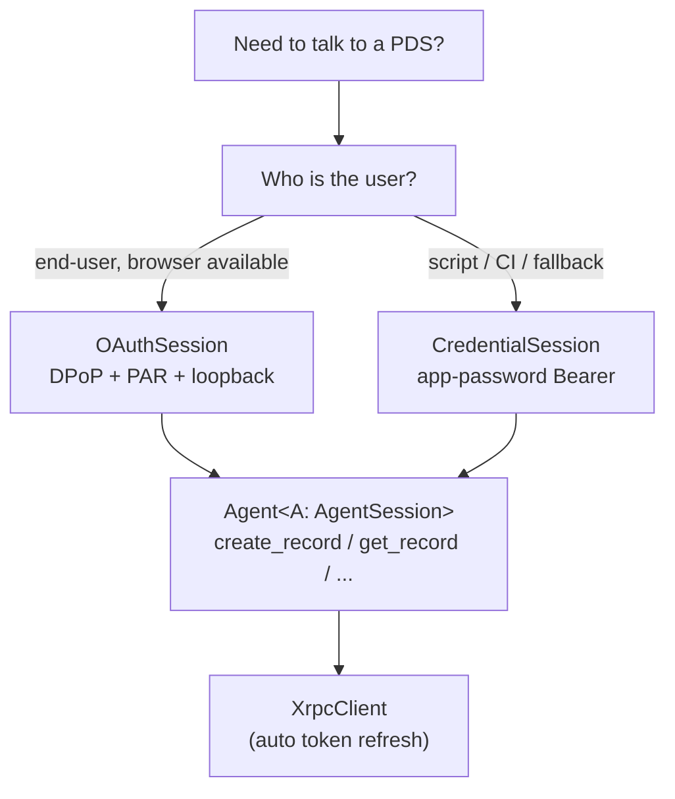

# Findings: tass auth CLI surface + session store

> **Research pass** for [`cli-surface.md`](./cli-surface.md). This document
> gathers raw, cross-comparable facts (with `file:line` citations) about how
> five reference CLIs and the Jacquard toolkit handle auth, plus a **draft**
> synthesis. Recommendations here are provisional input for the follow-up
> design conversation between rektide and the primary assistant — they are
> not a final design.
>
> Investigation was done by hand (no subagents) so the cross-comparison is
> first-hand. All archive paths are under `~/archive/`; upstream URLs are
> linked where canonical.

## 1. Executive summary

**What the surveyed CLIs converge on.** Every atproto CLI exposes the same
minimal three-command spine — `login`, `status` (a.k.a. `whoami`), `logout` —
and every one but skyboard backs it with the **OS keychain** (markbennett TS
via `@napi-rs/keyring`; Rust tangled-cli via the `keyring` crate) or a
plaintext file (skyboard). All five atproto-related tools authenticate with
either **app-password `createSession`** (markbennett, Rust tangled-cli,
Jacquard's `CredentialSession`) or **loopback OAuth via a local HTTP
callback server** (skyboard, Jacquard's `OAuthSession`). Only `gh` treats
multi-account, scope expansion, token-export, and account-switching as
first-class — and it is the single source we found that does all four well.

**Where they diverge.** (a) *Auth mechanism*: OAuth-loopback
(skyboard/Jacquard) vs. app-password (everyone else). Jacquard supports
**both**, and is the only one with a real OAuth-2.1/DPoP/PAR implementation.
(b) *Storage*: keychain (secret, single-blob) vs. JSON file
(whole-session, human-readable) vs. Jacquard's structured `ClientSessionData`
(8+ fields incl. DPoP key + nonces). (c) *Multi-account*: only `gh` truly
does it; the Rust tangled-cli scaffolds a `--profile` flag but doesn't wire
it in; skyboard/markbennett are strictly single-account. (d) *Machine
output*: inconsistent — skyboard/markbennett use `--json`, Rust tangled-cli
uses a global `--format json|table`, `gh` has no JSON on auth commands at
all.

**Headline gap Jacquard leaves for us.** Jacquard ships **no durable store**
for native targets — only `MemoryAuthStore` (OAuth), `MemorySessionStore`
(app-password), the dev-only `FileAuthStore`/`FileTokenStore` (plaintext,
no locking, no permissions), and `BrowserAuthStore` (WASM LocalStorage). A
SQLite/Turso-backed `ClientAuthStore` is explicitly listed as a known gap
([`AGENTS.md`](https://github.com/rsform/jacquard/blob/main/AGENTS.md) §"Known
gaps": *"Additional session storage backends (SQLite, etc.)"*). **Tassle
must build its own store** — and in doing so fills a Jacquard gap we could
upstream.

**One-sentence recommendation (provisional).** Model `tass auth` on `gh`'s
verb set (`login`, `status`, `logout`, `switch`, `refresh`, `token`) but
back it with Jacquard OAuth-loopback + a Turso `ClientAuthStore`, keeping
`CredentialSession` (app-password) as a fallback; expose ~6 auth verbs with
hidden top-level aliases, `--json` everywhere, and multi-account via a
global `--account` flag plus an "active DID" row.

## 2. Reference projects at a glance

| # | Project | Lang | CLI lib | Auth mechanism | Storage | Multi-account |
|---|---------|------|---------|----------------|---------|---------------|
| 1 | skyboard | TS | commander | OAuth loopback (`@atproto/oauth-client-node`) | JSON files, `~/.config/skyboard/` | No |
| 2 | create-tangled-repo | TS/Bun | (none, playwright) | Web-cookie scraping via headless browser | Playwright `storageState` JSON | No |
| 3 | markbennett tangled-cli | TS | commander | App password (`@atproto/api`) | OS keychain + plaintext metadata | No |
| 4 | did:plc:5rtp… tangled-cli | Rust | clap derive | App password (createSession, hand-rolled reqwest) | OS keyring + TOML config | Scaffolded only (`--profile`) |
| 5 | `gh` | Go | cobra | OAuth web + PAT paste | OS credential store ⇢ plaintext `hosts.yml` | **Yes (first-class)** |
| 6 | Jacquard | Rust | (library) | **Both**: OAuth DPoP/PAR + app-password | `MemoryAuthStore`, dev-only `FileAuthStore`, WASM `BrowserAuthStore` | Via `SessionKey{did,session_id}` |

Notable: **none** of the atproto CLIs use Jacquard yet. The Rust
tangled-cli depends on `atrium-*` in its manifest
([`Cargo.toml`](file:///home/rektide/archive/did:plc:5rtpn23tmq5jocptcbkooj4b/tangled-cli/Cargo.toml))
but its API client is actually hand-rolled `reqwest`
([`crates/tangled-api/src/client.rs:36-57`](file:///home/rektide/archive/did:plc:5rtpn23tmq5jocptcbkooj4b/tangled-cli/crates/tangled-api/src/client.rs))
— so **there is no direct Jacquard-using CLI sibling to copy**. We are the
first, which means Jacquard's own `examples/` are our best architectural
reference.

## 3. Area A — Auth CLI surface survey

### 3.1 Master comparison table

| Command / capability | skyboard | markbennett | Rust tangled-cli | `gh` | (Jacquard exposes, no CLI) |
|---|---|---|---|---|---|
| `login` | ✓ `login <handle>` | ✓ `auth login` (prompt) | ✓ `auth login [--handle --password --pds]` | ✓ `auth login [--hostname --web --with-token --scopes --git-protocol]` | `OAuthClient::login_with_local_server`, `CredentialSession::login` |
| `logout` | ✓ | ✓ `auth logout` | ✓ `auth logout` | ✓ `auth logout [-h -u]` (per-account) | `OAuthSession::logout`, `CredentialSession::logout` |
| `status` / `whoami` | ✓ `whoami`, `status` (both `--json`) | ✓ `auth status` | ✓ `auth status` | ✓ `auth status [-h -t]` (multi-account, token-source detection) | `session_info()`, `endpoint()` |
| `switch` (account) | ✗ | ✗ (must logout first) | ✗ (`--profile` plumbed, unused) | ✓ `auth switch [-h -u]` | `CredentialSession::switch_session` |
| `refresh` (scope expand) | ✗ | ✗ | ✗ | ✓ `auth refresh [--scopes --remove-scopes --reset-scopes]` | `OAuthSession::refresh` (token only; re-auth needed for new scopes) |
| `token` (export) | ✗ | ✗ | ✗ | ✓ `auth token [-h -u]` | `access_token()`, `refresh_token()` |
| `setup-git` / integration | ✗ | ✗ | ✗ | ✓ `auth setup-git` | — |
| `--json` / machine output | per-command `--json` | `--json [fields]` on issues | global `--format json\|table` | none on auth | — |
| Login flow | browser (loopback) | prompt identifier+password | prompt handle+password (`dialoguer`) | browser (default) / device-code / `--with-token` stdin | loopback server or manual paste |
| Session persistence | JSON, `~/.config/skyboard/` | keychain + `~/.config/tangled/session.json` | keyring + `~/.config/tangled/config.toml` | OS cred store ⇢ `~/.config/gh/hosts.yml` | trait-based; bring-your-own |
| Encryption at rest | ✗ (0600 files) | ✓ (keychain) | ✓ (keyring) | ✓ (cred store) or plaintext fallback | ✗ (plaintext JSON) |

### 3.2 Per-CLI narratives

#### skyboard (TS) — *our direct port origin; brief only*

Auth lives in
[`cli/src/lib/auth.ts`](file:///home/rektide/archive/disnet/skyboard/cli/src/lib/auth.ts)
and
[`cli/src/lib/config.ts`](file:///home/rektide/archive/disnet/skyboard/cli/src/lib/config.ts).
Commands: `sb login <handle>`, `sb logout`, `sb whoami [--json]`,
`sb status [--json]`, `sb use <board>`, `sb boards`
([`cli/src/index.ts:37-72`](file:///home/rektide/archive/disnet/skyboard/cli/src/index.ts)).
`use` selects a **board**, not an account — single-account throughout.

Key design points worth remembering:
- **`client_id` encodes the loopback port**
  ([`auth.ts:54`](file:///home/rektide/archive/disnet/skyboard/cli/src/lib/auth.ts)):
  `http://localhost?redirect_uri=http://127.0.0.1:PORT/callback&scope=…`.
  The port is therefore persisted in `session.json` as `oauthPort`
  ([`auth.ts:154`](file:///home/rektide/archive/disnet/skyboard/cli/src/lib/auth.ts),
  [`config.ts:172`](file:///home/rektide/archive/disnet/skyboard/cli/src/lib/config.ts))
  and **reused on restore** — a mismatch silently breaks token refresh ~1h
  later
  ([`auth.ts:211-219`](file:///home/rektide/archive/disnet/skyboard/cli/src/lib/auth.ts)).
  *(Jacquard sidesteps this — see §4.4.)*
- Storage layout: `~/.config/skyboard/config.json` (board refs),
  `session.json` (`AuthInfo{did,handle,service,oauthPort}` — the "active
  account" pointer), `auth/<base64url(sub)>.json` (one OAuth session file
  per `sub`), `state/<key>.json` (transient PKCE/CSRF). Dirs `0700`, files
  `0600` ([`config.ts:40-51,109-163`](file:///home/rektide/archive/disnet/skyboard/cli/src/lib/config.ts)).
- No encryption, no expiry handling, no multi-account, no scope expansion,
  no token export. The active-account pointer pattern (`session.json`
  separate from the session blob) is the clean, reusable idea.

#### create-tangled-repo (Bun) — *not atproto auth; web-cookie scraping*

A single-purpose bootstrap script
([`create-tangled-repo.js`](file:///home/rektide/archive/alice.mosphere.at/create-tangled-repo/create-tangled-repo.js)).
It does **not** use atproto OAuth or app passwords at all: it drives a
**headless Chromium via Playwright** to log into the Tangled *web UI* with
the user's **normal account password**, then persists the resulting browser
cookie jar (Playwright `storageState`) as a reusable "session"
([`:385-465`](file:///home/rektide/archive/alice.mosphere.at/create-tangled-repo/create-tangled-repo.js)).

Relevant takeaways for tassle:
- **Bootstrap story**: if the very first run needs to *create the user's
  repo* and that requires appview-level actions not exposed over OAuth/PDS
  XRPC, a browser-automation path may be the only option. Worth confirming
  whether `com.superbfowle.tass.*` record creation is plain
  `com.atproto.repo.createRecord` (OAuth-coverable) or needs appview
  help (not).
- **Env-var fallback pattern** is clean
  ([`:32-41`](file:///home/rektide/archive/alice.mosphere.at/create-tangled-repo/create-tangled-repo.js)):
  `TANGLED_IDENTIFIER`, `TANGLED_PASSWORD`, `TANGLED_HOST`,
  `TANGLED_SESSION_FILE`, `TANGLED_CONFIG_FILE`, etc. — every flag has an
  env-var twin. Good CLI hygiene to copy.
- **Session re-validation**: on a "session no longer valid" error it
  transparently re-runs login and retries once
  ([`:553-569`](file:///home/rektide/archive/alice.mosphere.at/create-tangled-repo/create-tangled-repo.js)).
  Jacquard gives us this for free on 401
  ([`client.rs:973-1010`](file:///home/rektide/archive/rsform/jacquard/crates/jacquard-oauth/src/client.rs)),
  but the *idea* of "one transparent re-auth retry" is worth noting.

#### markbennett tangled-cli (TS) — *keychain + app-password reference*

`auth login/logout/status` only
([`src/commands/auth.ts:9-100`](file:///home/rektide/archive/markbennett.ca/tangled-cli/src/commands/auth.ts)).
Three design choices worth flagging:

1. **OS keychain for secrets, plaintext file for the active-user pointer.**
   Session blob (full `AtpSessionData`) in keychain keyed by DID
   ([`src/lib/session.ts:28-43`](file:///home/rektide/archive/markbennett.ca/tangled-cli/src/lib/session.ts));
   a separate plaintext `~/.config/tangled/session.json` holds
   `{handle,did,pds,lastUsed}` so status works *even when the keychain is
   locked*
   ([`session.ts:80-102`](file:///home/rektide/archive/markbennett.ca/tangled-cli/src/lib/session.ts)).
   This split is the same idea as skyboard's `session.json` vs. blob, and
   as `gh`'s `hosts.yml`-vs-cred-store.
2. **`KeychainAccessError` vs. session-missing is distinguished**
   ([`api-client.ts:108-118`](file:///home/rektide/archive/markbennett.ca/tangled-cli/src/lib/api-client.ts),
   [`auth-helpers.ts:42-65`](file:///home/rektide/archive/markbennett.ca/tangled-cli/src/utils/auth-helpers.ts)):
   a locked keychain does **not** clear credentials (transient), and on
   macOS it shells out to `security unlock-keychain` interactively before
   giving up. Good resilience pattern.
3. **Cosmiconfig precedence for *non-secret* config**
   ([`src/lib/config.ts:47-73`](file:///home/rektide/archive/markbennett.ca/tangled-cli/src/lib/config.ts)):
   `TANGLED_REMOTE` env > repo-local `.tangledrc` (git-root) >
   `~/.tangledrc` > `/etc/tangledrc`. Not auth, but a tidy pattern for the
   "which PDS / which account is default" config layer.

Single-account; switching requires `auth logout` first
([`auth.ts:24-26`](file:///home/rektide/archive/markbennett.ca/tangled-cli/src/commands/auth.ts)).
Uses `@atproto/api` `AtpAgent` with app passwords
([`api-client.ts:31-60`](file:///home/rektide/archive/markbennett.ca/tangled-cli/src/lib/api-client.ts)).

#### Rust tangled-cli (did:plc:5rtp…) — *our closest structural sibling*

Clap v4 derive with a `Command` enum and **global** flags
([`crates/tangled-cli/src/cli.rs:3-32`](file:///home/rektide/archive/did:plc:5rtpn23tmq5jocptcbkooj4b/tangled-cli/crates/tangled-cli/src/cli.rs)):
`--config`, `--profile`, `--format json|table` (default table), `--verbose`,
`--quiet`, `--no-color`. Auth: `Auth::{Login,Status,Logout}` with
`AuthLoginArgs{--handle,--password,--pds}`
([`cli.rs:62-83`](file:///home/rektide/archive/did:plc:5rtpn23tmq5jocptcbkooj4b/tangled-cli/crates/tangled-cli/src/cli.rs)).

Most relevant findings:
- **`--profile` exists but is dead.** The flag is parsed globally
  ([`cli.rs:11`](file:///home/rektide/archive/did:plc:5rtpn23tmq5jocptcbkooj4b/tangled-cli/crates/tangled-cli/src/cli.rs))
  but `auth.rs` always uses `SessionManager::default()` (account slot
  fixed to `"default"`)
  ([`commands/auth.rs:37,43,52`](file:///home/rektide/archive/did:plc:5rtpn23tmq5jocptcbkooj4b/tangled-cli/crates/tangled-cli/src/commands/auth.rs)).
  `SessionManager::new(service, account)`
  ([`tangled-config/src/session.rs:47-52`](file:///home/rektide/archive/did:plc:5rtpn23tmq5jocptcbkooj4b/tangled-cli/crates/tangled-config/src/session.rs))
  *could* key multiple accounts; nobody calls it. Lesson: a `--profile`
  flag that isn't threaded through is worse than no flag.
- **Session shape** is a flat JSON blob in the keyring:
  `{access_jwt, refresh_jwt, did, handle, pds, created_at}`
  ([`session.rs:7-17`](file:///home/rektide/archive/did:plc:5rtpn23tmq5jocptcbkooj4b/tangled-cli/crates/tangled-config/src/session.rs)).
- **Global `--format json|table`** is the cleanest machine-output approach
  we saw — one flag, every command honours it, default is human. Worth
  adopting over per-command `--json`.
- **Service-auth token minting** for downstream services (knot/spindle):
  `com.atproto.server.getServiceAuth` with `aud=did:web:<host>`, `exp=+60s`
  ([`tangled-api/src/client.rs:1115-1140`](file:///home/rektide/archive/did:plc:5rtpn23tmq5jocptcbkooj4b/tangled-cli/crates/tangled-api/src/client.rs)).
  If tassle ever calls a non-PDS service (a future appview), this is the
  pattern.
- TOML config at `$XDG_CONFIG_HOME/tangled/config.toml` with
  `default/auth/knots/ui` sections
  ([`tangled-config/src/config.rs:8-86`](file:///home/rektide/archive/did:plc:5rtpn23tmq5jocptcbkooj4b/tangled-cli/crates/tangled-config/src/config.rs));
  env overrides `TANGLED_PDS_BASE` / `TANGLED_API_BASE` /
  `TANGLED_SPINDLE_BASE` ([README.md:108-111](file:///home/rektide/archive/did:plc:5rtpn23tmq5jocptcbkooj4b/tangled-cli/README.md)).

#### `gh auth` — *the UX gold standard, and the only multi-account reference*

Seven subcommands: `login`, `logout`, `refresh`, `setup-git`, `status`,
`switch`, `token`. Full flag sets captured from `--help` in the session
log; the load-bearing ideas:

- **`auth login`** defaults to an interactive **browser web flow**, stores
  the token in the OS credential store, and *falls back to plaintext*
  `hosts.yml` if no cred store. Alternatives: `--with-token` (read PAT from
  stdin) and env vars (`GH_TOKEN`/`GITHUB_TOKEN`) for headless/CI. Flags:
  `--hostname`, `--git-protocol ssh|https`, `--scopes`, `--web`,
  `--insecure-storage`.
- **`auth status`** iterates *all known hosts + all accounts per host*,
  reports the active one, and detects the token's **source** (cred store
  vs. env vs. file). `--show-token` prints it; `--hostname` filters. This
  is the model for `tass auth status` with multi-account.
- **`auth refresh`** is purpose-built for **scope expansion**:
  `--scopes`, `--remove-scopes` (idempotent), `--reset-scopes`, re-opens
  the browser. Crucially: "if you have multiple accounts … you must `auth
  switch` to that account first." For atproto OAuth, scope changes require
  a fresh authorize (scopes are bound to the grant), so this maps to a
  re-login preserving the account.
- **`auth switch`** / **`auth token`** / **`auth logout`** all take
  `--hostname` + `--user`; with ≤2 accounts switch auto-disambiguates, with
  >2 it prompts. `token` is the "pipe my creds into another tool" escape
  hatch (e.g. `gh auth token | docker login`).
- **Storage format** (`~/.config/gh/hosts.yml`, mode `0600`):

  ```yaml
  github.com:
    git_protocol: https
    users:
      rektide:
        oauth_token: ghp_…
    user: rektide          # <- the "active account" pointer, per host
    oauth_token: ghp_…     # legacy top-level mirror
  ```
  Global prefs live separately in `~/.config/gh/config.yml` (git_protocol,
  editor, prompt, pager, aliases, browser, telemetry). The split between
  *per-host credential file* and *global pref file* is exactly the
  skyboard/markbennett pattern at scale.

## 4. Area B — Jacquard auth briefing (the important section)

Upstream: [`rsform/jacquard`](https://github.com/rsform/jacquard) v0.12.0.
Crate map: `jacquard` (facade), `jacquard-oauth`, `jacquard-identity`,
`jacquard-common` (the `SessionStore` traits), `jacquard-axum` (server
side).

### 4.1 Session types — when to use which

Jacquard offers **two parallel auth stacks** unified under one `Agent`
wrapper.



| Type | Where | When to use | Auth header | Token refresh |
|---|---|---|---|---|
| **`OAuthSession<T,S,W>`** | [`oauth/client.rs:675`](https://github.com/rsform/jacquard/blob/main/crates/jacquard-oauth/src/client.rs) | Default for end-user CLI. DPoP-bound, scoped, revocable. | `DPoP <token>` + DPoP proof | Auto on `401 invalid_token` (`client.rs:973`); proactive 60 s pre-expiry (`session.rs:516`) |
| **`CredentialSession<S,T,W>`** | [`client/credential_session.rs:222`](https://github.com/rsform/jacquard/blob/main/crates/jacquard/src/client/credential_session.rs) | App-password fallback (legacy PDS, automation, accounts that can't OAuth). | `Bearer <jwt>` | Auto on `401`/expired (`credential_session.rs:705`) |
| **`BffSession` / `BrowserAuthStore`** | [`client/bff_session.rs`](https://github.com/rsform/jacquard/blob/main/crates/jacquard/src/client/bff_session.rs) | **WASM only** — front-end that proxies to a backend-for-frontend. N/A for a native CLI. | — | — |
| **`Agent<A: AgentSession>`** | [`client.rs:585`](https://github.com/rsform/jacquard/blob/main/crates/jacquard/src/client.rs) | The high-level wrapper to use for *all* record ops. `Agent::from(oauth_session)` and `Agent::from(credential_session)` both work. | delegates | delegates |

`AgentSessionExt` (record CRUD convenience methods) is auto-implemented for
anything that is `AgentSession + IdentityResolver`
([`AGENTS.md:256-258`](https://github.com/rsform/jacquard/blob/main/AGENTS.md)).

**Decision for tassle MVP**: ship `OAuthSession` (loopback) as the primary
path, keep `CredentialSession` available as a `--app-password` fallback.
Both feed into one `Agent` so the record code is identical.

### 4.2 The two store traits (and what's built-in)

Jacquard has **two separate storage abstractions**, and mixing them up is
the #1 source of confusion:

**(a) `ClientAuthStore`** — OAuth-only, in
[`jacquard-oauth/src/authstore.rs:126-171`](https://github.com/rsform/jacquard/blob/main/crates/jacquard-oauth/src/authstore.rs).
Stores **two kinds** of records:

```text
get_session(did, session_id)   -> Option<ClientSessionData>
upsert_session(ClientSessionData)
delete_session(did, session_id)
get_auth_req_info(state)       -> Option<AuthRequestData>   # transient PAR state
save_auth_req_info(&AuthRequestData)
delete_auth_req_info(state)
list_session_keys()            -> Vec<SessionKey>           # optional, default empty
```

`SessionKey = { did: Did, session_id: SmolStr }`
([`jacquard-common/src/session.rs:52`](https://github.com/rsform/jacquard/blob/main/crates/jacquard-common/src/session.rs)).
`OAuthSessionMatch` is the lookup result `{key, session}`
([`authstore.rs:17`](https://github.com/rsform/jacquard/blob/main/crates/jacquard-oauth/src/authstore.rs)).
`OAuthSessionSelector` wraps store+resolver to resolve `Handle`→`DID`
fallbacks ([`authstore.rs:40-66`](https://github.com/rsform/jacquard/blob/main/crates/jacquard-oauth/src/authstore.rs)).

**(b) `SessionStore<K, T>`** — generic K/V, in
[`jacquard-common/src/session.rs:211-229`](https://github.com/rsform/jacquard/blob/main/crates/jacquard-common/src/session.rs).
Used by `CredentialSession` as `SessionStore<SessionKey, AtpSession>`:

```text
get(&key) -> Option<T>
set(key, session)
del(&key)
list_keys() -> Vec<K>            # optional
```

Plus a **separate** `SessionSelector<M>` trait
([`session.rs:197-207`](https://github.com/rsform/jacquard/blob/main/crates/jacquard-common/src/session.rs))
for hint-based selection (`Any|Did|Handle|Key|Identifier`).

> **Bridge:** `Arc<T> where T: ClientAuthStore` *also* implements
> `SessionStore<SessionKey, ClientSessionData>`
> ([`authstore.rs:272-299`](https://github.com/rsform/jacquard/blob/main/crates/jacquard-oauth/src/authstore.rs)).
> So one OAuth store can serve both roles.

**Built-in implementations:**

| Impl | Crate | Backing | Persistent? | Secure? |
|---|---|---|---|---|
| `MemoryAuthStore` | jacquard-oauth | `DashMap` | ✗ (in-process) | n/a |
| `MemorySessionStore<K,T>` | jacquard-common | `RwLock<BTreeMap>` | ✗ | n/a |
| `FileAuthStore` (wraps `FileTokenStore`) | jacquard | **single JSON file** | ✓ | ✗ plaintext, no perms, no locking |
| `BrowserAuthStore` | jacquard | WASM `LocalStorage` | ✓ (browser) | ✗ |

`FileAuthStore` is explicitly documented **"NOT secure, only suitable for
development"**
([`session.rs:281-282`](https://github.com/rsform/jacquard/blob/main/crates/jacquard-common/src/session.rs))
— see §5.2 for its exact on-disk shape. **There is no SQLite/Turso/keyring
backend.** This is the gap tassle fills.

### 4.3 What the loopback helper provides

[`jacquard-oauth/src/loopback.rs`](https://github.com/rsform/jacquard/blob/main/crates/jacquard-oauth/src/loopback.rs)
(feature `loopback`, native only):

- **`LoopbackConfig`** (`loopback.rs:79-101`): `{ host: "127.0.0.1",
  port: Fixed(4000) | Ephemeral, open_browser: true, timeout_ms: 300_000 }`.
- **`OAuthClient::login_with_local_server(input, opts, cfg)`**
  (`loopback.rs:519`): the one-shot helper. It binds a one-shot TCP server,
  builds client metadata with `AtprotoClientMetadata::new_localhost`
  (`loopback.rs:446-470`, callback path **`/oauth/callback`**), runs
  `start_auth` (PAR), opens the browser (`try_open_in_browser`, feature
  `browser-open`), awaits the callback with timeout, runs `callback()`
  (code exchange), and returns an `OAuthSession`.
- **`resume_or_login_with_local_server(hint, opts, cfg)`**
  (`loopback.rs:533`): restore a stored session if the hint matches,
  otherwise start a new login. Returns `Ok(None)` if the hint is `Any` and
  there's nothing to resume — the signal to prompt for a handle.
- It handles **everything**: browser-open, callback server, success/failure
  HTML pages (`loopback.rs:151-175`), timeout. We do not need to write a
  loopback server.

> **Port-stability note (contrast with skyboard).** Jacquard's loopback
> builds the `client_id` from the *current* port each run
> (`loopback.rs:446`). On **restore** we don't re-run the loopback —
> `OAuthClient::restore(did, session_id)` reads `ClientSessionData` from
> the store and refreshes via the stored token endpoint
> (`client.rs:390-397`). So the skyboard "must reuse the same port or
> refresh breaks" problem **does not apply** to Jacquard's restore path.
> A fresh ephemeral port per *login* is fine.

### 4.4 The scope / permission-set model

[`jacquard-oauth/src/scopes.rs`](https://github.com/rsform/jacquard/blob/main/crates/jacquard-oauth/src/scopes.rs).
`Scope<S>` is a typed enum (`scopes.rs:93-116`): `Account`, `Identity`,
`Blob`, `Repo`, `Rpc`, `Atproto`, `Transition`, `Include`, plus OIDC
`OpenId/Profile/Email`.

Constructors on `Scope<SmolStr>` (`scopes.rs:183-361`) are the idiomatic
way to build a scope set:

```rust
let scopes = Scopes::builder()
    .atproto()
    .transition_generic()
    .repo_create("com.superbfowle.tass.node")?      // create only
    .repo_collection("com.superbfowle.tass.tass")?  // all actions
    .build()?;
```

- **`repo:<nsid>?action=create|update|delete`** — record-collection
  scopes. `repo_create`, `repo_update`, `repo_delete`, `repo_collection`
  helpers exist; `Scope::repo_all_record::<C>()` for typed collections.
- **`rpc:<nsid>` / `rpc:*`** — XRPC method scopes (with optional `?aud=`
  audience, e.g. `did:web:api.bsky.app#bsky_appview`).
- **`include:<nsid>[?aud=<did>]`** — references a **permission-set**
  lexicon (`IncludeScope { nsid, audience }`, `scopes.rs:485-490`). With
  feature `scope-check`, Jacquard eagerly fetches & expands these at
  callback time
  ([`client.rs:283-292`](https://github.com/rsform/jacquard/blob/main/crates/jacquard-oauth/src/client.rs),
  [`resolver::resolve_permission_set`](https://github.com/rsform/jacquard/blob/main/crates/jacquard-oauth/src/resolver.rs)).
  **This is the layerized.pub-style "declare a permission set, reference
  it" mechanism** — directly relevant to tassle's multi-domain authority
  story.
- `atproto` is the mandatory marker; `transition:generic` is needed for
  most current PDSes.
- `Scopes::to_normalized_string()` / `grants(&scope)` for display &
  checking. `Scopes` is a validated buffer+indices container, cheap to
  clone (`scopes.rs:931-1154`).

**For tassle's `com.superbfowle.tass.*` collections**: either enumerate
`repo_*` scopes per collection (simple, explicit) or publish a
`com.superbfowle.tass.permissions` permission-set lexicon and request
`include:com.superbfowle.tass.permissions`. The latter is more elegant and
matches the ontology direction; the former is the faster MVP.

### 4.5 Auth-store contents & DPoP key format

The persisted OAuth session is `ClientSessionData<S>`
([`oauth/src/session.rs:56-97`](https://github.com/rsform/jacquard/blob/main/crates/jacquard-oauth/src/session.rs)):

```text
account_did: Did                         # primary key
session_id: SmolStr                      # = the PAR state token; secondary key
host_url: Uri                  (PDS)
authserver_url
authserver_token_endpoint
authserver_revocation_endpoint: Option
scopes: Scopes
dpop_data: DpopClientData {              # flatten
    dpop_key: jose_jwk::Key,             # <- the private DPoP key, as a JWK
    dpop_authserver_nonce: SmolStr,
    dpop_host_nonce:      SmolStr,
}
token_set: TokenSet {                    # flatten
    iss, sub, aud, scope: Option,
    refresh_token: Option,
    access_token,
    token_type: OAuthTokenType,
    expires_at: Option<Datetime>,
}
resolved_scopes: Option<Vec<Scope>>      # populated when scope-check enabled
```

The transient PAR record is `AuthRequestData<S>`
([`session.rs:195-228`](https://github.com/rsform/jacquard/blob/main/crates/jacquard-oauth/src/session.rs)):
`{state, authserver_url, account_did?, scopes, request_uri,
authserver_token_endpoint, authserver_revocation_endpoint?, pkce_verifier,
dpop_data: DpopReqData{dpop_key, dpop_authserver_nonce?}}`.

**DPoP key is stored as a JWK** (`jose_jwk::Key`), serialized via serde
inside `DpopClientData` — i.e. a JSON object with `kty`, `crv`, `x`, `y`,
`d`. ES256 (P-256) by default (`FALLBACK_ALG`, `lib.rs:78`). So a Turso
store keeps it as a JSON `TEXT` blob (or normalized columns) — **no PEM,
no raw bytes**. (See §5.3.)

### 4.6 Identity resolution

`jacquard-identity` ([`resolver.rs`](https://github.com/rsform/jacquard/blob/main/crates/jacquard-identity/src/resolver.rs)):

- `IdentityResolver` trait: `resolve_handle(handle) -> Did`,
  `resolve_did_doc(did) -> DidDocResponse`, `options() -> &ResolverOptions`.
- **`JacquardResolver<C: HttpClient>`** is the default; constructed with
  `JacquardResolver::new(reqwest::Client, ResolverOptions::default())`.
- `ResolverOptions` configures `PlcSource` (`PlcDirectory` default vs
  `Slingshot`), PDS fallbacks, etc. (`resolver.rs:37-69`).
- Fallback chain (`resolver.rs:3-9`): handle→DID via **DNS TXT** (feature
  `dns`) → HTTPS well-known → PDS `resolveHandle` → public API → Slingshot;
  DID→doc via did:web well-known → PLC/Slingshot.
- Feature flags: `dns` (hickory-resolver) and `cache` are **on by default
  in the `jacquard` facade** (`jacquard/Cargo.toml` default features =
  `["api_full","dns","loopback","derive","cache"]`). For a CLI we want
  both.
- `OAuthResolver` (in jacquard-oauth) layers OAuth metadata discovery
  (`.well-known/oauth-authorization-server`, `…/oauth-protected-resource`)
  on top; `OAuthClient` requires `T: OAuthResolver + DpopExt`.

### 4.7 Examples — minimum viable flows

The two reference examples are short and clear:

**OAuth loopback** — [`examples/oauth_timeline.rs`](https://github.com/rsform/jacquard/blob/main/examples/oauth_timeline.rs):

```rust
let store = FileAuthStore::new(&args.store);          // dev-only store
let client_data = ClientData {
    keyset: None,
    config: AtprotoClientMetadata::default_localhost(),
};
let oauth = OAuthClient::new(store, client_data, reqwest::Client::new());
let hint  = SessionHint::from_optional_input(args.input.as_deref());
let scopes = Scopes::builder().atproto()
    .rpc_request_aud::<GetTimeline>("did:web:api.bsky.app#bsky_appview")?
    .build()?;

let session = match oauth.resume_or_login_with_local_server(
        &hint,
        AuthorizeOptions::default().with_scopes(scopes.clone()),
        LoopbackConfig::default()).await? {
    Some(s) => s,
    None => { /* prompt for handle, then oauth.login_with_local_server(...) */ }
};
let agent: Agent<_> = Agent::from(session);
let out = agent.send(GetTimeline::new().limit(5).build()).await?;
```

**App-password** — [`examples/app_password_create_post.rs`](https://github.com/rsform/jacquard/blob/main/examples/app_password_create_post.rs):
`CredentialSession::new(store, resolver)` → `resume(&hint)` → on
`LoginRequired(challenge)` call `login_from_challenge(challenge, opts)` →
`Agent::from(session)` → `agent.create_record(post, None)`.

Takeaways: **~30 lines to a working authenticated call**. The `resume`
→ `LoginRequired` → `login_from_challenge` pattern
([`credential_session.rs:514-589`](https://github.com/rsform/jacquard/blob/main/crates/jacquard/src/client/credential_session.rs))
is the idiomatic "resume-or-login" shape and maps cleanly onto a CLI
`tass login` that's also invoked implicitly by any authenticated
command. `OAuthClient` has the equivalent:
`resume_or_start_auth` / `resume_or_start_auth_for` returning
`OAuthResumeOrLogin::{Resumed, LoginUrl, NeedsInput}`
([`client.rs:399-469`](https://github.com/rsform/jacquard/blob/main/crates/jacquard-oauth/src/client.rs)).

No example does multi-account or session *switching* explicitly — the
plumbing exists (`SessionKey`, `switch_session`, `OAuthSession::to_client`
to start a second flow from inside a session, `client.rs:801-808`) but
it's left to the caller.

### 4.8 Feature flags we need

From [`jacquard-oauth/Cargo.toml:15-22`](https://github.com/rsform/jacquard/blob/main/crates/jacquard-oauth/Cargo.toml)
and the facade defaults:

**On `jacquard-oauth`:**
- `loopback` — required (the loopback server helper; native only).
- `browser-open` — required for `try_open_in_browser` (dep `webbrowser`).
- `scope-check` — **recommended**: enables pre-flight scope validation and
  eager `include:` resolution at login. Needs `T: LexiconSchemaResolver`
  too. If we publish a permission-set lexicon, we want this.
- `tracing` — optional, nice for debugging.

**On the `jacquard` facade:** the default feature set
(`api_full,dns,loopback,derive,cache`) already gives us loopback + DNS +
cache + the full generated API. That's the easy button. If `api_full` is
too heavy we can trim, but for a CLI the binary size is fine.

**Avoid (WASM-only / irrelevant):** `BrowserAuthStore` (`wasm32` only),
the `websocket`/`streaming` features unless we subscribe to a firehose.

### 4.9 Gaps in Jacquard we must fill ourselves

| Gap | Impact | Our response |
|---|---|---|
| **No durable native store** (only dev `FileAuthStore`) | blocks shipping | Implement a Turso/libsql `ClientAuthStore` (+ optional `SessionStore<SessionKey,AtpSession>` for app-password). Candidate to upstream. |
| **No encryption at rest** | tokens & DPoP key are plaintext | Our problem. Either rely on OS keyring for the *whole* blob (markbennett/Rust-tangled-cli pattern) or encrypt sensitive columns in Turso. Decide in design. |
| **No cross-process refresh lock** | two `tassle` processes could race on refresh | `SessionRegistry` uses an **in-process** per-`(DID,session_id)` `tokio::Mutex` (`session.rs:438-541`). For a single-user CLI this is fine; document as a limitation. A DB-level advisory lock is possible later. |
| **No "active account" notion** | CLI must know which DID is default | Add our own one-row pointer (like skyboard's `session.json`, `gh`'s `user:` key). Jacquard's `SessionHint::Any` returns *an* arbitrary session, not "the chosen default". |
| **No CLI at all** | we're the first | Build the `tass auth` surface ourselves; contribute learnings/examples upstream. |

## 5. Area C — Data store requirements

> No final schema here — that's the next conversation. This section
> enumerates *what* must be stored, with sensitivity / write-frequency /
> Jacquard-format annotations so a schema can be designed against it.

### 5.1 The store must implement

At minimum, **`jacquard_oauth::authstore::ClientAuthStore`** (the OAuth
path). If we keep the app-password fallback, also implement
**`SessionStore<SessionKey, AtpSession>`** for `CredentialSession`.
`FileAuthStore`
([`client/token.rs:70-195`](https://github.com/rsform/jacquard/blob/main/crates/jacquard/src/client/token.rs))
is the reference impl that does both — copy its key scheme.

### 5.2 What `FileAuthStore` stores on disk (to preserve semantics)

Single JSON object `{}` keyed by string
([`jacquard-common/src/session.rs:293-388`](https://github.com/rsform/jacquard/blob/main/crates/jacquard-common/src/session.rs)).
Each operation does a **whole-file read → modify → pretty-write**; **no
locking, no fsync, no permission setting** — hence "dev only".

```text
"oauth:<did>/<session_id>"   -> StoredSession::ClientSession(ClientSessionData)
"oauth-state:<state>"        -> StoredSession::AuthRequest(AuthRequestData)
"atp:<did>/<session_id>"     -> StoredSession::Atp(StoredAtSession { session_id, session: AtpSession })
```

where `StoredSession` is a tagged enum
([`client/token.rs:16-32`](https://github.com/rsform/jacquard/blob/main/crates/jacquard/src/client/token.rs)).
`<did>/<session_id>` is literally `SessionKey`'s `Display`
("did:plc:…/state-token") (`session.rs:79-83`).

A faithful Turso port = **three tables (or one KV table with a
`kind` discriminator)** mirroring these key shapes, each row's payload a
JSON `TEXT` column holding the serde output of the Jacquard type. This
guarantees round-trip compatibility with Jacquard's own
(de)serialization and keeps hedystia interop trivial (libsql reads the
same JSON). Normalizing fields into columns is a later optimization.

### 5.3 Per-field requirements

| Field | Source (Jacquard) | Sensitivity | Write freq | Jacquard serializes as | Scope |
|---|---|---|---|---|---|
| `account_did` | `ClientSessionData.account_did` | low | never (per session) | `Did` (string) | per-account PK |
| `session_id` | `ClientSessionData.session_id` | low | once | `SmolStr` | per-account PK (PAR `state`) |
| `handle` | (not in `ClientSessionData`; resolved separately) | low | on change | — | per-account, denormalized |
| `host_url` (PDS) | `ClientSessionData.host_url` | low | rarely | `Uri<String>` | per-account |
| `authserver_url` | `ClientSessionData.authserver_url` | low | rarely | string | per-account |
| `authserver_token_endpoint` | `.authserver_token_endpoint` | low | rarely | string | per-account |
| `authserver_revocation_endpoint` | `.authserver_revocation_endpoint` | low | rarely | `Option<string>` | per-account |
| `scopes` (granted) | `ClientSessionData.scopes` | low | on re-auth/refresh | `Scopes` → string | per-account |
| `resolved_scopes` | `.resolved_scopes` | low | at login (scope-check) | `Option<Vec<Scope>>` | per-account |
| `dpop_key` | `DpopClientData.dpop_key` | **HIGH** (private key) | once | **JWK** (`jose_jwk::Key`, JSON) | per-account |
| `dpop_authserver_nonce` | `.dpop_authserver_nonce` | medium | every authserver req | `SmolStr` | per-account |
| `dpop_host_nonce` | `.dpop_host_nonce` | medium | every PDS req | `SmolStr` | per-account (hot!) |
| `access_token` | `TokenSet.access_token` | **HIGH** | every refresh (~hours) | `SmolStr` | per-account |
| `refresh_token` | `TokenSet.refresh_token` | **HIGH** | every refresh | `Option<SmolStr>` | per-account |
| `expires_at` | `TokenSet.expires_at` | low | every refresh | `Option<Datetime>` | per-account |
| `token_type` / `iss`/`sub`/`aud`/`scope` | `TokenSet` | low | every refresh | strings/enum | per-account |
| **PAR state** `state` | `AuthRequestData.state` | medium | once per login | `SmolStr` | **transient**, global |
| `pkce_verifier` | `AuthRequestData.pkce_verifier` | **HIGH** (PKCE) | once per login | `SmolStr` | transient |
| `request_uri` | `AuthRequestData.request_uri` | low | once | string | transient |
| (PAR) scopes / authserver_* / dpop_key / nonce | `AuthRequestData` | mixed | once | as above | transient |
| **active-account pointer** | *(not in Jacquard)* | low | on switch/login | our own row | global |
| `created_at` / `last_used` | *(not in Jacquard; markbennett adds it)* | low | each use | our own column | per-account |

App-password path (if kept) adds `AtpSession { access_jwt, refresh_jwt,
did, handle, pds }`
([`client.rs:477-489`](https://github.com/rsform/jacquard/blob/main/crates/jacquard/src/client.rs))
— same sensitivity profile as the OAuth token fields.

### 5.4 DPoP key format (specific question)

**JWK.** `DpopClientData.dpop_key: jose_jwk::Key` is serialized through
serde as a JSON object. Confirmed by `BrowserAuthStore` round-tripping it
through `serde_json::to_value`
([`bff_session.rs:63-82`](https://github.com/rsform/jacquard/blob/main/crates/jacquard/src/client/bff_session.rs))
and the `FileAuthStore` test fixture
([`token.rs:337-338`](https://github.com/rsform/jacquard/blob/main/crates/jacquard/src/client/token.rs),
`generate_key(&["ES256"])`). Default curve P-256/ES256 (`FALLBACK_ALG`,
`lib.rs:78`). Not raw bytes, not PEM.

### 5.5 Concurrency / refresh across processes

- **Within one process:** `SessionRegistry` coalesces concurrent refreshes
  for the same `(DID, session_id)` behind a `DashMap<SmolStr,
  Arc<Mutex<()>>>` (`session.rs:452,494-541`) with a 60 s pre-expiry
  proactive refresh (`session.rs:516`). On permanent failure
  (`invalid_grant`) it **deletes the session** and surfaces
  `Error::RefreshFailed` (`session.rs:534-538`).
- **Across processes:** *no coordination*. `FileTokenStore` has no lock
  (`session.rs:343-373`); two `tassle` invocations refreshing the same
  session simultaneously could both hit the token endpoint and one would
  win the write. For a single-user CLI run interactively this is
  negligible; if we ever run a daemon/web tier sharing the DB, we'd need
  a Turro-level advisory lock or a `requestLock` equivalent. **Open
  question for the design call.**

### 5.6 Server-side replay protection (only if we run a web tier)

`jacquard-axum::service_auth::ReplayStore`
([`crates/jacquard-axum/src/service_auth.rs:81-181`](https://github.com/rsform/jacquard/blob/main/crates/jacquard-axum/src/service_auth.rs),
feature `service-auth-replay`) rejects replayed **service-auth JWTs** by
`jti`. `ReplayKey{iss, aud, jti}`, built-ins `InMemoryReplayStore`
(per-process) and `NoopReplayStore`. This is a **server-side** concern
(for when hedystia/tassle-server accepts incoming service-auth tokens),
**not** something the CLI's own session store needs. Flagged for the
future web-tier ticket; the AGENTS.md "Known gaps" note about "jti
tracking" appears slightly stale — the trait exists, but a shared/distributed
impl does not.

## 6. Draft recommended `tass auth` surface *(provisional — for the design call)*

Modelled on `gh`'s verb set, scoped to what Jacquard makes easy. `★` =
required-for-MVP, `☆` = nice-to-have.

| Verb | Purpose | MVP |
|---|---|---|
| `tass auth login [handle-or-did]` | OAuth loopback (default) or `--app-password` (CredentialSession). `--json`, `--scopes`, `--pds`. | ★ |
| `tass auth status` | List **all** stored accounts, mark active, show PDS + scope summary + token-expiry. `--json`. | ★ |
| `tass auth logout [<did>]` | Delete one session (default: active); `--all`. OAuth path calls `OAuthSession::logout` (revoke+delete). | ★ |
| `tass auth switch <did-or-handle>` | Set active account pointer. ≥2 accounts auto-disambiguate like `gh`. | ★ (multi-account is a stated hard-requirement) |
| `tass auth token [<did>]` | Print the current (refreshed) access token for piping. `--json`. Mirrors `gh auth token`. | ☆ |
| `tass auth refresh [--scopes …]` | Re-authorize to expand/shrink scopes (new OAuth grant; preserves account). Without args, force a token refresh. | ☆ |
| `tass auth list` | Alias-ish for `status --json` filtered to accounts only. | ☆ |

Notes:
- **Machine output**: prefer the Rust tangled-cli's **global `--format
  json|table`** over per-command `--json`. It composes better and matches
  a future web server consuming the same CLI. (Decide in design.)
- **Global `--account <did-or-handle>`** on every account-scoped command
  (overrides the active pointer for one invocation), per the brief.
- **App-password fallback**: `tass auth login --app-password` switches
  to `CredentialSession`. Same store, different table/key-prefix.

## 7. Top-level hidden aliases *(provisional)*

Hidden from `--help` (`#[command(hide = true)]` alias, or flatten to the
same handler) per the brief:

- `tass login` ≡ `tass auth login`
- `tass logout` ≡ `tass auth logout`
- `tass whoami` ≡ `tass auth status` (single-account convenience)
- `tass switch` ≡ `tass auth switch`
- *(maybe)* `tass token` ≡ `tass auth token`

Clap v4 derive sketch (one of two viable shapes — decide in design):

```rust
#[derive(Subcommand)]
enum Command {
    /// Auth subcommands (canonical)
    Auth(AuthArgs),
    // ...other top-level commands (Generate, Samples, ...)

    // Hidden top-level aliases, all flattening to auth handlers:
    #[command(hide = true, name = "login")]
    Login(LoginArgs),
    #[command(hide = true, name = "logout")]
    Logout(LogoutArgs),
    #[command(hide = true, name = "whoami")]
    Whoami(WhoamiArgs),
}
```

## 8. Bells & whistles worth copying

- **`gh auth status` multi-account view + token-source detection** — the
  single best status output we saw; adopt its "list everyone, mark active,
  show expiry" shape.
- **Global `--format json|table`** (Rust tangled-cli
  [`cli.rs:15-16`](file:///home/rektide/archive/did:plc:5rtpn23tmq5jocptcbkooj4b/tangled-cli/crates/tangled-cli/src/cli.rs))
  instead of per-command `--json`.
- **`--with-token` stdin** (gh) and **env-var fallback for every flag**
  (create-tangled-repo) — cheap, great for CI/scripting. e.g.
  `TASS_HANDLE`, `TASS_ACCOUNT`, `TASS_PDS`.
- **Plaintext active-account pointer separate from secrets**
  (skyboard/markbennett/gh all do this) so `status` works without
  unlocking the secret store. Even with Turso, keep a non-secret
  `meta`/`active` table readable without a key.
- **`KeychainAccessError` vs. session-missing distinction**
  (markbennett [`auth-helpers.ts:42-65`](file:///home/rektide/archive/markbennett.ca/tangled-cli/src/utils/auth-helpers.ts)):
  transient secret-store failures must not wipe credentials.
- **Transparent one-shot re-auth retry** on expired session
  (create-tangled-repo; Jacquard gives the token-refresh half for free).
- **`auth token` for piping** (gh) — surprisingly useful for glue.
- **Cosmiconfig-style config precedence** (markbennett
  [`config.ts:47-73`](file:///home/rektide/archive/markbennett.ca/tangled-cli/src/lib/config.ts)):
  env > repo-local > user > system, for non-secret prefs.

## 9. Open questions for the design conversation

1. **OAuth-only or also app-password for MVP?** Jacquard makes app-password
   nearly free (`CredentialSession`), but it doubles the store surface
   (`SessionStore<_,AtpSession>` + `ClientAuthStore`) and the login UI.
2. **Turso vs OS keyring for secrets.** Brief says Turso (for hedystia
   interop). But Turso is a plaintext file/DB unless *we* encrypt —
   whereas keyring is encrypted-but-single-process and TS-incompatible.
   Hybrid (keyring for DPoP key + tokens, Turso for the rest)? Decide.
3. **`--format json|table` (global) vs `--json` (per-command).** Pick one;
   recommend global.
4. **Active-account pointer location.** A row in Turso, or a separate
   tiny file (skyboard/gh style)? Affects hedystia reads.
5. **Scope strategy**: enumerate `repo_*` per `com.superbfowle.tass.*`
   collection (MVP-simple) vs. publish a permission-set lexicon and use
   `include:` (elegant, aligns with ontology work, more moving parts).
6. **Cross-process refresh locking.** Needed if a daemon/web tier ever
   shares the DB. Punt to a follow-up, or design the hook now?
7. **`scope-check` feature on or off for MVP?** On = pre-flight scope
   errors before hitting the PDS + eager `include:` expansion; requires
   `LexiconSchemaResolver` wiring. Recommend on, but confirm cost.
8. **CBOR output for auth commands.** Brief lists CBOR as a soft
   preference for the whole CLI; `auth status --format cbor` is trivial
   once `--format` is global. Confirm we actually want it for *auth*.
9. **Interop with existing TS `~/.config/tassle/` store.** Brief says
   "lovely but not required". Confirm we're free to start fresh.
10. **Upstream the Turso store?** It fills a stated Jacquard gap; do we
    design it as a standalone crate (`tass-auth-store` or
    `jacquard-sqlite-store`) from day one to ease contributing back?

## 10. Tickets to file

- [ ] **hedystia ⇄ Turso/libsql interop proof.** Verify a Bun/TS hedystia
  can open the same libsql DB tass-cli writes, read the session JSON
  blobs, and round-trip a `ClientSessionData`. (Brief explicitly asks for
  this follow-up.)
- [ ] **Implement `ClientAuthStore` (and optionally `SessionStore<_,AtpSession>`)
  over Turso/libsql** for tassle, mirroring `FileAuthStore`'s key scheme.
- [ ] **Encryption-at-rest decision & impl** for high-sensitivity fields
  (DPoP key, tokens) if Turso is the chosen store.
- [ ] **Active-account pointer** design (schema row vs. sidecar file).
- [ ] **`tass auth` CLI surface**: implement verbs from §6 behind the
  clap structure in `crates/tass-cli/src/main.rs`.
- [ ] **Jacquard gap report / upstream offer**: "Additional session
  storage backends (SQLite, etc.)" is listed in
  [`AGENTS.md`](https://github.com/rsform/jacquard/blob/main/AGENTS.md)
  Known gaps — propose our Turso store as a contribution once stable.
- [ ] **Write a Jacquard example** for multi-account OAuth (login a 2nd
  DID via `OAuthSession::to_client`, switch active). None exists today
  and it's exactly our use case.
- [ ] **Permission-set lexicon** (`com.superbfowle.tass.permissions`?) if
  we go the `include:` route — coordinates with the lexicon/ontology
  restructure tracked separately.
- [ ] **Scope-decision spike**: enumerate vs. `include:` — small spike to
  see how `transition:generic` + a permission set renders in the atproto
  [scope builder](https://atproto.com/guides/scope-builder).

---

### Appendix — key file:line index (for follow-up)

**Jacquard (canonical: [`rsform/jacquard`](https://github.com/rsform/jacquard))**
- Session data: [`jacquard-oauth/src/session.rs:56`](https://github.com/rsform/jacquard/blob/main/crates/jacquard-oauth/src/session.rs) (`ClientSessionData`), `:154` (`DpopClientData`), `:195` (`AuthRequestData`), `:438` (`SessionRegistry` refresh-coalescing)
- Stores: [`jacquard-oauth/src/authstore.rs:126`](https://github.com/rsform/jacquard/blob/main/crates/jacquard-oauth/src/authstore.rs) (`ClientAuthStore`), `:175` (`MemoryAuthStore`); [`jacquard-common/src/session.rs:211`](https://github.com/rsform/jacquard/blob/main/crates/jacquard-common/src/session.rs) (`SessionStore`), `:293` (`FileTokenStore` "dev only"); [`jacquard/src/client/token.rs:35`](https://github.com/rsform/jacquard/blob/main/crates/jacquard/src/client/token.rs) (`FileAuthStore`)
- Loopback: [`jacquard-oauth/src/loopback.rs:79`](https://github.com/rsform/jacquard/blob/main/crates/jacquard-oauth/src/loopback.rs) (`LoopbackConfig`), `:519` (`login_with_local_server`)
- OAuth client: [`jacquard-oauth/src/client.rs:208`](https://github.com/rsform/jacquard/blob/main/crates/jacquard-oauth/src/client.rs) (`start_auth`/PAR), `:273` (`callback`), `:390` (`restore`), `:675` (`OAuthSession`), `:819` (`logout`), `:936` (`send_with_opts` auto-refresh)
- Scopes: [`jacquard-oauth/src/scopes.rs:183`](https://github.com/rsform/jacquard/blob/main/crates/jacquard-oauth/src/scopes.rs) (constructors), `:485` (`IncludeScope`), `:1151` (`Scopes::builder`)
- App-password: [`jacquard/src/client/credential_session.rs:222`](https://github.com/rsform/jacquard/blob/main/crates/jacquard/src/client/credential_session.rs), `:477` (`AtpSession`)
- Examples: [`examples/oauth_timeline.rs`](https://github.com/rsform/jacquard/blob/main/examples/oauth_timeline.rs), [`examples/app_password_create_post.rs`](https://github.com/rsform/jacquard/blob/main/examples/app_password_create_post.rs)
- Identity: [`jacquard-identity/src/resolver.rs`](https://github.com/rsform/jacquard/blob/main/crates/jacquard-identity/src/resolver.rs)
- Server replay (future): [`jacquard-axum/src/service_auth.rs:117`](https://github.com/rsform/jacquard/blob/main/crates/jacquard-axum/src/service_auth.rs) (`ReplayStore`)

**Reference CLIs (archive)**
- skyboard: [`cli/src/lib/auth.ts`](file:///home/rektide/archive/disnet/skyboard/cli/src/lib/auth.ts), [`cli/src/lib/config.ts`](file:///home/rektide/archive/disnet/skyboard/cli/src/lib/config.ts), [`cli/src/index.ts`](file:///home/rektide/archive/disnet/skyboard/cli/src/index.ts)
- create-tangled-repo: [`create-tangled-repo.js`](file:///home/rektide/archive/alice.mosphere.at/create-tangled-repo/create-tangled-repo.js)
- markbennett: [`src/commands/auth.ts`](file:///home/rektide/archive/markbennett.ca/tangled-cli/src/commands/auth.ts), [`src/lib/session.ts`](file:///home/rektide/archive/markbennett.ca/tangled-cli/src/lib/session.ts), [`src/lib/api-client.ts`](file:///home/rektide/archive/markbennett.ca/tangled-cli/src/lib/api-client.ts), [`src/lib/config.ts`](file:///home/rektide/archive/markbennett.ca/tangled-cli/src/lib/config.ts)
- Rust tangled-cli: [`crates/tangled-cli/src/cli.rs`](file:///home/rektide/archive/did:plc:5rtpn23tmq5jocptcbkooj4b/tangled-cli/crates/tangled-cli/src/cli.rs), [`…/commands/auth.rs`](file:///home/rektide/archive/did:plc:5rtpn23tmq5jocptcbkooj4b/tangled-cli/crates/tangled-cli/src/commands/auth.rs), [`crates/tangled-config/src/session.rs`](file:///home/rektide/archive/did:plc:5rtpn23tmq5jocptcbkooj4b/tangled-cli/crates/tangled-config/src/session.rs), [`crates/tangled-config/src/config.rs`](file:///home/rektide/archive/did:plc:5rtpn23tmq5jocptcbkooj4b/tangled-cli/crates/tangled-config/src/config.rs), [`crates/tangled-api/src/client.rs`](file:///home/rektide/archive/did:plc:5rtpn23tmq5jocptcbkooj4b/tangled-cli/crates/tangled-api/src/client.rs)
- `gh`: see `~/.config/gh/hosts.yml`, `~/.config/gh/config.yml`; `gh auth <cmd> --help`
