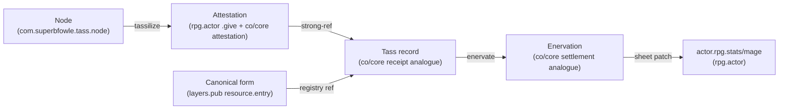
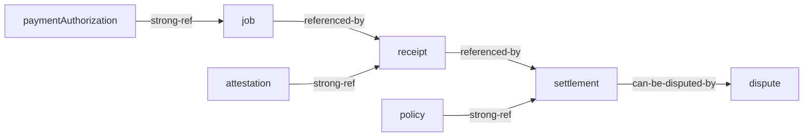
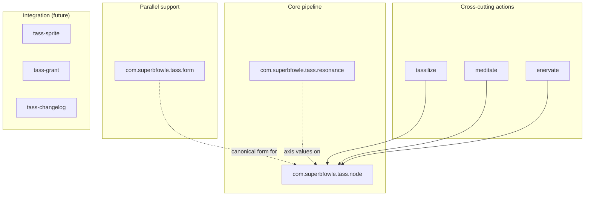
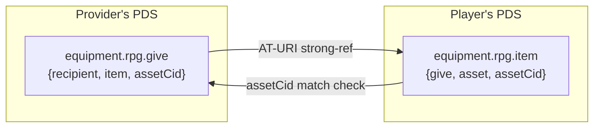
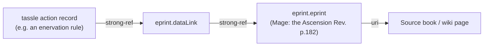

# Lexicon Ideas — Cross-ecosystem journal

This is a working journal of cross-ecosystem design ideas for tassle. It pulls threads from [`lex-rpg-actor.md`](lex-rpg-actor.md), [`lex-co-core.md`](lex-co-core.md), and [`lex-layers-pub.md`](lex-layers-pub.md) into bigger-picture syntheses. The per-ecosystem notes capture what each schema set individually offers; this file is where they meet tassle's actual design choices.

Everything here is conjecture — a place to think out loud, not a roadmap. Items that turn into real plans should graduate into their own design docs and tickets.

---

## 1. The Tass-as-inventory pattern (the single strongest convergence)

The same design surfaces independently in all three reference ecosystems. Stacked together they describe a Tass record that is more worked-out than anything in tassle today.

What each ecosystem contributes:

| Concern | Source ecosystem | Shape |
| --- | --- | --- |
| Genesis attestation ("this Tass came from this Node on this date with this resonance") | rpg.actor `equipment.rpg.give` + co/core `compute.attestation` | Node-published record, strong-ref'd by the Tass record |
| The Tass record itself (current quintessence, history, wear) | rpg.actor `equipment.rpg.item` + co/core `compute.receipt` | Mage-published record, references the genesis attestation |
| Canonical form ("a silver coin", "a vial of ink") | layers.pub `resource.entry` in a `resource.collection` | Mage's Tass record references a published form entry; ad-hoc forms allowed but unverified |
| Asset integrity (prevents retroactive quintessence inflation) | co/core `assetCid` matching | Genesis attestation hashes the original state; every mutation is checkable against it |
| Consumption record | co/core `compute.settlement` + layers.pub `changelog.entry` | Enervation record refs the Tass, captures before/after, signed |
| Visual rendering | rpg.actor `actor.rpg.sprite` pattern | Optional PNG blob + animation metadata, or a strong-ref to a generator-style decomposed layer set |
| Sheet mutation | rpg.actor `actor.rpg.stats/mage` | The Mage's actual pattern quintessence goes up/down |

A future `com.superbfowle.tass.tass` collection that supersedes today's `tassilize` action could literally re-use the `equipment.rpg.{item,give}` shapes with renamed fields, then layer co/core's `assetCid` integrity and layers.pub's source-citation machinery on top.

---

## 2. Theory-neutral schema as the unifying discipline

All three reference ecosystems converge on the same core discipline: **framework-specific stuff lives in data, not in schema**.

| Ecosystem | How it expresses the discipline |
| --- | --- |
| rpg.actor | `actor.rpg.stats` is per-system rkey (`actor.rpg.stats/<system>`) plus a `system` field inside the record. The schema does not enumerate game systems; new ones plug in without lexicon changes. |
| co/core | `dev.cocore.compute.defs` carries shared types (`money`, `tokenRate`, `tier`) used across compute, account, and exchange flows. The schema does not enumerate settlement processors or hardware attestation vendors. |
| layers.pub | Explicitly theory-neutral — frameworks are persona records, not schema fields. The same `annotationLayer` shape serves any linguistic theory. |

Tassle's `com.superbfowle.tass.resonance` already half-accidentally does this: the `system` field (`'mage'`, `'reverie'`, `'custom'`) is a theory switch. The convergence suggests going further — **replace the enum string with an AT-URI strong-ref to a published cosmology record** (a layers.pub `persona` analogue). Mage Triat, Reverie axes, Vampire Roads of Humanity, custom homebrew cosmologies: each is a published record that resonance records reference. New cosmologies plug in without lexicon changes.

---

## 3. The strong-ref discipline (or: tassle's missing integrity layer)

Co/core's compute lifecycle is rigorous about strong-refs:

Every arrow is `{uri, cid}` — the consumer can verify the referenced record hasn't been mutated. Tassle's current action records use bare AT-URI refs (the `sheet` field, the `node`/`source` fields) without CIDs. That means a Mage could publish an enervation record referencing a Tass, then mutate the Tass record retroactively to inflate the available quintessence.

Upgrading every cross-record reference to a strong-ref (`{uri, cid}` shape, à la `com.atproto.repo.strongRef`) is a near-zero-cost integrity upgrade. The downstream payoff is large: chronicle arbiters can verify the entire history of a Mage's career without trusting any party's current state.

This generalizes beyond tassle — rpg.actor's `equipment.rpg.item.give` field is also a bare AT-URI today, with the same vulnerability. There's an open design opportunity for a stronger integrity layer across all three ecosystems.

---

## 4. The sovereign-balance trilemma

Three different models for sovereign token balances across the reference ecosystems:

| Model | Source | Strength | Weakness |
| --- | --- | --- | --- |
| **Self-written state** | rpg.actor `actor.rpg.stats` | Fully sovereign: the Mage owns their pattern | Unverifiable: anyone could write any quintessence value |
| **Attested by authority** | co/core `account.{tokenGrant,tokenPatronage}` | Auditable: the exchange (Node/Storyteller) writes grant records | Centralized: the Mage depends on the attester |
| **Hybrid** | layers.pub `persona` + reference | Self-published persona, cross-referenced by others | Complex: multiple records must be reconciled |

Tassle today is firmly in the self-written-state model: the Mage writes their `actor.rpg.stats/mage` record including the `quintessence` field, and the action records (`tassilize`/`meditate`/`enervate`) are a paper trail of intent rather than enforcement. This matches rpg.actor's "you are always in control of your records" principle.

The co/core model is worth considering for **Node-side attestation**: a Node (or its Storyteller) writes patronage records to its own PDS naming each Mage who has drawn from it, with amounts and dates. The Mage's pattern becomes the join of (their self-published sheet) ∩ (the set of valid Node attestations). Two-source verification makes fabrication much harder.

---

## 5. The four-tier lexicon discipline

Layers.pub explicitly organizes its lexicons into four tiers ([see their overview](https://docs.layers.pub/foundations/lexicon-overview)):

- **Core pipeline** — primitives, the data model backbone
- **Parallel support** — orthogonal concerns that don't depend on each other
- **Integration layers** — connections to the wider ecosystem
- **Cross-cutting** — concerns that touch everything (changelog, alignment)

Tassle's lexicons are currently flat. The same reorganization would clarify the design:

The current `com.superbfowle.tass.form` belongs in parallel support (it's a registry, orthogonal to the Node backbone). The action records are cross-cutting (they mutate the Mage's sheet, which is upstream rpg.actor territory). Future integration lexicons (Tass-as-sprite, Tass patronage, sheet changelog) slot in cleanly.

---

## 6. The paired-record pattern as a general principle

Rpg.actor's `equipment.rpg.{item,give}` is the canonical paired-record shape:

One record on each party's PDS, cross-referenced, integrity-checked. This generalizes to every multi-party relationship in tassle:

| Relationship | Party A's record | Party B's record | Integrity check |
| --- | --- | --- | --- |
| Tass crystallization | Node's `.give` analogue (genesis attestation) | Mage's Tass record (current state) | `assetCid` or resonance-profile hash |
| Sheet validation | Storyteller's `actor.rpg.master` analogue | Mage's `actor.rpg.stats/mage` | `snapshotScope` comparison |
| Cabal membership | Mage A's `.friend` analogue | Mage B's reciprocal `.friend` analogue | bidirectional declaration (no acceptance required) |
| Sphere teaching | Mentor Mage's attestation record | Student Mage's record acknowledging | strong-ref + signature |

Tassle currently uses paired records for none of these — every relationship is encoded inside a single Mage's record. Adopting the paired-record discipline across the board is a structurally cleaner model that also matches the existing `equipment.rpg` precedent.

---

## 7. The lazy-mint regen pattern

Co/core's `exchangePolicy.weeklyRefresh` is worth calling out on its own:

> Optional 'use-it-to-keep-it' refresh that lazily issues `amountPerDid` tokens to active DIDs every `cadenceMinutes`. The refresh only fires when the DID touches the network (receipt as either side, balance read, governance act) — dormant DIDs accrue nothing.

This is **almost exactly** the Mage rule for Node ambient-quintessence regen. Nodes regenerate toward their capacity (`rating × 5`) on a schedule, but — critically — a Node that no Mage ever visits should not accrue an infinite backlog. The lazy-mint pattern prevents that failure mode for free:

- A Node's `ambientQuintessence` regenerates by `rating` per week
- The regen fires **only when a Mage touches the Node** (meditate, tassilize, or just observe)
- A dormant Node stays at whatever state it was last left in
- The total system energy stays bounded: sum of (active Nodes × weekly regen) is the compute-equivalent of "new compute coming online"

Tassle's current `com.superbfowle.tass.node` has `ambientQuintessence` as a mutable integer but no regen semantics. Adding a `regenPolicy` object borrowed from `exchangePolicy` would specify the rate, the cadence, and the trigger condition in one place.

---

## 8. The verifier-must-recompute discipline

Co/core's `compute.attestation.tier` field carries an important warning:

> The provider's self-asserted confidentiality tier for work done under this attestation. ADVISORY ONLY: a verifier MUST recompute the tier from the evidence in this record … and MUST NOT trust this field. Present so consumers can display the provider's claim before verifying.

The same discipline should apply to any tassle field that is *derived from* other fields rather than *primary data*. Specifically:

- `com.superbfowle.tass.node.ambientQuintessence` — derived from the action history (meditate additions, tassilize subtractions, regen events). A self-asserted value is informational; the verifier walks the action history and recomputes.
- `actor.rpg.stats/mage.quintessence` — derived from the action history. Same.
- Any future `totalResonance` or `alignedTo` field on a Tass record — derived from the resonance profile.

The principle: **fields that can be recomputed should be recomputed**. Self-asserted values are present for display convenience only. Verifiers (chronicle arbiters, appviews, peer Mages) must walk the strong-ref chain and verify, never trust a self-attested total.

---

## 9. Resonance as a multi-ecosystem concept

Resonance is tassle's unique contribution, but its design pulls from all three reference ecosystems:

| Ecosystem | Contribution to resonance design |
| --- | --- |
| rpg.actor | The `system` tag (game-cosmology switch) as a tagged field on every resonance-bearing record. |
| layers.pub | The `ontology` and `typeDef` shapes: typed definitions with `parentTypeRef` (resonance hierarchies), `allowedRoles` (which axes can pair), `allowedValues` (constraints on the `-1 to +1` value). |
| co/core | The verifier-must-recompute-from-evidence discipline: a Tass's asserted resonance profile is informational; the verifier recomputes from the genesis attestation + mutation history. |

A v2 `com.superbfowle.tass.resonance` could pull all three:

- `system` field upgraded from enum string to AT-URI strong-ref to a published cosmology persona (rpg.actor + layers.pub hybrid)
- Cosmology records use `ontology` shape with `parentTypeRef` for cosmology extension (layers.pub)
- Resonance profiles on Tass/Node records are always recomputable from the action history (co/core discipline)
- The graph of canonicals and their opposed-to / complementary-to / derivative-of edges uses the `graph.{graphNode,graphEdge,graphEdgeSet}` shape (layers.pub)

---

## 10. Source citation chains (the chronicle arbiter's toolset)

Layers.pub's `eprint` + `dataLink` pair is the model for grounding every tassle design decision in the Mage source material. The chain looks like:

A chronicle arbiter tool could walk this chain to verify "yes, this Paradox rule really is from M20 p. 203". This is most useful for:

- **Sphere rule citations** — every sphere rating's effect is grounded in a specific source-book page
- **Resonance type citations** — every canonical resonance (Dynamic, Static, Primordial) is grounded in a specific Triat description
- **Node / Tass form citations** — every canonical Tass form ("silver coin", "vial of ink") is grounded in a specific source-book example

Less essential than the integrity upgrades (#3, #6) but very useful for chronicle arbiters and for porting tassle to other game systems (Reverie, Vampire, custom). The same machinery that cites the Mage source book cites any other rule system tassle later supports.

---

## 11. The changelog-over-mutation principle

Layers.pub's `changelog.entry` is structurally exactly what tassle's action records *should* be, in miniature:

- **target** — any record via AT-URI (the Mage's sheet, the Node's state, the Tass record)
- **change sections** — categorized (annotations / segmentation / text / ontology / corpus for layers; quintessence / paradox / spheres / resonance for tassle)
- **change items** — typed (`added`/`changed`/`removed`/`fixed`/`deprecated`) with field path and before/after values
- **objectRef precision** — point at a specific sub-record within a target (e.g. "the `quintessence` field of the mage sheet", not just "the mage sheet")
- **optional semantic versioning** — for sheets that carry an explicit version

Today tassle's `tassilize`/`meditate`/`enervate` records are changelog entries with one section (energy) and one item type (changed) and no before/after. They are still useful but they leave most of the changelog value on the table.

A unification: a single `com.superbfowle.tass.changelog.entry` collection that supersedes the three action collections, with the existing `tassilize`/`meditate`/`enervate` becoming high-level convenience constructors that emit changelog entries. This is the layers.pub pattern (one cross-cutting collection, many specific uses) applied to tassle's action model.

---

## 12. AppView architecture convergence

All three ecosystems converge on the AppView pattern: a separate service that indexes records from many PDSes and serves read queries, explicitly a cache rather than a ledger.

| Ecosystem | AppView | Role |
| --- | --- | --- |
| co/core | `did:web:appview.cocore.dev` | Indexes provider/receipt/settlement records; serves `listReceipts`, `verifyReceipt`, `modelActivity`, etc. |
| rpg.actor | implicit (the `rpg.actor/api/*` endpoints) | Indexes stats/sprite/master/equipment records; serves directory + lookup queries |
| layers.pub | planned (per their `appview/` docs section) | Will index expression/annotation/ontology records across many repos |

Tassle's design.gpt.md mentions appview as a Phase 5+ concern, but the convergence suggests planning for it earlier. The minimum viable tassle appview indexes every `com.superbfowle.tass.*` record across every Mage's PDS and serves:

- `listNodes` / `getNode` — browse the Node directory
- `listTass` / `getTass` — browse Tass records by Node, Mage, or resonance
- `listActions` — browse the action history by Mage or Node
- `verifyTass` — walk the genesis chain and report findings (using the `verifyFinding` shape from `dev.cocore.defs`)

The `dev.cocore.defs#indexedRecord` shape (`{uri, cid, collection, repo, rkey, body, indexedAt}`) is the right wrapper for every result.

---

## 13. Dispute lifecycle for chronicle arbiters

Co/core's `compute.dispute` is a worked-out template for adjudicating conflicts. The lifecycle:

1. **Open** — a party raises a complaint (fraud, non-delivery, quality-failure, processor-chargeback, duplicate-charge, other)
2. **Adjudicate** — the exchange (Storyteller, in tassle's case) reviews evidence
3. **Resolve** — verdict (`refund-full`, `refund-partial`, `uphold-charge`, `forfeit-payout`) with optional compensating settlement record

Tassle currently has no notion of conflict. Two Mages could both `enervate` the same Tass and both records would be technically valid (the AppView would index both). A Storyteller needs a way to mark one of them as wrong.

A `com.superbfowle.tass.dispute` collection modelled on `compute.dispute` would give Storytellers that lever. The categories translate:

| co/core category | tassle category |
| --- | --- |
| fraud | forged Tass (genesis attestation invalid) |
| non-delivery | Tass never crystallized (tassilize without follow-through) |
| quality-failure | wrong resonance profile (Tass doesn't match working's requirement) |
| duplicate-charge | double-enervation (both records valid in isolation, only one should settle) |
| other | chronicle-specific disputes |

The dispute lives on the Storyteller's PDS, strong-refs the disputed record(s), and carries a verdict that downstream consumers (the AppView, peer Mages) should respect.

---

## 14. The integration path (suggested order of work)

These ideas are not equally ripe. A rough ordering by dependence and value:

1. **Strong-refs everywhere** (#3) — near-zero cost, big integrity win, prerequisite for most of the others
2. **CID integrity on Tass records** (part of #1) — the `assetCid` pattern from `equipment.rpg.{item,give}` / co/core's `compute.receipt`
3. **Theory-neutral `system` field** (#2, #9) — upgrade the resonance `system` enum to an AT-URI ref. Small schema change, large design payoff
4. **Lazy-mint regen on Nodes** (#7) — borrow co/core's `weeklyRefresh` shape for `com.superbfowle.tass.node`
5. **Verifier-must-recompute documentation** (#8) — add the discipline to tassle's own design docs and to lexicon descriptions
6. **Four-tier lexicon reorganization** (#5) — reorganize the `lexicons/` directory and the README into the layers.pub pattern
7. **Action records as changelog entries** (#11) — unify tassilize/meditate/enervate under a changelog collection
8. **Paired-record discipline** (#6) — adopt for Node attestation, sheet validation, cabal edges
9. **AppView** (#12) — minimum viable tassle appview indexing `com.superbfowle.tass.*` across many PDSes
10. **Source citations** (#10) — layers.pub eprint/dataLink pattern, mostly for chronicle arbiters
11. **Dispute lifecycle** (#13) — co/core compute.dispute template, only needed once a chronicle grows beyond one Storyteller

Items 1–5 are local schema and documentation work. Items 6–8 are the design-language evolution. Items 9–11 are infrastructure that becomes worth building once tassle has multi-Mage, multi-Storyteller traffic.

---

## 15. Open questions

- Should the Mage's pattern (quintessence in `actor.rpg.stats/mage`) ever move to a co/core-style attested-balance model (#4), or is self-written-state an essential part of rpg.actor's "your records, your authority" principle?
- Is the lazy-mint regen model (#7) right for Nodes, or does it undercut the fiction that Nodes are persistent places with continuous flow regardless of Mage attention?
- Should tassle publish its own `com.atproto.lexicon.schema` records on a publishing account's PDS, the way co/core and layers.pub do, or stick with static JSON on a project domain the way rpg.actor does?
- The four-tier lexicon reorganization (#5) is structurally clear but breaks the existing flat file layout — is the cleanup worth the migration cost at this stage?
- How much of layers.pub's source-citation machinery (#10) is useful for actual chronicle play versus over-engineering for an RPG energy ledger?

These questions should turn into tickets when they have concrete answers; for now they live here as prompts for the next pass of design work.

---

## See also

- [`lex-rpg-actor.md`](lex-rpg-actor.md) — rpg.actor ecosystem notes (host)
- [`lex-co-core.md`](lex-co-core.md) — co/core ecosystem notes (workqueue/token inspiration)
- [`lex-layers-pub.md`](lex-layers-pub.md) — layers.pub ecosystem notes (design language)
- [`doc/ref/README.md`](../ref/README.md) — manifest of every snapshotted schema and its source URL
- [`doc/design.gpt.md`](../design.gpt.md) — tassle's original design draft
