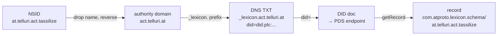

# Lexicon publication under telluri.at

> How tassle's lexicons get published, resolved, and DNS-wired. Covers the
> atproto publication mechanism, [marque.at](https://bsky.app/profile/marque.at)
> as the DNS-management path, the chosen NSID structure for `telluri.at`, and
> the delivery plan (reusable Rust CLI commands, gated on Rust OAuth writes
> landing). MVP scope: `node` + the three action collections. Resonance and
> form are deferred but their NSIDs are reserved.

This is a discovery document, not a finalized design. It captures the
understanding needed to turn publication into tickets and, later, into
`tassle lex` / `tassle dns` commands.

---

## 1. The mechanism — two halves that point at each other

Per the [Lexicon spec — Publication and Resolution](https://atproto.com/specs/lexicon#lexicon-publication-and-resolution),
publishing a lexicon so that any resolver can find it requires **two linked
halves**:

**Half A — the DNS glue.** A `TXT` record at `_lexicon.<authority>` links an
NSID authority domain to a DID:

```
_lexicon.<reversed-non-name-segments>  TXT  "did=did:plc:..."
```

The authority domain is derived from the NSID by **dropping the final segment**
(the "name") and **reversing the rest**. Resolution is **per-group, not
hierarchical**: all NSIDs that differ only by their final name segment share one
authority. Resolvers do **not** walk up or down the DNS tree — a miss is a miss.

**Half B — the lexicon record.** A `com.atproto.lexicon.schema` record in that
DID's repository, with **record key = the full NSID**:

```json
{
  "$type": "com.atproto.lexicon.schema",
  "lexicon": 1,
  "id": "<full-nsid>",
  "defs": { ... }
}
```

The `id` must be a simple NSID (no fragment) and **must match the record key**.

A resolving service walks the chain: NSID → authority domain → DNS `TXT` → DID
→ DID doc → PDS → `com.atproto.lexicon.schema/<nsid>` record.



A single repository can host lexicons for **multiple** authority domains. So one
publisher DID can serve several `_lexicon.*` TXT records.

---

## 2. marque.at — confirmed reference + the DNS tooling we consume

marque.at is a working, in-the-wild example of the full mechanism, and it is
**the registrar + nameserver already managing `telluri.at`** (see §3). Its
lexicons live at
`at://did:plc:nckosudltxrtrjkt4zz4jy5y/com.atproto.lexicon.schema/*` (PDS
`margin.cafe`), and its own resolution glue is live:

```
$ dig +short TXT _lexicon.marque.at
"did=did:plc:nckosudltxrtrjkt4zz4jy5y"
```

The marque lexicons relevant to DNS management (fetched from its PDS):

| NSID | Kind | Role for us |
| --- | --- | --- |
| `at.marque.domain` | record | A domain registration. rkey = FQDN. Carries `nameServers`, `expiresAt`, `atprotoHandle`, `atprotoVerified`, `status`. |
| `at.marque.dns` | record + `#entry` def | The DNS **zone**. rkey = FQDN. `records[]` of entries; `subject` is a strongRef to the `at.marque.domain` record. |
| `at.marque.dns.getRecords` | query | Read the parsed active DNS records for a domain from the Marque nameserver. |
| `at.marque.dns.getDsRecords` | query | DNSSEC DS records (for DNSSEC setup; not needed for `_lexicon` TXT). |
| `at.marque.authFull` | permission-set | Full create/update/delete on `at.marque.dns` + `at.marque.domain`. **The OAuth scope our publisher account must grant to manage the zone.** |
| `at.marque.partnerApi` / `at.marque.partner.*` | permission-set + queries/procedure | Partner domain-registration-via-Stripe flow. Not needed — `telluri.at` is already registered. |

### The `at.marque.dns` record shape (what we'll write)

From the published `at.marque.dns` lexicon, the zone record is:

```
collection:  at.marque.dns
rkey:        telluri.at            # the FQDN; matches the at.marque.domain rkey
value:
  domain:    telluri.at            # denormalized FQDN
  subject:   { strongRef to at.marque.domain/telluri.at }
  records:   [ #entry, ... ]
  createdAt: <datetime>
```

The `#entry` def:

| field | type | notes |
| --- | --- | --- |
| `name` | string | **Relative to the zone apex.** `@` = apex itself. |
| `recordType` | string | `A`/`AAAA`/`CNAME`/`MX`/`TXT`/`SRV`/`NS`/`CAA` |
| `value` | string | The rdata |
| `ttl` | integer | seconds, min 1 |
| `priority` | integer | MX/SRV only |

So a `_lexicon` TXT under the `telluri.at` apex is an entry with
`name: "_lexicon"` (or `"_lexicon.act"` for the subdomain authority) — **not**
the full `_lexicon.telluri.at`.

---

## 3. telluri.at — current state

```
$ dig +short NS telluri.at
cirrus.ns.marque.network.
stratus.ns.marque.network.
```

**Already delegated to Marque nameservers**, but the zone is empty — no `A`,
no apex `TXT`, no `_lexicon` records, and no `at.marque.dns` record published
for it yet. So `telluri.at` is registered and on Marque's NS, but unconfigured.
That is exactly the starting point §5 addresses.

---

## 4. The NSID structure

Base authority is `telluri.at`. The MVP groups top-level entities separately
from the `.act` action group.

### MVP set (to publish now)

| New NSID | Old placeholder | Authority domain | Record key |
| --- | --- | --- | --- |
| `at.telluri.node` | `com.superbfowle.tass.node` | `telluri.at` | `at.telluri.node` |
| `at.telluri.act.tassilize` | `com.superbfowle.tass.tassilize` | `act.telluri.at` | `at.telluri.act.tassilize` |
| `at.telluri.act.meditate` | `com.superbfowle.tass.meditate` | `act.telluri.at` | `at.telluri.act.meditate` |
| `at.telluri.act.enervate` | `com.superbfowle.tass.enervate` | `act.telluri.at` | `at.telluri.act.enervate` |

Because nothing was ever published under the `com.superbfowle.tass.*`
placeholder authority (samples use a fake DID and records were written
`validate:false`), **the rename has zero migration cost** — it is a rename
before first publication.

### Deferred (NSIDs reserved, not published in MVP)

| NSID | Status | Note |
| --- | --- | --- |
| `at.telluri.resonance` | deferred | The current `com.superbfowle.tass.resonance` canonical registry + `#resonanceValue`/`#resonanceProfile` defs. Shares the `telluri.at` authority with `node`. Resonance design (cosmology/typeDef/annotationLayer) is out of MVP — see [`resonance-design.md`](resonance-design.md). |
| `at.telluri.form` | likely dropped | A named tass-form registry (`materializeCost`/`totalCapacity`). Not wired into code — `node.tassForm` and `tassilize.form` are freeform strings today. Re-evaluate when forms become referenced. |

### Structural consequence: `.act` is a second authority

Introducing the `.act` segment creates a **distinct DNS authority**
(`act.telluri.at`), because resolution is per-group: each set of non-final
segments is its own authority with its own `_lexicon` lookup. The same applies
to any future group (e.g. a hypothetical `at.telluri.resonance.*` would be a
third authority, `resonance.telluri.at`).

This is not a problem — a single repo hosts many authorities — but it is a
**structural fact**: every grouping segment you add is one more `_lexicon` TXT
record to create and keep in sync. The MVP therefore has **two** authority
domains, both pointing at the same publisher DID:

| Authority domain | TXT record | Covers |
| --- | --- | --- |
| `telluri.at` | `_lexicon.telluri.at` | `at.telluri.node` (+ reserved `resonance`) |
| `act.telluri.at` | `_lexicon.act.telluri.at` | `at.telluri.act.{tassilize,meditate,enervate}` |

---

## 5. What gets published, concretely

### 5a. The DNS zone — one `at.marque.dns` record

A single `at.marque.dns` record (rkey `telluri.at`) in the **publisher
account's** repo, with two `TXT` entries pointing at the publisher DID:

```json
{
  "$type": "at.marque.dns",
  "domain": "telluri.at",
  "subject": { "$type": "com.atproto.repo.strongRef", "uri": "at://<publisher-did>/at.marque.domain/telluri.at", "cid": "..." },
  "records": [
    { "name": "_lexicon",      "recordType": "TXT", "value": "did=<publisher-did>", "ttl": 3600 },
    { "name": "_lexicon.act",  "recordType": "TXT", "value": "did=<publisher-did>", "ttl": 3600 }
  ],
  "createdAt": "2026-07-01T00:00:00.000Z"
}
```

Requires the `at.marque.authFull` permission scope (create/update on
`at.marque.dns`). An `at.marque.domain` record for `telluri.at` must also exist
as the `subject` strongRef — it may need creating if Marque did not auto-publish
one at registration.

> **Optional, later:** if the publisher account takes `telluri.at` as its
> handle, add a third entry `name:"_atproto"`, `recordType:"TXT"`,
> `value:"did=<publisher-did>"` for handle resolution. Handle can start as a
> `.bsky.social` default and switch later; it is not on the critical path.

### 5b. The lexicon records — `com.atproto.lexicon.schema` × 4

One record per NSID, rkey = full NSID, in the publisher account's repo. The
lexicon JSON already exists in
[`crates/tass-lex-schema/lexicons/`](../../crates/tass-lex-schema/lexicons/) —
it needs the `id` field renamed and `$type: "com.atproto.lexicon.schema"` added
before publication. Example, the published form of `at.telluri.node`:

```json
{
  "$type": "com.atproto.lexicon.schema",
  "lexicon": 1,
  "id": "at.telluri.node",
  "defs": {
    "main": { "type": "record", "key": "tid", "record": { ... } }
  }
}
```

The `defs` body is unchanged from the current file; only `id` (and the leading
`$type`) differ from the source JSON.

---

## 6. The canonical publisher account

A **dedicated project account** (new DID) is the authority the DNS TXT records
point to and the repo that owns both the `com.atproto.lexicon.schema` records
and the `at.marque.dns` zone record. Rationale: clean authority separation from
any individual's personal account; the project owns its schema namespace.

Open account-setup questions (manual, one-time):

- Which PDS hosts it? (A Bluesky-hosted PDS is fine to start; movable later.)
- Does it take `telluri.at` as its handle? (Clean, but needs the `_atproto`
  TXT — deferred; not blocking.)
- Who holds its credentials / OAuth session in `tassle`'s config? (Likely a
  named profile, e.g. `tassle auth login --profile telluri`.)

Scope requirements for the publisher session:

- `repo:com.atproto.lexicon.schema` (to publish lexicons)
- `at.marque.authFull` (to write the DNS zone) — this is a permission-set, not
  a wildcard; it grants create/update/delete on `at.marque.dns` +
  `at.marque.domain` only.

---

## 7. Delivery plan

```
0. Discovery doc                    ← this file; no deps
1. Project account (DID)            ← manual; canonical publisher; blocks 3–5
2. NSID rename                      ← file edits (lexicon JSON + code refs); no deps
3. Publish lexicon records          ← needs 1 + 2 + Rust write capability
4. Publish at.marque.dns zone       ← needs 1 + Rust write capability (+ authFull scope)
5. Verify resolution                ← dig + getRecord; needs 3 + 4
```

### Decisions (recorded)

- **Bootstrap path:** wait for Rust OAuth writes to land
  ([`tass-auth-mvp`](#), [`tass-config-login-kinds`](#)), then publish from the
  canonical Rust CLI. **No stopgap TS/manual script** — avoid throwaway code.
- **Tooling scope:** publication becomes **reusable CLI commands**
  (`tassle lex ...`, `tassle dns ...`), not one-off scripts. Lexicons evolve
  during dev, so re-publish must be a normal operation.
- **Doc scope:** MVP-focused. `node` + the three actions are documented
  fully; `resonance` and `form` are reserved-but-deferred.

### Dependency on the auth roadmap

The `lex publish` and `dns` commands are **gated on Rust write capability**.
They can be designed now and implemented when auth lands. The relevant tickets:

- `tass-auth-mvp` — app-password auth MVP (jac-store-fjall sessions + figment
  profile switching)
- `tass-config-login-kinds` — model logins as app-password | oauth; enable
  oauth for CLI commands

Until those land, nothing in phases 3–5 can run. Phase 2 (the rename) and
phase 0 (this doc) can proceed independently and should.

---

## 8. Proposed CLI surface

These sit outside the existing product layering (`repo` / `mage` / `ledger`)
— they are **infra/bootstrap** concerns. Sketched here to inform tickets; final
placement is a design decision (a top-level `lex` + `dns` group, or nested
under an `infra` umbrella).

### `tassle lex` — lexicon lifecycle

```
tassle lex publish [--all | --collection <nsid>]
    # read crates/tass-lex-schema/lexicons/*.json, write
    # com.atproto.lexicon.schema records (rkey = NSID) to the publisher
    # profile. Validates each against the meta-schema first; --all is the
    # normal "re-publish everything" op after a schema change.

tassle lex list [--repo <did>]
    # list published com.atproto.lexicon.schema records (verify what's live)

tassle lex show <nsid>
    # fetch one published lexicon record back

tassle lex resolve <nsid>
    # exercise the full resolution path (DNS TXT -> DID -> PDS -> getRecord),
    # reporting each hop. The end-to-end glue debugger.
```

### `tassle dns` — marque DNS management

```
tassle dns set-lexicon <authority-domain> [--did <did>]
    # upsert the _lexicon TXT entry in the at.marque.dns zone record for the
    # given authority domain (e.g. "telluri.at" -> entry name "_lexicon";
    # "act.telluri.at" -> entry name "_lexicon.act"). Wraps at.marque.dns
    # putRecord under the at.marque.authFull scope.

tassle dns show <domain>
    # thin wrapper over at.marque.dns.getRecords — show the active zone
```

The `dns` group is deliberately thin: it manages the `_lexicon` TXT entries
tassle cares about, not general-purpose DNS editing. Full zone editing stays a
manual or out-of-band concern.

---

## 9. Tickets

To file against beads (prefix from `bd config get issue_prefix`):

- **`tass-lex-nsid-rename`** — rename the 4 MVP lexicons
  (`com.superbfowle.tass.{node,tassilize,meditate,enervate}`) to the
  `at.telluri.*` / `at.telluri.act.*` NSIDs. Touches:
  [`crates/tass-lex-schema/lexicons/*.json`](../../crates/tass-lex-schema/lexicons/)
  (`id` + filenames),
  [`src/atproto/tass.ts`](../../src/atproto/tass.ts) (`TASS_COLLECTIONS`),
  [`src/auth/scopes.ts`](../../src/auth/scopes.ts),
  [`src/samples/generate.ts`](../../src/samples/generate.ts), then
  `cargo xtask codegen` + `cargo xtask samples`. Reserve (don't delete)
  `resonance` and `form` files, or move them aside.
- **`tass-lex-publish`** — the `tassle lex publish/list/show/resolve` command
  group. Gated on Rust writes. Reads lexicon JSON, writes
  `com.atproto.lexicon.schema` records.
- **`tass-dns-marque`** — the `tassle dns set-lexicon/show` command group.
  Gated on Rust writes + `at.marque.authFull` scope. Wraps `at.marque.dns`
  putRecord + `at.marque.dns.getRecords`.
- **`tass-publisher-account`** — manual setup epic: create the dedicated
  project DID, decide PDS/handle, record it as the canonical publisher
  (README + a profile entry). Not code, but tracked.

---

## 10. Open questions

1. **`at.marque.domain` for telluri.at** — does Marque auto-publish one on
   registration, or must we create it as the `subject` strongRef for the
   `at.marque.dns` record? Verify before first publish (query the publisher
   repo for `at.marque.domain/telluri.at`).
2. **CLI placement** — top-level `lex`/`dns` groups, or nested under an
   `infra` umbrella? The product layering in the README (`repo`/`mage`/
   `ledger`) doesn't have a home for bootstrap concerns.
3. **Validation strictness on publish** — `com.atproto.lexicon.schema` records
   can be written with explicit `validate:true` (PDS must resolve + validate)
   or optimistic. For our own authority the PDS will know the lexicon once
   published, but the *first* lexicon in a fresh authority has a bootstrapping
   quirk. Decide per-record.
4. **Schema evolution discipline** — once published, lexicons are frozen under
   the evolution rules (new fields optional, no type/rename changes). The
   `tassle lex publish` command should warn on breaking diffs against the
   currently-published version. Worth building into the command from the start?
5. **Resonance authority** — if/when resonance lands, does it share
   `telluri.at` with `node`, or get its own `resonance.telluri.at` (a third
   TXT)? The deferred design in [`resonance-design.md`](resonance-design.md)
   proposes collections that could go either way.

## See also

- [Lexicon spec — Publication and Resolution](https://atproto.com/specs/lexicon#lexicon-publication-and-resolution) — the canonical mechanism
- [marque.at on Bluesky](https://bsky.app/profile/marque.at/post/3moozkdbp222g) — the outline post
- [`resonance-design.md`](resonance-design.md) — the deferred resonance/cosmology restructure
- [`lexicon-ideas.md`](lexicon-ideas.md) — cross-ecosystem design journal (theme 15: "should tassle publish its own lexicon records")
- [`crates/tass-lex-schema/lexicons/`](../../crates/tass-lex-schema/lexicons/) — the source lexicon JSON to be renamed + published
- [`README.md`](../../README.md) — "Deferred: Multi-domain parameterized authority" (this doc retires that deferral for the MVP set)
