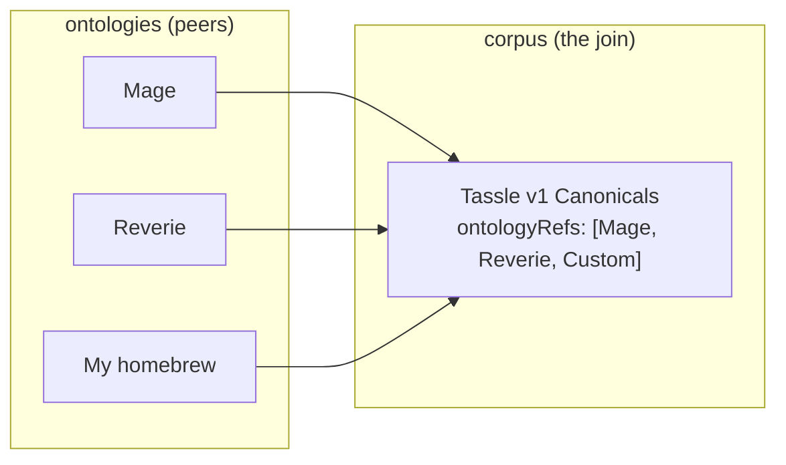

# Resonance design — open discussion

This is a discussion document, not a finalized design. The goal is to think through how tassle's resonance model should evolve by borrowing from `pub.layers.ontology` and `pub.layers.corpus`, and specifically to figure out the relationship between a **broad Mage ontology** (the whole conceptual vocabulary of Mage: the Ascension — spheres, resonance, Avatar, Paradigm, paradox, quintessence) and a **specific resonance-system ontology** (the Triat's Dynamic/Static/Primordial, Reverie's six axes, a custom homebrew cosmology).

It ends with open questions. Please push back on anything that feels wrong.

---

## The framing observation

Tassle's current resonance lexicon ([`lexicons/com.superbfowle.tass.resonance.json`](../../lexicons/com.superbfowle.tass.resonance.json)) is — read charitably — a degenerate `pub.layers.ontology` instance with one collection and one typeDef kind. Specifically:

| tassle today | layers.pub analogue |
| --- | --- |
| `com.superbfowle.tass.resonance.main` (the canonical record) | `pub.layers.ontology.typeDef` with `typeKind: "attribute-type"`, `allowedValues: ["-1..1"]` |
| `main.system` field (`'mage'`/`'reverie'`/`'custom'`) | `pub.layers.ontology.ontology` record (the parent ontology the typeDef belongs to) — but inlined as a string instead of an AT-URI ref |
| `main.cosmology` field (`'Wyld'`, `'Weaver'`, `'Wyrm'`) | A `pub.layers.defs#knowledgeRef` to the in-fiction source referent |
| `main.opposedTo` (bare string) | A `pub.layers.graph.graphEdge` of type `opposed-to` between two typeDef nodes |
| `main.description` | `typeDef.gloss` |
| `resonanceValue` (`{axis, value}`) | An *instance* of an attribute-type — what layers.pub would call an annotation |
| `resonanceProfile` (`{ref, values[]}`) | An `annotationLayer` over a target entity |

That last row is the most important framing shift. **A resonance profile on a Node or Tass is, in layers.pub terms, an annotation layer over that entity.** Whether we adopt that framing fully or not, it's the right mental model: the resonance canonicals are *types*, the profiles on entities are *instances of those types*, and the current lexicon collapses both into a single record type.

## What ontology gives us

`pub.layers.ontology.ontology` is the record that names a cosmology. Read in tassle terms:

```
name:           "Mage: The Ascension"
description:    "The World of Darkness consensus-reality model...."
version:        "M20" or "rev-2.0"
domain:         "custom"            # layers.pub's knownValues list has no good RPG fit
parentRef:      <world-of-darkness ontology at-uri>
personaRef:     <White Wolf / Storyteller persona at-uri>
knowledgeRefs:  [Mage source-book citations, whitewolf.fandom.com pages, ...]
```

Then `pub.layers.ontology.typeDef` records hang off that ontology:

```
# A canonical resonance as a typeDef
ontologyRef:    <Mage ontology at-uri>
name:           "Dynamic"
typeKind:       "attribute-type"
gloss:          "The Wyld. Creation, chaos, the unshaped potential...."
parentTypeRef:  <a "Resonance" parent typeDef at-uri>
knowledgeRefs:  [Mage Revised p.167, whitewolf.fandom.com/wiki/Wyld]
features:       { cosmology: "Wyld", numericRange: [-1, +1] }

# A sphere as a typeDef
ontologyRef:    <Mage ontology at-uri>
name:           "Prime"
typeKind:       "attribute-type"
gloss:          "The sphere of working with raw quintessence itself...."
knowledgeRefs:  [Mage Revised p.190]
features:       { numericRange: [0, 5] }

# A Mage (entity-type)
ontologyRef:    <Mage ontology at-uri>
name:           "Mage"
typeKind:       "entity-type"
gloss:          "An Awakened being whose Avatar allows them to reshape reality...."
allowedRoles:   [...]                # ritual roles this entity can fill
```

This gives us four things the current lexicon lacks:

1. **Pluggable cosmologies.** Vampire, Reverie, custom homebrew — each is just another ontology record. Consumers parse any of them generically; the `system` enum string becomes an AT-URI ref to a published ontology.
2. **Type hierarchies.** `parentTypeRef` lets us say "Static Pattern is a kind of Pattern is a kind of Resonance" without flattening everything into one big list.
3. **Typed relations.** `opposedTo` today is a bare string. With `pub.layers.graph.graphEdge`, every relation between canonicals (opposed-to, complementary-to, derivative-of) is its own typed record with provenance.
4. **Source citations on every canonical.** `knowledgeRefs[]` carries theMage source-book page that defines each type. A chronicle arbiter can walk the chain to verify "yes, this Dynamic definition really is from p.167".

## What corpus adds

`pub.layers.corpus.corpus` is structurally separate from ontology — it's about **curation and review**, not definition. A corpus record wraps a set of expressions (or, in our case, a set of canonical typeDefs) into a citable, versioned, licensed whole with explicit review criteria.

Read in tassle terms:

```
name:             "Mage Revised Canonical Resonances"
version:          "1.0"
domain:           "custom"
ontologyRefs:     [<Mage ontology at-uri>]
eprintRefs:       [<Mage Revised source-book eprint at-uri>]
license:          "white-wolf-fair-use"  # whatever the citation license is
expressionCount:  3                      # Dynamic, Static, Primordial
annotationDesign: {
  redundancy: { count: 2, assignmentStrategy: "expertise-based", annotatorPool: 3 },
  adjudication: { method: "expert", dedicatedAdjudicator: true, agreementThreshold: 750 },
  qualityCriteria: [
    { metric: "percent-agreement", threshold: 800, scope: "item" },
    { metric: "custom", threshold: 1000, scope: "item" }   # "has a source citation"
  ],
  guidelinesRef: <annotation guidelines at-uri>,
  annotationRounds: 2
}
```

The really interesting fields here are the `annotationDesign` ones. Read in tassle terms, they describe **the review process for adding canonicals**:

- `redundancy.count` = how many Storytellers must sign off on a new canonical
- `redundancy.assignmentStrategy` = `"expertise-based"` (only Storytellers with certain sphere ratings)
- `adjudication.method` = `"expert"` (lead Storyteller decides) or `"majority-vote"` (cabal vote)
- `adjudication.agreementThreshold` = the consensus threshold (0-1000)
- `qualityCriteria` = "the new canonical must cite a source-book page"
- `guidelinesRef` = a published guidelines document for what makes a canonical acceptable

The corpus `membership` record then attaches individual typeDefs to the corpus, optionally with split assignment (train/dev/test/unlabeled, which in our case might be canonical/experimental/deprecated).

**What this gets us:** the difference between "anyone can publish a `com.superbfowle.tass.resonance` record on their PDS" (the current firehose) and "this set of canonicals is vetted by these Storytellers under these review criteria, version X.Y" (a citable corpus). Downstream consumers (an appview, a chronicle arbiter tool, a Mage's spell-checker) can choose which to trust.

## The convergence question (the heart of this doc)

> How might a broader Mage ontology and a specific resonance-system ontology converge in design?

Two patterns, not mutually exclusive:

### Pattern A — Nesting via `parentRef` (the extension model)

A broader Mage ontology record contains every typeDef that applies to Mage in general (spheres, Avatar, Paradigm, quintessence, paradox). Specific resonance systems like the Triat are **child ontologies** that extend it:

```mermaid
flowchart TD
  WoD["World of Darkness<br/>ontology"]
  Mage["Mage: the Ascension<br/>ontology"]
  Triat["The Triat<br/>resonance ontology"]
  Vamp["Vampire roads<br/>resonance ontology"]
  Reverie["Reverie<br/>resonance ontology"]
  CustomHomebrew["My homebrew<br/>resonance ontology"]

  WoD -- parentRef --> Mage
  Mage -- parentRef --> Triat
  Mage -- parentRef -. extends .-> Vamp
  Mage -- parentRef -. extends .-> Reverie
  Triat -- parentRef --> CustomHomebrew
```

Each child ontology inherits the parent's `knowledgeRefs` (cites the same source books) and `personaRef` (same Storyteller framework) and adds its own typeDefs. A typeDef lookup can walk the chain: "is this `Dynamic` canonical valid under my homebrew cosmology?" → walk up parentRefs until you find an ontology that declares it.

**Strengths:** clean inheritance, easy to express "my cosmology extends Mage by adding two axes". **Weaknesses:** forces a single lineage; doesn't naturally express "this corpus uses Mage AND Reverie canonicals simultaneously".

### Pattern B — Composition via `corpus.ontologyRefs[]` (the join model)

Ontologies stay independent (Mage, Reverie, Vampire are peers, not nested). A **corpus** is the join: it lists multiple `ontologyRefs[]` and collects typeDefs from each into a single curated set.



Downstream consumers cite the corpus, not the ontologies: "this Node uses the Tassle v1 canonical set" → look up the corpus → enumerate its memberships → fetch the typeDefs.

**Strengths:** natural fit for "tassle supports multiple cosmologies simultaneously". **Weaknesses:** loses the inheritance story — a homebrew cosmology can't easily say "I extend Mage by adding two axes" without explicit re-publication.

### Pattern C — Both, used for different things

The cleanest answer is probably to use both patterns for different relationships:

- **Pattern A (parentRef)** for *cosmological inheritance*: Reverie extends Mage, my homebrew extends the Triat. This is an ontological claim about how the cosmologies relate.
- **Pattern B (corpus composition)** for *operational curation*: the Tassle v1 canonical registry collects typeDefs from Mage + Reverie + custom cosmologies into a vetted set. This is an editorial claim about which canonicals tassle officially recognizes.

The two patterns compose: a corpus can include typeDefs from a child ontology that itself extends a parent. Consumers can ask both "what cosmology is this canonical from?" (Pattern A) and "is this canonical in the vetted registry?" (Pattern B).

## Where tassle should diverge from layers.pub

Layers.pub is built for linguistic annotation; tassle is built for RPG energy accounting. The fit is good but not perfect. Specific places to diverge:

1. **Numeric ranges.** Layers.pub `typeDef.allowedValues[]` is an enumerated string list. Tassle needs numeric ranges: 0-5 for spheres, -1 to +1 for resonance, 0-INF for quintessence. We can stuff these into `features: { numericRange: [...] }` but it's a stretch — better to define a tassle-native `rangeSpec` def and use it directly.

2. **No `expression` dependency.** Layers.pub ontologies describe types of *expressions* (linguistic units). Tassle's describe types of *energy entities* (Nodes, Tass, Mages). The schema should not force tassle into the expression model. The `pub.layers.ontology` shapes are usable directly without the expression pipeline.

3. **Simpler `typeKind` set.** Layers.pub has 5 type kinds (`entity-type`, `situation-type`, `role-type`, `relation-type`, `attribute-type`). Tassle probably needs only 3:
   - `entity-type` — things that exist (Mage, Node, Tass object, Avatar)
   - `attribute-type` — measurable properties (spheres, resonance axes, quintessence, paradox, arete)
   - `relation-type` — typed edges between entities/attributes (opposed-to, derived-from, attuned-to)
   
   `situation-type` and `role-type` are only relevant if we later model rituals/workings, and even then they're a Phase-later concern.

4. **No `roleSlot` machinery initially.** The frame-semantics machinery (`roleSlot.roleName`, `fillerTypeRefs`, etc.) is overkill for resonance. Keep it in mind for rituals, skip for now.

5. **`domain` knownValues list doesn't fit.** Layers.pub's `domain` enum (`general`/`biomedical`/`legal`/`financial`/`news`/`social-media`/`scientific`/`intelligence`/`dialogue`/`multimodal`/`custom`) has no RPG category. Use `custom` with a `domainUri` pointing at a published "RPG cosmology" node, or contribute `"rpg"` / `"game-cosmology"` to layers.pub upstream.

## A concrete design sketch

To make the discussion concrete, here's a sketch of what tassle v2 might look like if it adopted these patterns. Treat this as one option among several — the goal is to have something specific to argue about, not to commit to this shape.

### Option 1: Full import of layers.pub shapes

Use `pub.layers.ontology.ontology` and `pub.layers.ontology.typeDef` directly (with tassle-specific `features` for the bits that don't fit, like numeric ranges). No new tassle lexicons for cosmology or typeDefs — just publish records that reference the layers.pub schemas.

**Pros:** Zero new lexicon surface. Maximum interoperability with layers.pub consumers. Inherits all the corpus/annotation machinery for free.
**Cons:** Forces tassle into the linguistic-annotation framing. The `features: { numericRange: [...] }` workaround is ugly. Tassle becomes dependent on layers.pub reaching a stable release (currently v0.7.0-draft).

### Option 2: Tassle-native analogues

Define tassle's own `com.superbfowle.tass.cosmology` and `com.superbfowle.tass.resonanceType` collections, structurally modeled on the layers.pub ontology/typeDef shapes but with tassle-native types (numeric ranges, simpler typeKind set, no expression dependency).

```
# com.superbfowle.tass.cosmology
name:           string
description:    string
version:        string
parentRef:      at-uri              # to a parent cosmology
personaRef:     at-uri              # to the Avatar/Storyteller persona
knowledgeRefs:  knowledgeRef[]      # source-book citations
features:       featureMap
createdAt:      datetime

# com.superbfowle.tass.resonanceType (replaces the current resonance.main)
cosmologyRef:   at-uri              # replaces the current 'system' field
name:           string
kind:           "entity" | "attribute" | "relation"
gloss:          string
parentTypeRef:  at-uri
opposedToRef:   at-uri              # typed relation
complementaryToRef: at-uri[]        # typed relation
allowedRange:   { min, max, step? } # tassle-native numeric range spec
knowledgeRefs:  knowledgeRef[]
features:       featureMap
createdAt:      datetime
```

Plus a new `com.superbfowle.tass.canonicalSet` (corpus analogue) for curated registries.

**Pros:** Tassle-native. No dependency on layers.pub stability. Numeric ranges are first-class. No expression-pipeline baggage.
**Cons:** New lexicon surface to maintain. Loses automatic interop with layers.pub consumers. Have to re-derive the design choices layers.pub has already made.

### Option 3: Hybrid — import the defs, ship tassle records

Use `pub.layers.defs#knowledgeRef`, `pub.layers.defs#featureMap`, and the `pub.layers.corpus.defs#annotationDesign` shapes directly (they're general-purpose), but ship tassle-native record collections (Option 2's shapes) that embed those defs.

**Pros:** Reuses the well-designed general defs. Keeps records tassle-flavored. Corpus review machinery comes for free.
**Cons:** Slightly more coupling to layers.pub than Option 2.

My current lean is Option 3, but the call should turn on how stable layers.pub looks over the next few months and whether anyone wants tassle's cosmology records to be readable by general layers.pub consumers.

## Open questions

1. **Is the framing right?** Is treating resonance canonicals as ontology typeDefs and resonance profiles as annotation layers the right mental model, or does the linguistic-annotation framing distort tassle's actual data model? An alternative: treat them as a typed property graph (`pub.layers.graph`) where canonicals are nodes and opposed-to/complementary-to are typed edges — no ontology machinery at all.

2. **Pattern A or Pattern B for the cosmology lineage question?** Should Reverie's relationship to Mage be expressed via `parentRef` (Pattern A — Reverie extends Mage) or just via shared membership in a corpus (Pattern B — they're peers that happen to be co-cited)?

3. **Does tassle need the corpus pattern at all?** The current "anyone can publish a canonical" firehose model works for now. The corpus pattern is about *curation* and *review* — is there a tassle use case that demands that today, or is it speculative? If speculative, defer.

4. **Numeric ranges — tassle-native or pushed upstream?** If we go Option 2 or 3, the `rangeSpec` def is a tassle-local extension. Worth pushing it upstream to layers.pub so other numeric-bounded domains (any scientific measurement, any game system) can share it? The contribution would be small and well-scoped.

5. **`domain: "rpg"` upstream contribution?** Layers.pub's `knownValues` for `domain` is currently biased toward linguistic/NLP use cases. Contributing `"rpg"` (or a more general `"game"` / `"fictional-cosmology"`) might be welcome and would give tassle a non-`custom` slot.

6. **Migration story.** If we adopt cosmology records, the current `system` enum on every existing canonical record needs to become an AT-URI ref. Is this a hard migration (rewrite every existing record) or a soft one (new records use the new shape, old records continue to work with `system` as a fallback)? Probably soft, but worth being explicit.

7. **Should `opposedTo` become a first-class edge record?** Today it's a bare string. If we move to typed edges (`com.superbfowle.tass.resonanceRelation` with `fromRef`, `toRef`, `kind`), we gain the ability to express *why* two canonicals are opposed (a `gloss`, a `knowledgeRef` citing the source page that explains the opposition). Worth it?

8. **Avatar and Paradigm — do they live in the ontology or in `pub.layers.persona`?** Earlier in [`lexicon-ideas.md`](lexicon-ideas.md) section 9 I suggested `persona` for Avatars/Paradigms. With the ontology framing, they could equally be `entity-type` typeDefs. Which is cleaner — persona (the agent doing the annotating) or typeDef (the role being filled)?

9. **Source citation chains — layers.pub eprint, or roll our own?** The corpus pattern's `eprintRefs[]` is good for citing source books. But the `pub.layers.eprint` schema is much richer (DOI, arXiv, ACL Anthology, dataLinks). For Mage source-book citations, do we need that richness, or is a simple `eprintRef` enough?

10. **Who owns the Mage ontology record?** If we publish a "Mage: The Ascension" ontology, who is its `personaRef`? White Wolf Publishing (the actual publisher, defunct)? The tassle project (claiming stewardship of the cosmology for ATProto purposes)? A specific Storyteller? This is a social/governance question more than a technical one, but it shapes the schema.

## See also

- [`lex-layers-pub.md`](lex-layers-pub.md) — broader layers.pub ecosystem notes
- [`lexicon-ideas.md`](lexicon-ideas.md) — cross-ecosystem design journal (themes 2, 9, and the integration-path table are most relevant)
- [`doc/ref/pub.layers.ontology.ontology.json`](../ref/pub.layers.ontology.ontology.json), [`doc/ref/pub.layers.ontology.typeDef.json`](../ref/pub.layers.ontology.typeDef.json), [`doc/ref/pub.layers.ontology.defs.json`](../ref/pub.layers.ontology.defs.json) — source schemas
- [`doc/ref/pub.layers.corpus.corpus.json`](../ref/pub.layers.corpus.corpus.json), [`doc/ref/pub.layers.corpus.membership.json`](../ref/pub.layers.corpus.membership.json), [`doc/ref/pub.layers.corpus.defs.json`](../ref/pub.layers.corpus.defs.json) — source schemas
- [`lexicons/com.superbfowle.tass.resonance.json`](../../lexicons/com.superbfowle.tass.resonance.json) — tassle's current resonance schema

---

# Resonance design — round 2 (resolutions)

The first-round discussion above landed on enough convergences to update the design. This section records what was settled, answers the direct questions that came back, and proposes a concrete v2 sketch with sample typeDefs. New open questions at the end.

## What got settled

1. **Reverie and Mage are peer ontologies, not nested.** The Pattern A example in round 1 (`Reverie extends Mage via parentRef`) was wrong. Mage and Reverie are independent cosmologies that exist at the same level. A given Reality persona can compose both via corpus membership (Pattern B), but neither is the parent of the other.

2. **`parentRef` is for *intra-ontology* hierarchies.** Inside the Mage ontology, `Dynamic` can `parentTypeRef` up to a broader `Mage-Resonance` parent type, which itself can `parentTypeRef` up to a `Mage-Attribute` parent. Cross-ontology lineage (Mage ↔ Reverie) does *not* use `parentRef` — it uses corpus composition.

3. **Annotation as the instance frame is adopted.** A resonance profile on a Node or Tass is an annotation layer over that entity; the canonical resonance types are attribute-type defs in the ontology. This is the framing shift from round 1 that we're keeping.

4. **A new `com.superbfowle.tass.reality` collection** is the canonical-authority persona. It is a published record owned by an account (often the tassle project itself, or a Storyteller's account), declares which ontologies this reality accepts, and is the `personaRef` that every annotation layer published under this reality carries. **One account can publish multiple realities** — three different Mage chronicles, a Reverie campaign, an experimental homebrew — each as a separate reality record.

5. **Persona splits into two roles**:
   - **Reality persona** (the new `com.superbfowle.tass.reality`): the authority, owns the cosmology + review rules, publishes annotation layers down onto entities. Source of truth for "what counts in this world".
   - **Player persona** (theMage character, equivalent to rpg.actor's `actor.rpg.stats`): owns their sheet, can publish their own annotation layers over themselves, but is not an authority over consensus reality.
   
   These are different records with different lexicons. A reality is a layers.pub `persona` analogue; a player is an rpg.actor `actor` whose sheet is annotated *by* reality personas.

6. **Corpus is the authority + composition mechanism.** A reality persona publishes a corpus that declares `ontologyRefs: [<Mage ontology>, <Reverie ontology>, <custom homebrew>]` plus an `annotationDesign` describing the review process. Consensus-reality modifications ("can we add a new canonical resonance?") flow through corpus membership rules.

7. **Range spec is tassle-native, parallel to `allowedValues`.** We define a tassle-local `allowedRange` def with shape `{min, max, type: "integer" | "number", step?}`. Defer the integer-vs-number distinction at first (treat everything as integer; fractional quintessence is a known future need). Naming chosen to be parallel to `allowedValues` so future cross-ecosystem tools can dispatch on either.

8. **rpg.actor integration is via annotation, not duplication.** Tassle does not redefine spheres, arete, quintessence, paradox — those already live in `actor.rpg.stats/mage`. Tassle publishes *annotation layers* over that sheet: "this `prime` rating of 3 is annotated by theMage-reality persona with these provenance/guideline notes". The entity being annotated is the rpg.actor sheet.

## Direct answers

### What is `main` and why is it everywhere?

`main` is just convention. In an ATProto lexicon file, `defs` is a map of named definitions; the **record** type that the collection's records take their shape from is conventionally named `main`. So `pub.layers.ontology.ontology.json` has `defs.main` of `type: "record"` because every record published to the `pub.layers.ontology.ontology` collection uses that shape, and the convention is to call that def `main`.

You can name defs anything — `defs.resonanceCanonical`, `defs.sphereTypeDef`, whatever. The convention exists because:
- `com.atproto.repo.getRecord` and similar tools historically look for `#main` as the default record shape
- Most lexicons have only one record type, so the single def might as well be `main`
- Sub-defs (object shapes that the record references) get descriptive names (`roleSlot`, `featureMap`, `knowledgeRef`)

For tassle v2, multi-def lexicons should use descriptive names (`cosmology`, `resonanceType`, `rangeSpec`). The record def can stay `main` for tool compatibility, but every reusable sub-shape gets a real name.

### How does `pub.layers.graph.graphEdge` work?

A `graphEdge` record is one directed typed edge between any two Layers objects. The shape:

```
{
  source: objectRef,        # one of: localId (UUID), recordRef (AT-URI), knowledgeRef (external KB)
  target: objectRef,        # same shape as source
  edgeType: string,         # slug from knownValues list, OR edgeTypeUri for full reference
  label: string,            # optional human-readable label
  ordinal: integer,         # optional ordering
  confidence: integer,      # 0-1000
  properties: featureMap,   # open key-value properties on this edge
  metadata: annotationMetadata,
  createdAt: datetime
}
```

The `edgeType` knownValues list is huge — `coreference`, `derived-from`, `supports`, `contradicts`, `same-as`, `type-of`, plus Allen temporal relations and RCC-8 spatial relations. For tassle we'd mostly use:

- `derived-from` — a Tass is derived-from its Node
- `contradicts` — Dynamic contradicts Static (this is the opposedTo relation)
- `supports` — a resonance complements another (e.g. certain resonant pairs are canonically synergistic)
- `type-of` — a custom canonical is a type-of a parent canonical
- `annotates` — a resonance profile annotation annotates its target entity

A separate `graphEdgeSet` record batches many edges into one published record for high-volume relationships. For tassle's small graphs (one Triat = 3 nodes + 3 opposed-to edges) a single `graphEdgeSet` would do.

The `graphNode` record is for entities that don't have their own record — floating concepts. Most tassle entities (Nodes, Tass, Mages) *do* have their own records and are "implicitly nodes via objectRef" — no separate `graphNode` record needed.

### What is `roleSlot` and do we need it?

A `roleSlot` is a named position in a frame/situation type definition. From `pub.layers.ontology.defs#roleSlot`:

```
{
  roleName: string,         # e.g. "Agent", "Patient", "Theme", "ARG0"
  roleDescription: string,
  fillerTypeRefs: at-uri[], # which typeDefs can fill this slot
  collectionRef: at-uri,    # OR a resource.collection constraining fillers
  required: boolean,
  defaultValue: string,
  constraints: constraint[],# declarative constraints on fillers
  knowledgeRefs: knowledgeRef[],
  features: featureMap
}
```

It's the linguistic concept of a *frame slot* — like Fillmore's frame semantics where a "Buying" frame has Agent, Patient, Theme, Source roles. A `situation-type` typeDef for "Buying" would list its `allowedRoles` as those four roleSlots.

**Tassle relevance: skip for v1, plan for rituals.** Resonance canonicals and spheres are attribute-types; they don't have roles. Rituals (later) are situation-types: a `Working` situation might have roleSlots for `Lead Mage`, `Secondary Mage`, `Target`, `Focus Object`, each with `fillerTypeRefs` constraining what entity types can fill them. When tassle gets to modeling rituals/workings as records, roleSlot is the right shape. Not needed yet.

### What is `featureMap`?

The shape is `{entries: feature[]}` where `feature` is an open key-value entry (the file shows it has its own def). The intended use is for arbitrary typed key-value properties that don't fit the structured fields.

The user asked: *"we might want to make features which are the eponymous name of the def. features: { quintessence: ... }? but that too is also needing enumerated string list?"*

Two answers:

- For **eponymous features** (a feature named after the def it's characterizing), the featureMap pattern works — `features: { entries: [{key: "quintessence", value: 5}, {key: "prime", value: 3}, ...] }` is fine.
- For **typed values** (integer / number / enumerated string), the layers.pub `feature` shape supports all of these — see [`doc/ref/pub.layers.defs.json#feature`](../ref/pub.layers.defs.json). We do not need a separate enumerated-string-list mechanism on top of featureMap; it's already there.

That said: for the *definitional* shape of an attribute (what range can this attribute take?), featureMap is the wrong tool. Use `allowedRange` for numeric and `allowedValues` for enumerated strings, as typeDef fields. FeatureMap is for *instance* properties (what's the value on this specific entity?), not *definitional* constraints.

## A concrete v2 sketch with sample typeDefs

Two new collections plus the existing resonance lib restructured.

### `com.superbfowle.tass.reality` (new) — the authority persona

A reality is what an account publishes to declare "this is a game reality I run". It is the persona that owns consensus-reality annotations. Multiple per account.

```json
{
  "$type": "com.superbfowle.tass.reality",
  "name": "The Tuesday Chronicles",
  "description": "My home Mage chronicle, Tuesday nights, Reverie-compatible crossover.",
  "system": "mage",
  "domain": "custom",
  "domainUri": "at://did:plc:kwgllf365cwmxbnxitx4pjdj/pub.layers.graph.graphNode/<rpg-cosmology-node>",
  "kind": "expert-panel",
  "ontologyRefs": [
    "at://did:plc:<tassle-authority>/pub.layers.ontology.ontology/<mage-cosmology-rkey>",
    "at://did:plc:<tassle-authority>/pub.layers.ontology.ontology/<reverie-cosmology-rkey>"
  ],
  "knowledgeRefs": [
    { "source": "custom", "identifier": "mage-revised", "uri": "https://whitewolf.fandom.com/wiki/Mage:_The_Ascension", "label": "Mage Revised" }
  ],
  "features": { "entries": [
    { "key": "paradoxRule", "value": "backlash-per-5" },
    { "key": "quintessenceCap", "value": "avatar-rating-times-five" }
  ] },
  "createdAt": "2026-06-21T20:00:00Z"
}
```

This is structurally a layers.pub `persona.persona` (same `domain`/`domainUri`/`kind`/`parentRef`/`ontologyRefs`/`guidelines`/`knowledgeRefs`/`features` shape) with a tassle-specific `system` field kept for back-compat with the existing resonance schema. The `system` field becomes a tag that says "this reality operates in Mage cosmology" — separate from the `ontologyRefs[]` which can compose multiple peer cosmologies.

### `com.superbfowle.tass.cosmology` (new) — analog of `pub.layers.ontology.ontology`

Peers, never nested across systems. Mage, Reverie, Vampire Roads, custom homebrews are all cosmology records at the same level. `parentRef` is reserved for "this cosmology is a revision/edition of another cosmology" (e.g. Mage M20 → Mage Revised as a *publishing lineage*, not a cosmological-lineage).

```json
{
  "$type": "com.superbfowle.tass.cosmology",
  "name": "Mage: The Ascension",
  "description": "World of Darkness consensus-reality model. Awakened beings reshape reality through nine spheres of magick, fueled by Quintessence, balanced against Paradox.",
  "version": "M20-rev",
  "domain": "custom",
  "domainUri": "at://did:plc:kwgllf365cwmxbnxitx4pjdj/pub.layers.graph.graphNode/<rpg-cosmology-node>",
  "parentRef": "at://did:plc:<authority>/com.superbfowle.tass.cosmology/<mage-revised-rkey>",
  "personaRef": "at://did:plc:<authority>/com.superbfowle.tass.reality/<rkey-of-canonical-Mage-reality>",
  "knowledgeRefs": [
    { "source": "custom", "identifier": "whitewolf-mage-revised", "uri": "https://whitewolf.fandom.com/wiki/Mage:_The_Ascension", "label": "Mage Revised" },
    { "source": "custom", "identifier": "whitewolf-mage-M20", "uri": "https://www.drivethrurpg.com/product/181757", "label": "Mage 20th Anniversary Edition" }
  ],
  "createdAt": "2026-06-21T20:00:00Z"
}
```

### `com.superbfowle.tass.typeDef` (new, replaces `com.superbfowle.tass.resonance.main`)

The actual type definitions — spheres, resonance canonicals, quintessence, arete, etc. This is parallel to `pub.layers.ontology.typeDef` but with a tassle-native `allowedRange` and a reduced `kind` set.

**Sample: Quintessence as an attribute typedef**

```json
{
  "$type": "com.superbfowle.tass.typeDef",
  "cosmologyRef": "at://did:plc:<authority>/com.superbfowle.tass.cosmology/<mage-cosmology-rkey>",
  "name": "Quintessence",
  "kind": "attribute",
  "gloss": "Raw magickal energy channeled by Avatars through the Sphere of Prime. Mages store up to their Avatar rating in their pattern; Nodes produce it; Tass is its crystallized form.",
  "parentTypeRef": "at://did:plc:<authority>/com.superbfowle.tass.typeDef/<mage-energy-attribute-rkey>",
  "allowedRange": { "min": 0, "max": 20, "type": "integer" },
  "knowledgeRefs": [
    { "source": "custom", "identifier": "mage-revised-prime", "uri": "https://whitewolf.fandom.com/wiki/Quintessence_(MTAs)", "label": "Quintessence, Mage Revised" }
  ],
  "features": { "entries": [
    { "key": "carriedBy", "value": "actor.rpg.stats/mage" },
    { "key": "canonicalField", "value": "quintessence" }
  ] },
  "createdAt": "2026-06-21T20:00:00Z"
}
```

Note the **`features.carriedBy` and `features.canonicalField`** — these are how the typeDef points at the rpg.actor field that already stores the value. Tassle does *not* duplicate quintessence; it publishes an annotation layer over `actor.rpg.stats/mage` whose entries reference this typeDef.

**Sample: a sphere as an attribute typedef**

```json
{
  "$type": "com.superbfowle.tass.typeDef",
  "cosmologyRef": "at://did:plc:<authority>/com.superbfowle.tass.cosmology/<mage-cosmology-rkey>",
  "name": "Prime",
  "kind": "attribute",
  "gloss": "The Sphere of raw magick itself. Governs Quintessence, Tass, Nodes, and the energetic underpinnings of all working.",
  "parentTypeRef": "at://did:plc:<authority>/com.superbfowle.tass.typeDef/<sphere-attribute-rkey>",
  "allowedRange": { "min": 0, "max": 5, "type": "integer" },
  "knowledgeRefs": [
    { "source": "custom", "identifier": "mage-revised-prime-sphere", "uri": "https://whitewolf.fandom.com/wiki/Prime_(Sphere)", "label": "Prime Sphere" }
  ],
  "features": { "entries": [
    { "key": "carriedBy", "value": "actor.rpg.stats/mage" },
    { "key": "canonicalField", "value": "prime" }
  ] },
  "createdAt": "2026-06-21T20:00:00Z"
}
```

**Sample: a resonance canonical as an attribute typedef**

```json
{
  "$type": "com.superbfowle.tass.typeDef",
  "cosmologyRef": "at://did:plc:<authority>/com.superbfowle.tass.cosmology/<mage-cosmology-rkey>",
  "name": "Dynamic",
  "kind": "attribute",
  "gloss": "The Wyld. Creative chaos, unshaped potential, the principle of change. Opposed to Static (the Weaver).",
  "parentTypeRef": "at://did:plc:<authority>/com.superbfowle.tass.typeDef/<mage-resonance-attribute-rkey>",
  "allowedRange": { "min": -1, "max": 1, "type": "number" },
  "knowledgeRefs": [
    { "source": "custom", "identifier": "mage-revised-wyld", "uri": "https://whitewolf.fandom.com/wiki/Wyld", "label": "Wyld / Dynamic Resonance" }
  ],
  "features": { "entries": [
    { "key": "cosmology", "value": "Wyld" },
    { "key": "triatRole", "value": "creator" }
  ] },
  "createdAt": "2026-06-21T20:00:00Z"
}
```

The `parentTypeRef` here points at a `mage-resonance-attribute` parent typeDef, which itself points at `mage-attribute` — that's the intra-ontology nesting you liked. The Mage cosmology has one big typeDef tree:

```
Mage-Attribute
├── Mage-Resonance
│   ├── Dynamic         (allowedRange: -1 to +1, number)
│   ├── Static          (allowedRange: -1 to +1, number)
│   └── Primordial      (allowedRange: -1 to +1, number)
├── Mage-Sphere
│   ├── Correspondence  (allowedRange: 0 to 5, integer)
│   ├── Entropy         (...)
│   ├── Forces          (...)
│   ├── Life            (...)
│   ├── Matter          (...)
│   ├── Mind            (...)
│   ├── Prime           (...)
│   ├── Spirit          (...)
│   └── Time            (...)
├── Mage-Energy
│   ├── Quintessence    (allowedRange: 0 to 20, integer)
│   └── Paradox         (allowedRange: 0 to 20, integer)
└── Mage-Meta
    ├── Arete           (allowedRange: 0 to 10, integer)
    └── Willpower       (...)
```

This is all *inside* the Mage cosmology. The Reverie cosmology has its own tree. The two cosmologies are peers; nothing in Reverie has a `parentTypeRef` into Mage.

### `opposedTo` as a typed graphEdge

```json
{
  "$type": "pub.layers.graph.graphEdge",
  "source": { "recordRef": "at://did:plc:<authority>/com.superbfowle.tass.typeDef/<dynamic-rkey>" },
  "target": { "recordRef": "at://did:plc:<authority>/com.superbfowle.tass.typeDef/<static-rkey>" },
  "edgeType": "contradicts",
  "label": "opposedTo",
  "confidence": 1000,
  "properties": { "entries": [
    { "key": "triatRelation", "value": "opposite-poles" }
  ] },
  "metadata": {
    "author": "did:plc:<authority>",
    "tool": "tassle",
    "createdAt": "2026-06-21T20:00:00Z"
  },
  "createdAt": "2026-06-21T20:00:00Z"
}
```

The existing `edgeType: "contradicts"` from layers.pub's knownValues list is a decent fit for opposedTo; the `label: "opposedTo"` carries theMage-specific name. For multiple Triat relations in one published record, use a `graphEdgeSet`.

The bidirectional inverse (Static opposedTo Dynamic) is a separate edge record — graphEdge is directed. Either publish both or have consumers treat `contradicts` as semantically bidirectional for tassle purposes.

### An annotation layer instance (the resonance profile on a Node)

This is what the current `resonanceProfile` def becomes — an instance, not a definition:

```json
{
  "$type": "com.superbfowle.tass.annotationLayer",
  "targetRef": { "recordRef": "at://did:plc:<mage>/com.superbfowle.tass.node/<rkey>" },
  "personaRef": "at://did:plc:<authority>/com.superbfowle.tass.reality/<rkey-of-Mage-reality>",
  "ontologyRef": "at://did:plc:<authority>/com.superbfowle.tass.cosmology/<mage-cosmology-rkey>",
  "annotations": [
    {
      "typeRef": "at://did:plc:<authority>/com.superbfowle.tass.typeDef/<dynamic-rkey>",
      "value": 0.7,
      "confidence": 800
    },
    {
      "typeRef": "at://did:plc:<authority>/com.superbfowle.tass.typeDef/<primordial-rkey>",
      "value": 0.3,
      "confidence": 600
    }
  ],
  "metadata": {
    "author": "did:plc:<storyteller>",
    "tool": "tassle",
    "createdAt": "2026-06-21T20:00:00Z"
  },
  "createdAt": "2026-06-21T20:00:00Z"
}
```

The structure mirrors `pub.layers.annotation.annotationLayer` with tassle-specific simplification. The `personaRef` is the *reality* persona (authority); a player persona can publish their own `annotationLayer` over themselves with their own `personaRef` to declare self-assessed resonance.

### An annotation layer over rpg.actor quintessence

```json
{
  "$type": "com.superbfowle.tass.annotationLayer",
  "targetRef": { "recordRef": "at://did:plc:<mage-did>/actor.rpg.stats/mage" },
  "personaRef": "at://did:plc:<authority>/com.superbfowle.tass.reality/<rkey>",
  "ontologyRef": "at://did:plc:<authority>/com.superbfowle.tass.cosmology/<mage-cosmology-rkey>",
  "annotations": [
    {
      "typeRef": "at://did:plc:<authority>/com.superbfowle.tass.typeDef/<quintessence-rkey>",
      "fieldPath": "quintessence",
      "observedValue": 5,
      "assertedAt": "2026-06-21T20:00:00Z",
      "confidence": 1000
    },
    {
      "typeRef": "at://did:plc:<authority>/com.superbfowle.tass.typeDef/<prime-sphere-rkey>",
      "fieldPath": "prime",
      "observedValue": 3,
      "assertedAt": "2026-06-21T20:00:00Z",
      "confidence": 1000
    }
  ],
  "metadata": { "tool": "tassle", "author": "did:plc:<authority>", "createdAt": "2026-06-21T20:00:00Z" },
  "createdAt": "2026-06-21T20:00:00Z"
}
```

This is the answer to "how can we use rpg.actor's sense of quintessence". TheMage sheet's `quintessence` field (integer 0-20, per `actor.rpg.stats/mage`) is the authoritative value; tassle's annotation layer cites it by `fieldPath` and stamps it with provenance (which reality, which ontology, when observed). No duplication. If the sheet changes, the annotation layer can be republished; consumers comparing the annotation's `observedValue` to the sheet's current value can detect drift.

## What this means for existing tassle lexicons

Migration path for the current lexicons:

| Current | v2 |
| --- | --- |
| `com.superbfowle.tass.resonance.main` (canonical record) | migrates to `com.superbfowle.tass.typeDef` records |
| `com.superbfowle.tass.resonance.resonanceValue` | absorbed into the `annotations[]` array of `com.superbfowle.tass.annotationLayer` |
| `com.superbfowle.tass.resonance.resonanceProfile` | becomes `com.superbfowle.tass.annotationLayer` itself |
| `com.superbfowle.tass.resonance` (the collection) | kept as a back-compat namespace; new records go to the new collections |
| `com.superbfowle.tass.node.resonance` (inline profile) | becomes a `targetRef` to a separately published `annotationLayer` |
| `com.superbfowle.tass.tassilize`/`meditate`/`enervate` | unchanged for now (action records), but each can publish an `annotationLayer` as a side-effect of the energy transfer |

No need to delete or migrate existing records — the v2 collections are additive. New code writes to the new collections; old records continue to validate against the old lexicon.

## Open questions (round 2)

1. **Should `com.superbfowle.tass.reality` carry an explicit `system` field, or just infer from `ontologyRefs`?** The current proposal has both — `system: "mage"` as a denormalized tag plus `ontologyRefs` as the canonical list. The tag is for fast filtering without resolving the ontology refs; the list is for the actual authority. Is the redundancy worth it?

2. **Where does the *canonical* Mage reality live?** Should the tassle project itself (under `com.superbfowle.tass` NSID authority) publish one "canonical Mage" reality record that downstream consumers treat as the default? Or should every Storyteller publish their own and there's no canonical?

3. **`features.carriedBy` pointing at rpg.actor — what are the integrity implications?** If rpg.actor changes theMage sheet schema (e.g. renames `quintessence` to `patternEnergy`), every tassle typeDef with that `carriedBy` is stale. Need a versioning story.

4. **Does each Mage reality need its own copy of the cosmology + typeDefs, or do they all reference a shared published set?** If my friend and I both run Mage chronicles, do we both publish our own `Dynamic` typeDef records (with different rkeys) or do we both reference the canonical Mage cosmology's `Dynamic` typeDef? The latter is much less duplication but requires the canonical Mage cosmology to be published somewhere durable.

5. **Fractional quintessence — when?** The `allowedRange.type: "integer" | "number"` field is in the spec but the v1 sketch treats everything as integer. The user wants fractional quintessence eventually (with synthetic canonical quintessence derived from the fractional value). When does this become concrete enough to design?

6. **Annotation layers as changelog entries.** Each annotation layer could itself be a changelog entry against the target entity (per the lexicon-ideas.md theme 11). Worth unifying from the start, or keep them separate collections?

7. **OpposedTo as `contradicts` or as a custom edgeType?** Layers.pub's `edgeType: "contradicts"` is in the knownValues list and is semantically correct, but it carries NLP baggage (claim contradiction). Worth proposing a custom `"opposed-to"` to layers.pub upstream, or just use `contradicts` with a `label: "opposedTo"` override?

8. **The reality persona's `kind` field.** Layers.pub persona kinds are `human-annotator` / `ml-model` / `guidelines-persona` / `expert-panel` / `crowd-worker` / `custom`. For a reality, `expert-panel` (a Storyteller + their advisory circle) or `guidelines-persona` (a published rules framework) seem closest. Worth adding `"game-reality"` or `"chronicle"` to the upstream knownValues?

9. **Does tassle publish its own `com.superbfowle.tass.rangeSpec` def, or extend `pub.layers.ontology.typeDef#allowedValues`?** Parallel naming (`allowedRange` next to `allowedValues`) is clean but creates a tassle-local concept. Could contribute `rangeSpec` to layers.pub upstream — the use case (any scientific measurement, any game system with bounded attributes) is general.

10. **When a player annotates themselves vs. when a reality annotates them — what's the trust story?** A Mage's self-published `annotationLayer` over their own sheet carries different weight than the reality's authoritative `annotationLayer` over the same sheet. AppViews need a clear way to dispatch.

## See also (round 2 additions)

- [`doc/ref/pub.layers.defs.json`](../ref/pub.layers.defs.json) — for `featureMap`, `feature`, `knowledgeRef`, `objectRef`, `annotationMetadata` shapes
- [`doc/ref/pub.layers.graph.graphEdge.json`](../ref/pub.layers.graph.graphEdge.json) — full graphEdge schema with the 60+ knownValues edge types
- [`doc/ref/pub.layers.persona.persona.json`](../ref/pub.layers.persona.persona.json) — the persona shape that `com.superbfowle.tass.reality` mirrors
- [`doc/ref/actor.rpg.stats.json`](../ref/actor.rpg.stats.json) — the entity being annotated; `mageStats.quintessence` is at integer 0-20
