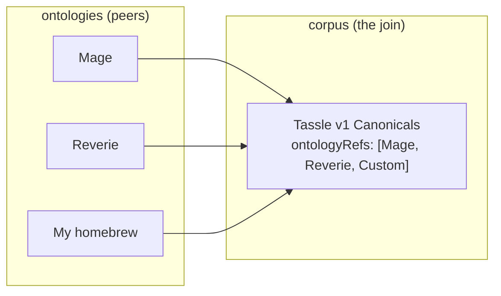

# Resonance design — open discussion

This is a discussion document, not a finalized design. The goal is to think through how tassle's resonance model should evolve by borrowing from `pub.layers.ontology` and `pub.layers.corpus`, and specifically to figure out the relationship between a **broad Mage ontology** (the whole conceptual vocabulary of Mage: the Ascension — spheres, resonance, Avatar, Paradigm, paradox, quintessence) and a **specific resonance-system ontology** (the Triat's Dynamic/Static/Primordial, Reverie's six axes, a custom homebrew cosmology).

It ends with open questions. Please push back on anything that feels wrong.

---

## The framing observation

Tassle's current resonance lexicon ([`lexicons/com.superbfowle.tass.resonance.json`](../../lexicons/com.superbfowle.tass.resonance.json)) is — read charitably — a degenerate `pub.layers.ontology` instance with one collection and one typeDef kind. Specifically:

| tassle today | layers.pub analogue |
| --- | --- |
| `com.superbfowle.tass.resonance.main` (the canonical record) | `pub.layers.ontology.typeDef` with `typeKind: "attribute-type"`, `allowedValues: ["-1..1"]` |
| `main.system` field (`'mage'`/`'reverie'`/`'custom'`) | `pub.layers.ontology.ontology` record (the parent ontology the typeDef belongs to) — but inlined as a string instead of an AT-URI ref |
| `main.cosmology` field (`'Wyld'`, `'Weaver'`, `'Wyrm'`) | A `pub.layers.defs#knowledgeRef` to the in-fiction source referent |
| `main.opposedTo` (bare string) | A `pub.layers.graph.graphEdge` of type `opposed-to` between two typeDef nodes |
| `main.description` | `typeDef.gloss` |
| `resonanceValue` (`{axis, value}`) | An *instance* of an attribute-type — what layers.pub would call an annotation |
| `resonanceProfile` (`{ref, values[]}`) | An `annotationLayer` over a target entity |

That last row is the most important framing shift. **A resonance profile on a Node or Tass is, in layers.pub terms, an annotation layer over that entity.** Whether we adopt that framing fully or not, it's the right mental model: the resonance canonicals are *types*, the profiles on entities are *instances of those types*, and the current lexicon collapses both into a single record type.

## What ontology gives us

`pub.layers.ontology.ontology` is the record that names a cosmology. Read in tassle terms:

```
name:           "Mage: The Ascension"
description:    "The World of Darkness consensus-reality model...."
version:        "M20" or "rev-2.0"
domain:         "custom"            # layers.pub's knownValues list has no good RPG fit
parentRef:      <world-of-darkness ontology at-uri>
personaRef:     <White Wolf / Storyteller persona at-uri>
knowledgeRefs:  [Mage source-book citations, whitewolf.fandom.com pages, ...]
```

Then `pub.layers.ontology.typeDef` records hang off that ontology:

```
# A canonical resonance as a typeDef
ontologyRef:    <Mage ontology at-uri>
name:           "Dynamic"
typeKind:       "attribute-type"
gloss:          "The Wyld. Creation, chaos, the unshaped potential...."
parentTypeRef:  <a "Resonance" parent typeDef at-uri>
knowledgeRefs:  [Mage Revised p.167, whitewolf.fandom.com/wiki/Wyld]
features:       { cosmology: "Wyld", numericRange: [-1, +1] }

# A sphere as a typeDef
ontologyRef:    <Mage ontology at-uri>
name:           "Prime"
typeKind:       "attribute-type"
gloss:          "The sphere of working with raw quintessence itself...."
knowledgeRefs:  [Mage Revised p.190]
features:       { numericRange: [0, 5] }

# A Mage (entity-type)
ontologyRef:    <Mage ontology at-uri>
name:           "Mage"
typeKind:       "entity-type"
gloss:          "An Awakened being whose Avatar allows them to reshape reality...."
allowedRoles:   [...]                # ritual roles this entity can fill
```

This gives us four things the current lexicon lacks:

1. **Pluggable cosmologies.** Vampire, Reverie, custom homebrew — each is just another ontology record. Consumers parse any of them generically; the `system` enum string becomes an AT-URI ref to a published ontology.
2. **Type hierarchies.** `parentTypeRef` lets us say "Static Pattern is a kind of Pattern is a kind of Resonance" without flattening everything into one big list.
3. **Typed relations.** `opposedTo` today is a bare string. With `pub.layers.graph.graphEdge`, every relation between canonicals (opposed-to, complementary-to, derivative-of) is its own typed record with provenance.
4. **Source citations on every canonical.** `knowledgeRefs[]` carries theMage source-book page that defines each type. A chronicle arbiter can walk the chain to verify "yes, this Dynamic definition really is from p.167".

## What corpus adds

`pub.layers.corpus.corpus` is structurally separate from ontology — it's about **curation and review**, not definition. A corpus record wraps a set of expressions (or, in our case, a set of canonical typeDefs) into a citable, versioned, licensed whole with explicit review criteria.

Read in tassle terms:

```
name:             "Mage Revised Canonical Resonances"
version:          "1.0"
domain:           "custom"
ontologyRefs:     [<Mage ontology at-uri>]
eprintRefs:       [<Mage Revised source-book eprint at-uri>]
license:          "white-wolf-fair-use"  # whatever the citation license is
expressionCount:  3                      # Dynamic, Static, Primordial
annotationDesign: {
  redundancy: { count: 2, assignmentStrategy: "expertise-based", annotatorPool: 3 },
  adjudication: { method: "expert", dedicatedAdjudicator: true, agreementThreshold: 750 },
  qualityCriteria: [
    { metric: "percent-agreement", threshold: 800, scope: "item" },
    { metric: "custom", threshold: 1000, scope: "item" }   # "has a source citation"
  ],
  guidelinesRef: <annotation guidelines at-uri>,
  annotationRounds: 2
}
```

The really interesting fields here are the `annotationDesign` ones. Read in tassle terms, they describe **the review process for adding canonicals**:

- `redundancy.count` = how many Storytellers must sign off on a new canonical
- `redundancy.assignmentStrategy` = `"expertise-based"` (only Storytellers with certain sphere ratings)
- `adjudication.method` = `"expert"` (lead Storyteller decides) or `"majority-vote"` (cabal vote)
- `adjudication.agreementThreshold` = the consensus threshold (0-1000)
- `qualityCriteria` = "the new canonical must cite a source-book page"
- `guidelinesRef` = a published guidelines document for what makes a canonical acceptable

The corpus `membership` record then attaches individual typeDefs to the corpus, optionally with split assignment (train/dev/test/unlabeled, which in our case might be canonical/experimental/deprecated).

**What this gets us:** the difference between "anyone can publish a `com.superbfowle.tass.resonance` record on their PDS" (the current firehose) and "this set of canonicals is vetted by these Storytellers under these review criteria, version X.Y" (a citable corpus). Downstream consumers (an appview, a chronicle arbiter tool, a Mage's spell-checker) can choose which to trust.

## The convergence question (the heart of this doc)

> How might a broader Mage ontology and a specific resonance-system ontology converge in design?

Two patterns, not mutually exclusive:

### Pattern A — Nesting via `parentRef` (the extension model)

A broader Mage ontology record contains every typeDef that applies to Mage in general (spheres, Avatar, Paradigm, quintessence, paradox). Specific resonance systems like the Triat are **child ontologies** that extend it:

```mermaid
flowchart TD
  WoD["World of Darkness<br/>ontology"]
  Mage["Mage: the Ascension<br/>ontology"]
  Triat["The Triat<br/>resonance ontology"]
  Vamp["Vampire roads<br/>resonance ontology"]
  Reverie["Reverie<br/>resonance ontology"]
  CustomHomebrew["My homebrew<br/>resonance ontology"]

  WoD -- parentRef --> Mage
  Mage -- parentRef --> Triat
  Mage -- parentRef -. extends .-> Vamp
  Mage -- parentRef -. extends .-> Reverie
  Triat -- parentRef --> CustomHomebrew
```

Each child ontology inherits the parent's `knowledgeRefs` (cites the same source books) and `personaRef` (same Storyteller framework) and adds its own typeDefs. A typeDef lookup can walk the chain: "is this `Dynamic` canonical valid under my homebrew cosmology?" → walk up parentRefs until you find an ontology that declares it.

**Strengths:** clean inheritance, easy to express "my cosmology extends Mage by adding two axes". **Weaknesses:** forces a single lineage; doesn't naturally express "this corpus uses Mage AND Reverie canonicals simultaneously".

### Pattern B — Composition via `corpus.ontologyRefs[]` (the join model)

Ontologies stay independent (Mage, Reverie, Vampire are peers, not nested). A **corpus** is the join: it lists multiple `ontologyRefs[]` and collects typeDefs from each into a single curated set.



Downstream consumers cite the corpus, not the ontologies: "this Node uses the Tassle v1 canonical set" → look up the corpus → enumerate its memberships → fetch the typeDefs.

**Strengths:** natural fit for "tassle supports multiple cosmologies simultaneously". **Weaknesses:** loses the inheritance story — a homebrew cosmology can't easily say "I extend Mage by adding two axes" without explicit re-publication.

### Pattern C — Both, used for different things

The cleanest answer is probably to use both patterns for different relationships:

- **Pattern A (parentRef)** for *cosmological inheritance*: Reverie extends Mage, my homebrew extends the Triat. This is an ontological claim about how the cosmologies relate.
- **Pattern B (corpus composition)** for *operational curation*: the Tassle v1 canonical registry collects typeDefs from Mage + Reverie + custom cosmologies into a vetted set. This is an editorial claim about which canonicals tassle officially recognizes.

The two patterns compose: a corpus can include typeDefs from a child ontology that itself extends a parent. Consumers can ask both "what cosmology is this canonical from?" (Pattern A) and "is this canonical in the vetted registry?" (Pattern B).

## Where tassle should diverge from layers.pub

Layers.pub is built for linguistic annotation; tassle is built for RPG energy accounting. The fit is good but not perfect. Specific places to diverge:

1. **Numeric ranges.** Layers.pub `typeDef.allowedValues[]` is an enumerated string list. Tassle needs numeric ranges: 0-5 for spheres, -1 to +1 for resonance, 0-INF for quintessence. We can stuff these into `features: { numericRange: [...] }` but it's a stretch — better to define a tassle-native `rangeSpec` def and use it directly.

2. **No `expression` dependency.** Layers.pub ontologies describe types of *expressions* (linguistic units). Tassle's describe types of *energy entities* (Nodes, Tass, Mages). The schema should not force tassle into the expression model. The `pub.layers.ontology` shapes are usable directly without the expression pipeline.

3. **Simpler `typeKind` set.** Layers.pub has 5 type kinds (`entity-type`, `situation-type`, `role-type`, `relation-type`, `attribute-type`). Tassle probably needs only 3:
   - `entity-type` — things that exist (Mage, Node, Tass object, Avatar)
   - `attribute-type` — measurable properties (spheres, resonance axes, quintessence, paradox, arete)
   - `relation-type` — typed edges between entities/attributes (opposed-to, derived-from, attuned-to)
   
   `situation-type` and `role-type` are only relevant if we later model rituals/workings, and even then they're a Phase-later concern.

4. **No `roleSlot` machinery initially.** The frame-semantics machinery (`roleSlot.roleName`, `fillerTypeRefs`, etc.) is overkill for resonance. Keep it in mind for rituals, skip for now.

5. **`domain` knownValues list doesn't fit.** Layers.pub's `domain` enum (`general`/`biomedical`/`legal`/`financial`/`news`/`social-media`/`scientific`/`intelligence`/`dialogue`/`multimodal`/`custom`) has no RPG category. Use `custom` with a `domainUri` pointing at a published "RPG cosmology" node, or contribute `"rpg"` / `"game-cosmology"` to layers.pub upstream.

## A concrete design sketch

To make the discussion concrete, here's a sketch of what tassle v2 might look like if it adopted these patterns. Treat this as one option among several — the goal is to have something specific to argue about, not to commit to this shape.

### Option 1: Full import of layers.pub shapes

Use `pub.layers.ontology.ontology` and `pub.layers.ontology.typeDef` directly (with tassle-specific `features` for the bits that don't fit, like numeric ranges). No new tassle lexicons for cosmology or typeDefs — just publish records that reference the layers.pub schemas.

**Pros:** Zero new lexicon surface. Maximum interoperability with layers.pub consumers. Inherits all the corpus/annotation machinery for free.
**Cons:** Forces tassle into the linguistic-annotation framing. The `features: { numericRange: [...] }` workaround is ugly. Tassle becomes dependent on layers.pub reaching a stable release (currently v0.7.0-draft).

### Option 2: Tassle-native analogues

Define tassle's own `com.superbfowle.tass.cosmology` and `com.superbfowle.tass.resonanceType` collections, structurally modeled on the layers.pub ontology/typeDef shapes but with tassle-native types (numeric ranges, simpler typeKind set, no expression dependency).

```
# com.superbfowle.tass.cosmology
name:           string
description:    string
version:        string
parentRef:      at-uri              # to a parent cosmology
personaRef:     at-uri              # to the Avatar/Storyteller persona
knowledgeRefs:  knowledgeRef[]      # source-book citations
features:       featureMap
createdAt:      datetime

# com.superbfowle.tass.resonanceType (replaces the current resonance.main)
cosmologyRef:   at-uri              # replaces the current 'system' field
name:           string
kind:           "entity" | "attribute" | "relation"
gloss:          string
parentTypeRef:  at-uri
opposedToRef:   at-uri              # typed relation
complementaryToRef: at-uri[]        # typed relation
allowedRange:   { min, max, step? } # tassle-native numeric range spec
knowledgeRefs:  knowledgeRef[]
features:       featureMap
createdAt:      datetime
```

Plus a new `com.superbfowle.tass.canonicalSet` (corpus analogue) for curated registries.

**Pros:** Tassle-native. No dependency on layers.pub stability. Numeric ranges are first-class. No expression-pipeline baggage.
**Cons:** New lexicon surface to maintain. Loses automatic interop with layers.pub consumers. Have to re-derive the design choices layers.pub has already made.

### Option 3: Hybrid — import the defs, ship tassle records

Use `pub.layers.defs#knowledgeRef`, `pub.layers.defs#featureMap`, and the `pub.layers.corpus.defs#annotationDesign` shapes directly (they're general-purpose), but ship tassle-native record collections (Option 2's shapes) that embed those defs.

**Pros:** Reuses the well-designed general defs. Keeps records tassle-flavored. Corpus review machinery comes for free.
**Cons:** Slightly more coupling to layers.pub than Option 2.

My current lean is Option 3, but the call should turn on how stable layers.pub looks over the next few months and whether anyone wants tassle's cosmology records to be readable by general layers.pub consumers.

## Open questions

1. **Is the framing right?** Is treating resonance canonicals as ontology typeDefs and resonance profiles as annotation layers the right mental model, or does the linguistic-annotation framing distort tassle's actual data model? An alternative: treat them as a typed property graph (`pub.layers.graph`) where canonicals are nodes and opposed-to/complementary-to are typed edges — no ontology machinery at all.

2. **Pattern A or Pattern B for the cosmology lineage question?** Should Reverie's relationship to Mage be expressed via `parentRef` (Pattern A — Reverie extends Mage) or just via shared membership in a corpus (Pattern B — they're peers that happen to be co-cited)?

3. **Does tassle need the corpus pattern at all?** The current "anyone can publish a canonical" firehose model works for now. The corpus pattern is about *curation* and *review* — is there a tassle use case that demands that today, or is it speculative? If speculative, defer.

4. **Numeric ranges — tassle-native or pushed upstream?** If we go Option 2 or 3, the `rangeSpec` def is a tassle-local extension. Worth pushing it upstream to layers.pub so other numeric-bounded domains (any scientific measurement, any game system) can share it? The contribution would be small and well-scoped.

5. **`domain: "rpg"` upstream contribution?** Layers.pub's `knownValues` for `domain` is currently biased toward linguistic/NLP use cases. Contributing `"rpg"` (or a more general `"game"` / `"fictional-cosmology"`) might be welcome and would give tassle a non-`custom` slot.

6. **Migration story.** If we adopt cosmology records, the current `system` enum on every existing canonical record needs to become an AT-URI ref. Is this a hard migration (rewrite every existing record) or a soft one (new records use the new shape, old records continue to work with `system` as a fallback)? Probably soft, but worth being explicit.

7. **Should `opposedTo` become a first-class edge record?** Today it's a bare string. If we move to typed edges (`com.superbfowle.tass.resonanceRelation` with `fromRef`, `toRef`, `kind`), we gain the ability to express *why* two canonicals are opposed (a `gloss`, a `knowledgeRef` citing the source page that explains the opposition). Worth it?

8. **Avatar and Paradigm — do they live in the ontology or in `pub.layers.persona`?** Earlier in [`lexicon-ideas.md`](lexicon-ideas.md) section 9 I suggested `persona` for Avatars/Paradigms. With the ontology framing, they could equally be `entity-type` typeDefs. Which is cleaner — persona (the agent doing the annotating) or typeDef (the role being filled)?

9. **Source citation chains — layers.pub eprint, or roll our own?** The corpus pattern's `eprintRefs[]` is good for citing source books. But the `pub.layers.eprint` schema is much richer (DOI, arXiv, ACL Anthology, dataLinks). For Mage source-book citations, do we need that richness, or is a simple `eprintRef` enough?

10. **Who owns the Mage ontology record?** If we publish a "Mage: The Ascension" ontology, who is its `personaRef`? White Wolf Publishing (the actual publisher, defunct)? The tassle project (claiming stewardship of the cosmology for ATProto purposes)? A specific Storyteller? This is a social/governance question more than a technical one, but it shapes the schema.

## See also

- [`lex-layers-pub.md`](lex-layers-pub.md) — broader layers.pub ecosystem notes
- [`lexicon-ideas.md`](lexicon-ideas.md) — cross-ecosystem design journal (themes 2, 9, and the integration-path table are most relevant)
- [`doc/ref/pub.layers.ontology.ontology.json`](../ref/pub.layers.ontology.ontology.json), [`doc/ref/pub.layers.ontology.typeDef.json`](../ref/pub.layers.ontology.typeDef.json), [`doc/ref/pub.layers.ontology.defs.json`](../ref/pub.layers.ontology.defs.json) — source schemas
- [`doc/ref/pub.layers.corpus.corpus.json`](../ref/pub.layers.corpus.corpus.json), [`doc/ref/pub.layers.corpus.membership.json`](../ref/pub.layers.corpus.membership.json), [`doc/ref/pub.layers.corpus.defs.json`](../ref/pub.layers.corpus.defs.json) — source schemas
- [`lexicons/com.superbfowle.tass.resonance.json`](../../lexicons/com.superbfowle.tass.resonance.json) — tassle's current resonance schema
