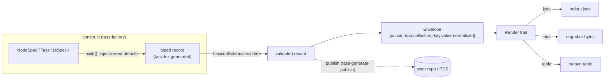

# generate / construct-render pipeline — design (early draft)

> Status: **early draft.** Tracks epic `tass-build-render` and its children
> (`tass-record-factory`, `tass-output-layer`, `tass-samples-generator`,
> `tass-generate-subcommands`, `tass-generate-publish`). Written to align the
> slices before implementation; details will move into the child tickets.

## Problem

The legacy TypeScript path had one coherent thing the Rust port split into
three disconnected halves:

- **`src/commands/mint.ts`** — build a Node *and* publish it.
- **`src/atproto/tass.ts`** — fluent builders that owned real construction
  policy: derived defaults (`ambientQuintessence = rating * 5` at
  `src/atproto/tass.ts:123`), range checks, optional-skip ergonomics.
- **`src/samples/generate.ts`** — canonical example records.

On the Rust side today:

- `generate node` (`crates/tassle-cli/src/commands/generate/node.rs`) builds +
  validates but **does not publish**, and **silently drops the
  `ambientQuintessence` default** when the flag is omitted
  (`generate/node.rs:67-69`) — a behavior regression vs TS.
- The jacquard-generated builders (`crates/tassle-lexicons/.../tassilize.rs`)
  are type-state, schema-only, no defaults, no cross-field rules.
- Sample definitions live **inside the CLI command**
  (`crates/tassle-cli/src/commands/samples.rs:53`); the corpus
  (`crates/tass-lex-sample`) only embeds the output behind its `samples`
  feature (`Cargo.toml:15`).
- Output is split three ways: record `OutputFormat` + `emit()`
  (`commands/mod.rs:18,27`), the planned global `--format json|table`
  (`tass-cli-format-flag`), and ad-hoc `println!` across mage/auth/config
  (`mage.rs:361`, `auth.rs:96`, `config.rs:50`).

## Goal

One **construct → render** pipeline, as library crates, shared by the CLI, the
ledger fold, tests, and the future web/XRPC surface (`tass-xrpc-surface`).



## Scope boundary: seed vs derived truth

The factory produces the **asserted seed record** only. Anything that must be
recomputed from action history belongs to the ledger fold (`tass-ledger-fold`),
not here. Concretely: `ambientQuintessence` on a freshly generated Node is a
**seed default** (`rating * 5`) the factory owns; the *current* ambient of an
existing Node is **derived truth** the ledger recomputes (see
`doc/discovery/lexicon-ideas.md:193`). The factory must not pretend to compute
the latter.

---

## 1. `tass-factory` (child: `tass-record-factory`)

New crate `crates/tass-factory`. Hand-written facade over the generated
`tass-lex` builders. Owns seed defaults, semantic validation, cross-field
rules, and option-passthrough ergonomics.

### API shape — `Spec` structs over typed-builder facades

The generated builders are type-state and verbose (see
`tassilize.rs:238`–`395`). Wrapping them with another builder gains little and
doubles the type-state surface. Instead, each record gets a plain **`Spec`
struct** plus a `build()` that calls the generated builder internally and
injects defaults:

```rust
// crates/tass-factory/src/node.rs
use jacquard_common::{types::datetime::Datetime, DefaultStr};
use tass_lex::com_superbfowle::tass::node::Node;

/// Everything needed to construct a Node. Required fields are non-optional;
/// optional record fields are `Option<T>` and pass straight through from clap.
pub struct NodeSpec {
    pub name: String,
    pub rating: i64,
    pub description: Option<String>,
    pub location: Option<String>,
    pub resonance: Option<String>,
    pub tass_form: Option<String>,
    pub ambient_quintessence: Option<i64>, // None -> rating * 5
    pub created_at: Datetime,
}

impl NodeSpec {
    pub fn build(self) -> Node<DefaultStr> {
        let ambient = self.ambient_quintessence.unwrap_or(self.rating * 5);
        Node::builder()
            .name(self.name)
            .rating(self.rating)
            .ambient_quintessence(ambient)
            .created_at(self.created_at)
            .maybe_description(self.description.map(Into::into))
            .maybe_location(self.location.map(Into::into))
            .maybe_resonance(self.resonance.map(Into::into))
            .maybe_tass_form(self.tass_form.map(Into::into))
            .build()
    }
}
```

CLI usage collapses to a struct literal — no `maybe_*(Some(...))` dance, no
inline defaults:

```rust
let spec = NodeSpec { name: args.name, rating: args.rating, /* … */, .. };
let node = spec.build();
node.validate()?;
```

### Defaults policy

| Field | Seed default | Source |
|---|---|---|
| `Node.ambientQuintessence` | `rating * 5` | TS `tass.ts:123` |
| `*.createdAt` | caller-supplied (CLI: now; samples: fixed) | deterministic by design |

Any future default lives in one place (the `Spec::build`), not scattered across
commands. Semantic vocabulary (resonance values, form refs) that the lexicon
schema cannot express goes in a `validate_semantic()` companion to
`LexiconSchema::validate`.

### Open questions

- Does `tass-factory` depend on `tass-lex` (renamed `tassle-lexicons`), or do we
  re-export the generated types through it? Lean: depend on `tass-lex`, re-export
  the record types the factory constructs so consumers have one import path.
- Should `Spec` expose a `builder()` too (bon-style) for programmatic
  incremental construction, or is the struct literal enough for current
  callers (CLI + samples + tests)? Defer until a non-struct-literal caller
  appears.
- Naming after `tass-crate-rename`: crate is `tass-factory` either way; module
  path `tass_factory::node::NodeSpec`.

---

## 2. Output layer (child: `tass-output-layer`)

Unify `commands::emit` (`mod.rs:27`), the global `--format json|table`
dispatch (`tass-cli-format-flag`), and the record envelope from the README.

### Envelope

```rust
pub struct Envelope<V> {
    pub uri: Option<String>,      // at://did/collection/rkey
    pub cid: Option<String>,
    pub repo: Option<String>,     // did:plc:...
    pub collection: Option<String>,
    pub rkey: Option<String>,
    pub value: V,                 // the record (or normalized projection)
    pub normalized: Option<serde_json::Value>,
}
```

Reads (`repo`, `mage`) fill the whole envelope; generated records (`generate`,
`samples`) fill only `value`. Same renderer handles both.

### Render

Free functions over a `Format` enum, rather than a trait object, so each arm
stays monomorphized and there is no dynamic dispatch on the hot path:

```rust
pub enum Format { Json, Cbor, Table }

pub fn render_value<V: Serialize>(v: &V, fmt: Format, w: &mut impl Write) -> miette::Result<()>;
pub fn render_envelope<V: Serialize>(e: &Envelope<V>, fmt: Format, w: &mut impl Write) -> miette::Result<()>;
```

`render_value` replaces `commands::emit`. `Table` is stubbed for now (this
ticket = **trait + envelope only**); per-command human formatting stays ad-hoc
until a follow-up consolidates it.

### Open questions

- Lift `tass-cli-format-flag` out of `tass-auth-mvp` into `tass-build-render`
  once the trait lands, or leave it and just route its dispatch through
  `render_value`? Lean: lift it — the flag is broader than auth.
- Envelope generic over string backing (`S: BosStr`) or always `String` at the
  CLI boundary? Lean: `String` at the boundary; the ledger can keep its own
  typed envelope.

---

## 3. Samples relocation (child: `tass-samples-generator`)

**Relocate only** this pass. The four sample values move out of
`samples.rs:53` (`build_samples`) into named presets. Two viable homes:

1. **`tass-factory` presets** — `tass_factory::samples::crystal_spring_node()`
   etc., returning built records. Reuses the factory; one import path for
   "canonical example".
2. **`tass-lex-sample` data** — sample specs as embedded data the corpus
   exposes alongside its lexicon JSON. Keeps the corpus the single
   data-of-record; CLI calls factory to materialize.

Lean: **(1) factory presets**, since samples are *constructed* values that
should exercise the factory like everything else, and the corpus stays a pure
data/embed layer. The CLI `samples` command becomes:

```rust
let records = tass_factory::samples::all(); // Vec<(filename, description, record)>
for (filename, description, record) in records { /* write */ }
```

### Acceptance gate

The four existing `*.example.json` files regenerate **byte-identically** (fixed
`createdAt` preserved) — this is the regression guard for the move.

---

## 4. `generate` CLI shape (child: `tass-generate-subcommands`)

Each new subcommand is a thin clap `Args` struct → `Spec` literal →
`Spec::build()` → `validate()` → `render_value`. No construction logic in the
CLI. Covers `tassilize`, `meditate`, `enervate` now; `form`, `resonance` when
those lexicons land. Field sets mirror `src/atproto/tass.ts`.

XRPC parity: each subcommand gets a WIP sketch per `tass-xrpc-surface` (the
`tassilize` procedure already distinguishes `source = magePattern | node`).

---

## 5. `generate` → publish (child: `tass-generate-publish`)

Restores `mint` parity. `generate` stays local/no-auth; publish is a separate
step needing a session. Surface TBD — `generate <kind> --publish`, a `put`
command, or both. Publish goes through `tass-app` (profile/PDS resolution,
`tass-app-crate`) + `tass-factory`, never inline construction. Rkey strategy:
TID default (`doc/design.gpt.md:280`).

Blocked on `tass-auth-mvp` (app-password session). Bead dep edge points at the
relevant auth child, not the epic (tasks cannot block epics).

---

## Suggested ordering

1. `tass-record-factory` — unblocks everything else; standalone new crate.
2. `tass-output-layer` — `render_value` + envelope; replace `commands::emit`.
3. `tass-samples-generator` — move presets into the factory; byte-identical regen.
4. `tass-generate-subcommands` — new subcommands on top of (1) + (2).
5. `tass-generate-publish` — once `tass-auth-mvp` lands a working session.

(1) and (2) are independent and can move in parallel.
