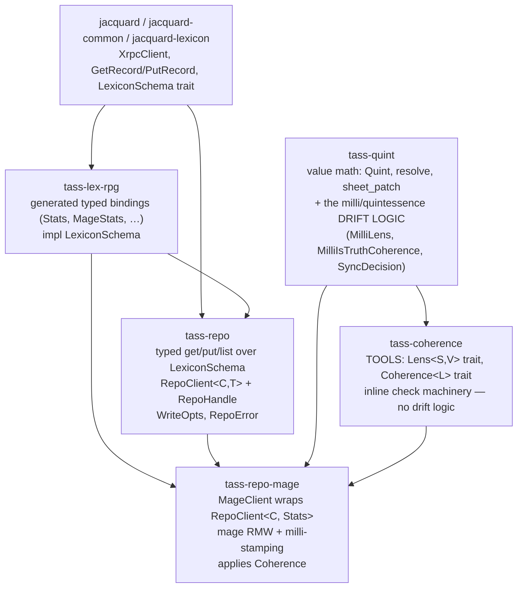

# tass-repo — the jacquard tooling layer

`tass-repo` is the workspace's home for **typed atproto record access over jacquard**. It sits one layer above raw `GetRecord`/`PutRecord` and one layer below domain crates. It knows the `LexiconSchema` *trait* (the abstraction) but **names no specific lexicon** — no `actor.rpg.stats`, no `mage`. That bright line is what keeps it a reusable library rather than a grab-bag: domain meaning lives in domain crates (`tass-repo-mage`, …).

This doc captures the typed record layer, the "minting" pattern (`RepoClient<C, T>` + `RepoHandle`), and how the Client / Error / WriteOpts shapes that used to live quint-specifically in `tass-repo-mage` lift into the generic layer. It also sketches the pointer/operator (Lens) abstraction that `tass-coherence` will host — the generalization of `SheetFields`/`SheetPatch`.

## Layering



- **`tass-repo`** — typed record I/O + identity resolution. Generic over `T: LexiconSchema`.
- **`tass-repo-mage`** — the mage DAO. `MageClient` wraps `RepoClient<C, Stats>`; hosts the quint RMW and applies the coherence policy on read/write. Where domain meaning ("mage block", "milli timestamp stamping") lives.
- **`tass-quint`** — the value math (`Quint`, `resolve`, `sheet_patch`) **and** the milli/quintessence drift logic (the specific `Lens` impl, the specific `Coherence` impl, the specific `SyncDecision` variants). Drift stays here.
- **`tass-coherence`** — the *tools* for coherence checks: the `Lens<S, V>` pointer trait, the `Coherence<L>` trait, the inline read/write check plumbing. No drift logic of its own; `tass-quint` plugs into it.
- **`tass-lex-rpg`** — generated typed bindings; the `T` in `RepoClient<C, T>`.

## The typed record layer

Today `tass-repo` exposes `get_record` / `list_records` returning `RecordEnvelope { value: serde_json::Value }` — lexicon-agnostic but untyped. The typed layer adds the same operations generic over a lexicon binding:

```text
trait bound (re-exported from jacquard-lexicon):
  T: LexiconSchema + serde::de::DeserializeOwned        // for reads
  T: LexiconSchema + serde::Serialize                   // for writes
  T::nsid() -> &'static str                              // supplies the collection

shapes:
  TypedEnvelope<T> { uri, cid: Option, rkey, value: T }   // mirrors RecordEnvelope
  TypedListPage<T>  { cursor: Option<String>, records: Vec<TypedEnvelope<T>> }

operations:
  get_record_typed::<T>(client, repo, rkey)      -> Result<Option<TypedEnvelope<T>>>
  put_record_typed::<T>(client, repo, rkey, value: T, opts: WriteOpts) -> Result<()>
  list_records_typed::<T>(client, repo, limit, cursor, reverse) -> Result<TypedListPage<T>>
```

The collection argument disappears — it is inferred from `T::nsid()`. `tass-repo` gains a dep on `jacquard-lexicon` (for the `LexiconSchema` trait only); it still names no specific lexicon. The untyped `get_record`/`list_records` stay for lexicon-agnostic callers (e.g. a generic `repo list` CLI that prints any collection).

`tass-repo-mage`'s private `QuintClient::get_record`/`put_record` and the standalone `get_stats_record`/`list_stats_records` collapse into one-liners over the typed layer.

## Dragging Client / Error / WriteOpts up from the quint layer

`tass-repo-mage` (formerly `tass-quint-jac`) grew three patterns that are not mage-specific and belong in the generic layer:

### `WriteOpts` — generic write options

The `at(ts)` / `unstamped()` stamping concept, plus the swap guards jacquard already accepts, are generic. Lift to `tass-repo`:

```text
// tass-repo
struct WriteOpts {
    stamp: Stamp,                       // Now (default) | At(ts) | None  — for record-level updatedAt
    swap_record: Option<Cid>,           // optimistic concurrency
    swap_commit: Option<Cid>,
    validate: Option<bool>,
}
```

`tass-repo-mage`'s `milliQuintessenceUpdatedAt` stamping is a **mage-specific extension** layered on top (a `MageWriteOpts` that wraps `WriteOpts` and adds the milli-stamp control). The record-level stamp is generic; the field-level stamp is domain.

### `RepoError` — the generic base; domain crates layer their own

`tass-repo`'s existing `RepoError { Ident, Resolve, Uri, Xrpc, Decode }` is the generic base. Domains extend:

```text
// tass-repo-mage
enum MageError {
    Repo(RepoError),                    // generic transport/decode
    NoMageBlock,                        // domain: record exists but no mage block
    LegacyMageField(String),            // domain: PascalCase fields rejected
}
```

The hand-rolled-error convention (no `thiserror`) is the workspace norm — `tass-repo`, `tass-output`, `tass-ledger`, `tass-config`'s `AuthError` all do this. `MageError` follows it.

### `RepoClient<C, T>` — every lexicon type mints a typed Client

This is the "minting" vision: parameterize the client by lexicon type, and every binding gets a typed client + the base operations for free.

```text
// tass-repo
struct RepoClient<'c, C, T> { client: &'c C, _t: PhantomData<T> }

impl<'c, C: XrpcClient + Sync, T: LexiconSchema + De + Ser> RepoClient<'c, C, T> {
    fn new(client: &'c C) -> Self
    fn at(&self, repo, rkey) -> RepoHandle<'_, 'c, C, T>   // the bound builder
    async fn get(&self, repo, rkey)   -> Result<Option<TypedEnvelope<T>>>
    async fn put(&self, repo, rkey, value: T, opts: WriteOpts) -> Result<()>
    async fn list(&self, repo, limit, cursor, reverse) -> Result<TypedListPage<T>>
}

// the bound handle: captures repo + rkey + T once
struct RepoHandle<'a, 'c, C, T> { client: &'a RepoClient<'c, C, T>, repo, rkey }
impl … {
    async fn get(&self) -> Result<Option<TypedEnvelope<T>>>
    async fn put(&self, value: T, opts: WriteOpts) -> Result<()>
}
```

So "what a repo bound builder means": it is a `RepoHandle<C, T>` — a typed, repo+rkey-bound lens onto the substrate. `MageClient` becomes a thin domain wrapper owning a `RepoHandle<C, Stats>` plus a coherence policy:

```text
// tass-repo-mage
struct MageClient<'c, C, Co = MilliIsTruthCoherence> {
    handle: RepoHandle<'c, 'c, C, Stats>,   // bound to did + "mage"
    coherence: Co,
}
// MageClient::read delegates to handle.get(), applies Coherence, returns the coherent Quint.
// MageClient::write delegates to handle.put() with the replicated floor patch.
```

The bound handle removes the `repo`/`rkey` repetition the `tass-quint-cli` ticket flagged as residual friction.

## The pointer/operator abstraction (for `tass-coherence`)

`SheetFields` and `SheetPatch` are not, today, general ideas — they are the 4 milli/quintessence fields and the 3-field write-shape. But the *pattern* they express is general and worth naming:

- **`SheetFields` is a projection** — a View pulled out of a typed Source (`MageStats`). It is the data a policy inspects.
- **`SheetPatch` is a write-shape** — the data a policy applies back to the Source.
- `extract_fields` is the **getter** half of a lens; `apply_quint` is the **setter** half.
- `Coherence::classify` is a **read-operator** over the lens: `View → Decision`.

Naming the abstraction:

```text
// tass-coherence — the TOOLS, no drift logic
trait Lens<S, V> {
    fn get(source: &S) -> V;
    fn set(source: &mut S, view: V);
}

trait Coherence<L: Lens> {
    type Decision;
    fn classify(view: &L::View) -> Self::Decision;
    // + inline read/write plumbing helpers shared by every domain
}
```

Then the quint drift (which stays in `tass-quint`) plugs in:

```text
// tass-quint — the DRIFT LOGIC
struct MilliLens;
impl Lens<MageStats, SheetFields> for MilliLens {
    fn get(m: &MageStats) -> SheetFields { extract_fields(m, …) }
    fn set(m: &mut MageStats, patch: SheetPatch) { apply_quint(m, &patch) }
}

enum QuintDecision { InSync, RefreshFloor, HydrateMilli }   // quint-specific

struct MilliIsTruthCoherence;
impl Coherence<MilliLens> for MilliIsTruthCoherence {
    type Decision = QuintDecision;
    fn classify(view: &SheetFields) -> QuintDecision { … the floor/timestamp checks … }
}
```

**Is it generalizable?** Yes — any "check or patch a subset of a typed record's fields" fits (a willpower-drift lens, a paradox-cap operator, a sphere-total check). `tass-coherence` hosts the generic `Lens` + `Coherence` machinery; each domain supplies its own lens + decision enum + impl.

**Where does `Lens` live?** A lens is more general than coherence (any field-level operation uses one). Pragmatically it starts in `tass-coherence` as the first consumer; if a non-coherence use surfaces later it lifts to its own micro-crate (`tass-lens` or similar). Do not pre-build that crate now.

**What does NOT generalize, and stays quint-specific:** the `QuintDecision` variants (`RefreshFloor`, `HydrateMilli`), the floor/replication math, `SheetFields`'s four named fields, `SheetPatch`'s three. Those are the drift logic, and they stay in `tass-quint`.

## What moves where (migration summary)

| Symbol | Today | After |
|---|---|---|
| `get_record` / `list_records` (`serde_json::Value`) | `tass-repo` | stays (lexicon-agnostic path) |
| `get_record_typed` / `put_record_typed` / `list_records_typed` | — | **new in `tass-repo`** |
| `WriteOpts` (stamping + swap guards + validate) | `tass-repo-mage` (quint-flavored) | generic in `tass-repo`; mage milli-stamp extension stays in `tass-repo-mage` |
| `QuintError` | `tass-repo-mage` | rename `MageError`; generic part is `RepoError` (already there) |
| `QuintClient` private `get_record`/`put_record` | `tass-repo-mage` | deleted; routes through `RepoClient<C, Stats>` |
| `QuintClient` | `tass-repo-mage` | rename `MageClient`; wraps `RepoHandle<C, Stats>` + a `Coherence` |
| `SheetFields`, `SheetPatch`, `MilliIsTruthCoherence`, `QuintDecision` | `tass-quint` | stay in `tass-quint` (the drift logic) |
| `Coherence` trait, `Lens` trait, inline machinery | `tass-quint` | **new `tass-coherence` crate** (the tools) |
| `Quint`, `resolve`, `sheet_patch`, constants | `tass-quint` | stay (the value math) |
| `PER_POINT` / `MAX_POINTS` / `MAX_MILLIS` | `tass-quint` | stay, but doc-cross-ref `tass-lex-rpg`'s `MageStats::validate()` bounds as authoritative; repo-mage calls `validate()` on reads |

## Non-goals

- `tass-repo` does not own domain meaning. No `mage`, no `quintessence`, no `meditate`. If a piece of code names a specific lexicon or field, it belongs in a domain crate.
- `tass-repo` does not apply coherence policies. The inline-check machinery lives in `tass-coherence`; the policies live in domain crates; `tass-repo` is just the typed pipe.
- The typed layer does not replace the untyped `get_record`/`list_records` — both stay. The untyped path serves lexicon-agnostic tooling; the typed path serves domain crates.
- No `bon` builder. The workspace convention is hand-rolled consuming builders (`WriteOpts::at`, `RepoClient::at`); `bon` is not used anywhere and we follow suit.
- No codegen for the "minting." `RepoClient<C, T>` is plain generic-parameterization — every `T: LexiconSchema` gets a typed client for free without a derive macro. If per-lexicon boilerplate ever grows (custom domain ops repeated per type), a `#[derive(LexiconEntity)]` macro can be revisited then.

## References

- [`doc/microquint.md`](/doc/microquint.md) — the quintessence coherence concept this repo layer hosts.
- [`doc/ledger.md`](/doc/ledger.md) — why the ledger must not silently mutate `actor.rpg.stats`; sheet writes are explicit commands.
- `crates/tass-repo/src/lib.rs` — current generic resolve/get/list substrate.
- `crates/tass-repo-mage/src/lib.rs` — the mage DAO; `MageClient` (post-rename) wraps the typed repo layer.
- `crates/tass-lex-rpg/src/actor_rpg/stats.rs` — generated `Stats` / `MageStats` bindings; the `T` in `RepoClient<C, T>`.
- `jacquard-lexicon::schema::LexiconSchema` — the trait bound (`nsid()`, `def_name()`).
